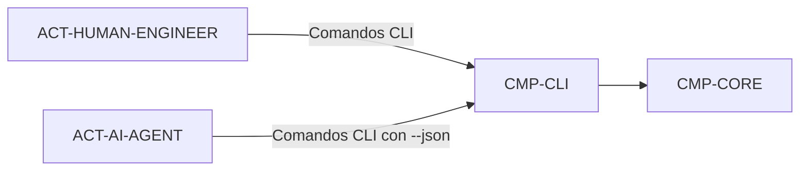

# CMP-CLI: Interfaz de Línea de Comandos AI-SDLC

## 1. Responsabilidad y Límites
Punto de entrada de ejecución por consola (`aisdlc`) que orquesta los subcomandos operativos (`verify`, `report`, `sdd`, `init`), gestiona variables de entorno de formato y traduce los resultados en salidas legibles o JSON estructurado.

## 2. Diagrama de Estructura Interna (Nivel 2)

