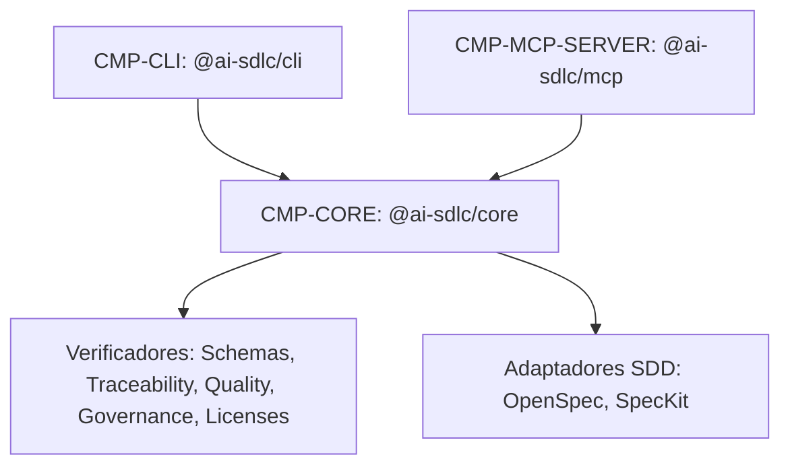

# CMP-CORE: Motor Central AI-SDLC

## 1. Responsabilidad y Límites
Biblioteca central que contiene la lógica de negocio, adaptadores SDD (SpecKit, OpenSpec), motores de verificación determinista (esquemas, trazabilidad, calidad de código, gobernanza de ramas, licencias OSS, AST) y generadores de reportes.

## 2. Diagrama de Estructura Interna (Nivel 1)

