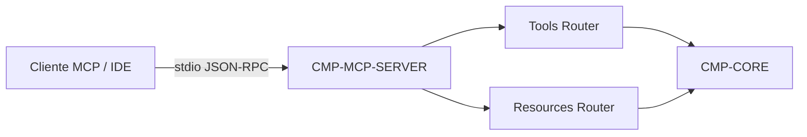

# CMP-MCP-SERVER: Servidor Model Context Protocol

## 1. Responsabilidad y Límites
Servidor conforme a la especificación Model Context Protocol (MCP) que expone las herramientas y recursos del ecosistema AI-SDLC directamente a agentes de IA integrados en IDEs (Cursor, Claude, Antigravity) vía comunicación por transporte stdio.

## 2. Diagrama de Estructura Interna (Nivel 2)

