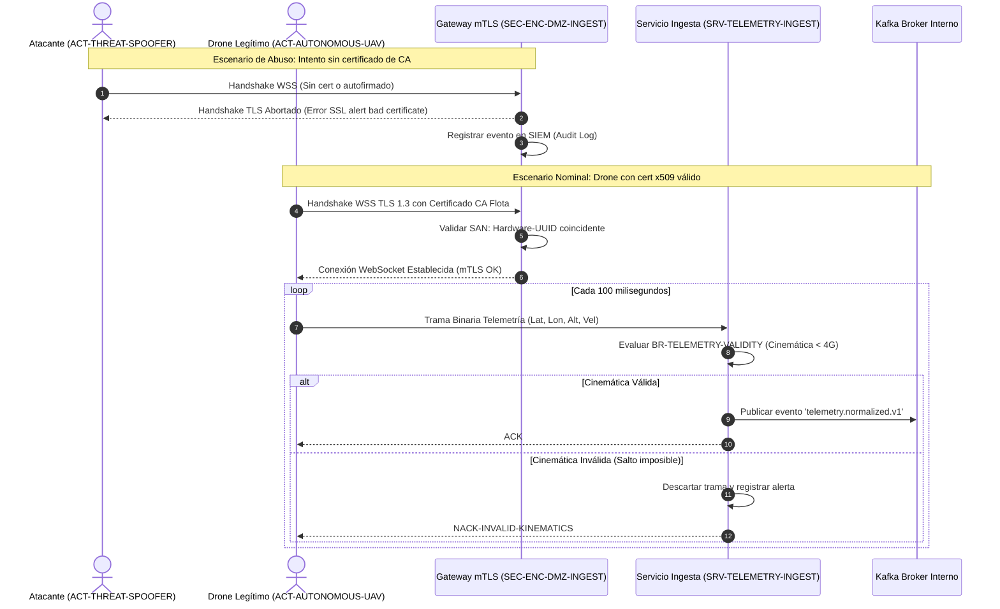

# 06. Vista de Ejecución (Runtime View - arc42 Sec. 6 / NAF Behaviour)

## Flujo 1: Recepción de Telemetría con Mitigación de Spoofing (mTLS)

El siguiente diagrama modela el escenario nominal y el rechazo inmediato de un atacante conforme a los requerimientos `FR-TELEMETRY-STREAM-001` y `SEC-REQ-MTLS-STREAM`:

