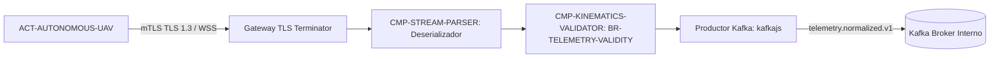

# CMP-TELEMETRY-INGEST: Componente de Ingesta Telemétrica

## 1. Responsabilidad y Límites
Punto de entrada perimetral de alta concurrencia encargado de recibir conexiones WebSocket con mTLS de flotas de drones, validar firmas de certificados, deserializar payloads binarios Protobuf y verificar la regla cinemática `BR-TELEMETRY-VALIDITY`.

## 2. Diagrama de Estructura Interna (Whitebox Nivel 2)

---

## 3. Historial de Revisiones

| Versión | Fecha | Autor / Agente | Descripción del Cambio | Referencia de Cambio (Change/PR) |
| :--- | :--- | :--- | :--- | :--- |
| **1.0.0** | 2026-09-03 | Carlos Mendoza (Lead) | Definición formal del componente de ingesta telemétrica | CHG-ARCH-001 |
