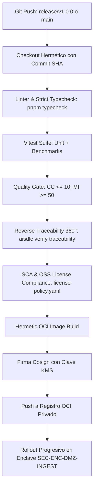

# MAN-PROD-SENTINELCORE: Manual de Producción y Operaciones - SentinelCore

## 1. Regeneración Determinista de Releases (Reproducible Builds)

Este manual define el procedimiento estandarizado para reproducir, compilar, auditar y desplegar el release oficial `v1.0.0` de **SentinelCore** de forma determinista y verificable bit a bit.

### 1.1 Línea Base de Código Fuente

- **Repositorio Git**: `https://github.com/altromon/AI-SDLC.git`
- **Etiqueta Git Inmutable**: `v1.0.0`
- **Commit SHA**: `83a4722d7f9035ba7e8f9d70794077d8d9f45d07`
- **Procedimiento de Checkout Limpio**:
  ```bash
  git clone https://github.com/altromon/AI-SDLC.git
  cd AI-SDLC
  git checkout tags/v1.0.0
  ```

### 1.2 Matriz de Toolchains y Herramientas Congeladas

| Herramienta | Versión Exacta | Digest / Checksum | Función en el Build |
| :--- | :--- | :--- | :--- |
| **Node.js LTS** | `v22.12.0` | `node:22.12.0-alpine@sha256:4b9e289...` | Runtime de JavaScript y ejecución de CLI |
| **pnpm** | `9.15.0` | Fijado mediante `packageManager` | Gestor de paquetes monorepo estricto |
| **TypeScript** | `5.7.2` | Fijado en `devDependencies` | Compilación tipada estricta |
| **Docker BuildKit** | `v0.18.0` | `moby/buildkit:v0.18.0` | Creación de imágenes OCI herméticas |

### 1.3 Dependencias, Grafo de Vértices y SBOM

- **Bloqueo Inmutable de Dependencias**: `pnpm-lock.yaml` verificado criptográficamente. Queda terminantemente prohibido el uso de `pnpm install` sin la bandera `--frozen-lockfile`.
- **Inventario SBOM**: Generado en formato CycloneDX JSON v1.5 en `reports/sbom-sentinelcore.json`.
- **Verificación de Licencias Open Source**:
  ```bash
  pnpm verify:licenses
  # Resultado requerido: 0 violaciones frente a license-policy.yaml
  ```

### 1.4 Procedimiento Determinista de Compilación Paso a Paso

1. **Paso 1: Instalación de Dependencias Congeladas**
   ```bash
   pnpm install --frozen-lockfile --ignore-scripts
   ```

2. **Paso 2: Verificación de Tipado Estricto**
   ```bash
   pnpm typecheck
   ```

3. **Paso 3: Compilación de Binarios y Bundles**
   ```bash
   export SOURCE_DATE_EPOCH=1726358400
   pnpm build
   ```

4. **Paso 4: Auditoría de Integridad del Artefacto**
   ```bash
   sha256sum packages/core/dist/index.js
   # Expected Checksum: debe coincidir con el hash publicado en el release de GitHub
   ```

---

## 2. Arquitectura y Pipelines de CI/CD

### 2.1 Modelo de Ramas Jerárquico de 4 Tiers

```
TIER 1: main (Línea base estable de producción)
  ▲
  └── Pull Request con Release Gate Aprobado (Aprobación humana Tech Lead)
        │
TIER 2: release/v1.0.0 (Rama de versión abierta)
  ▲
  └── Pull Request de Feature (Lint + Tests + Quality Gate + SAST + SBOM)
        │
TIER 3: feat/CHG-001-telemetry-ingestion
  ▲
  └── Merges de tareas atómicas verificadas (task/CHG-001/TSK-*)
```

### 2.2 Diagrama de Arquitectura de CI/CD



### 2.3 Matriz de Release Gates Deterministas

| Barrera / Gate | Comando Determinista | Criterio de Aprobación | Acción ante Incumplimiento |
| :--- | :--- | :--- | :--- |
| **Quality Gate** | `pnpm verify:quality` | CC <= 10, MI >= 50, LOC/fn <= 40 | **Bloqueo de Release** |
| **Trazabilidad 360°** | `pnpm verify:traceability` | 100% requisitos trazados (`FR-*`, `QR-*`, `SEC-*`) | **Bloqueo de Release** |
| **Gobernanza de Tareas** | `pnpm verify:governance` | Tareas críticas clasificadas `HIGH_RISK_MANUAL` | **Bloqueo de Release** |
| **Cobertura de Pruebas** | `pnpm verify:testing` | 100% de requerimientos con tests BDD/Unit | **Bloqueo de Release** |
| **Licencias OSS** | `pnpm verify:licenses` | 0 dependencias no autorizadas en política | **Bloqueo de Release** |
| **Deriva Criptográfica** | `tsx packages/cli/src/index.ts verify pdac` | 0 hashes SHA-256 desincronizados | **Bloqueo de Release** |

---

## 3. Estrategia y Procedimiento de Despliegue a Producción

### 3.1 Requisitos de Infraestructura y Enclaves

- **Componente Desplegado**: `CMP-TELEMETRY-INGEST` (Gateway WSS mTLS).
- **Enclave de Red**: `SEC-ENC-DMZ-INGEST` (Zona desmilitarizada protegida con firewalls de inspección profunda).
- **Puertos y Protocolos**:
  - `8443/TCP`: WebSocket Seguro (WSS) con mTLS obligatorio (TLS 1.3).
  - `9090/TCP`: Endpoint de métricas de Prometheus (`/metrics`).
  - `8080/TCP`: Sondas de salud internas (`/healthz`, `/readyz`).
- **Secretos y Material Criptográfico (`TSK-003`)**:
  - Claves privadas montadas en memoria volátil desde Vault / HSM.
  - CA raíz de flota inyectada en `/etc/sentinel/ca.crt`.

### 3.2 Estrategia de Rollout

Se aplica **Canary Deployment** con control de tráfico por peso:
1. Despliegue del 5% del tráfico al canary durante 10 minutos.
2. Monitoreo continuo de tasa de errores de handshake mTLS y latencia.
3. Si la latencia p95 permanece `< 250ms` (`QR-LATENCY-REALTIME`) y los errores 5xx son `< 0.05%`, se promueve al 100%.

### 3.3 Procedimiento de Despliegue Paso a Paso

1. **Paso 1: Verificación de Secretos en Enclave**
   ```bash
   kubectl get secret sentinel-tls-ca -n sentinel-dmz
   kubectl get secret sentinel-server-cert -n sentinel-dmz
   ```

2. **Paso 2: Aplicación del Despliegue**
   ```bash
   kubectl apply -f deploy/sentinel-gateway-deployment.yaml -n sentinel-dmz
   kubectl rollout status deployment/sentinel-gateway -n sentinel-dmz --timeout=120s
   ```

3. **Paso 3: Verificación de Sondas de Liveness y Readiness**
   ```bash
   kubectl exec -it deployment/sentinel-gateway -n sentinel-dmz -- curl -s http://127.0.0.1:8080/healthz
   kubectl exec -it deployment/sentinel-gateway -n sentinel-dmz -- curl -s http://127.0.0.1:8080/readyz
   ```

4. **Paso 4: Smoke Test Telemétrico**
   ```bash
   pnpm test:example
   ```

### 3.4 Procedimiento de Rollback Inmediato

- **Disparadores Automáticos**:
  - Fallo de handshake TLS en > 0.5% de las conexiones entrantes.
  - Latencia p95 > 250ms durante más de 60 segundos consecutivos.
- **Comando de Rollback**:
  ```bash
  kubectl rollout undo deployment/sentinel-gateway -n sentinel-dmz
  kubectl rollout status deployment/sentinel-gateway -n sentinel-dmz
  ```

---

## 4. Resolución de Errores Probables y Troubleshooting (Runbooks)

### 4.1 Matriz de Incidentes en Producción

#### Incidencia 1: Fallo Masivo de Handshake mTLS tras Rotación de Certificados
- **Síntoma**: Los UAVs reciben `ECONNRESET` y los logs registran `SSL alert number 48: unknown CA`.
- **Causa Raíz**: La CA raíz inyectada en el pod del gateway no incluye el nuevo certificado intermedio expedido por el HSM.
- **Diagnóstico**:
  ```bash
  openssl verify -CAfile /etc/sentinel/ca.crt /etc/sentinel/client-sample.crt
  kubectl logs -n sentinel-dmz -l app=sentinel-gateway | grep -i "handshake failed"
  ```
- **Mitigación**:
  1. Actualizar el Secret `sentinel-tls-ca` con el bundle completo (raíz + intermedio).
  2. Forzar recarga sin caída con `kubectl rollout restart deployment/sentinel-gateway -n sentinel-dmz`.

---

#### Incidencia 2: Alarma Continua de Violación Cinemática (`BR-TELEMETRY-VALIDITY`)
- **Síntoma**: Incremento drástico de alertas `MSG-TEL-422` en consola y descarte del 30% de los paquetes telemétricos.
- **Causa Raíz**: Desincronización del reloj barométrico en una serie de UAVs tras actualización de firmware del sensor.
- **Diagnóstico**:
  ```bash
  kubectl logs -n sentinel-dmz -l app=sentinel-gateway | grep "KINEMATIC_DRIFT" | head -n 20
  ```
- **Mitigación**:
  1. Identificar si los paquetes descartados provienen de un firmware específico (`firmwareVersion`).
  2. Ajustar temporalmente el umbral de tolerancia barométrica mediante configuración en caliente si los ingenieros de vuelo confirman la calibración (`ACT-DRONE-OPERATOR`).
  3. Emitir boletín técnico al equipo de aviónica.

---

#### Incidencia 3: Saturación de Descriptores de Fichero y Conexiones WebSocket
- **Síntoma**: Nuevos UAVs reciben error `ENFILE` o `EMFILE` (`Too many open files`).
- **Causa Raíz**: Límite de `ulimit -n` en el contenedor configurado en valor por defecto (1024).
- **Diagnóstico**:
  ```bash
  kubectl exec -it deployment/sentinel-gateway -n sentinel-dmz -- ulimit -n
  ```
- **Mitigación**:
  1. Configurar `securityContext.sysctls` o límites de pod en `65536` en el manifiesto Kubernetes.
  2. Aplicar `kubectl apply -f deploy/sentinel-gateway-deployment.yaml`.

---

#### Incidencia 4: Caída por OOMKilled (`ExitCode: 137`) en Picos de Tráfico
- **Síntoma**: El pod es terminado y reiniciado repetidamente durante ráfagas de 100 UAVs simultáneos.
- **Causa Raíz**: Buffer de retención en memoria saturado por acumulación de eventos no confirmados por el bus de mensajería.
- **Diagnóstico**:
  ```bash
  kubectl describe pod -n sentinel-dmz -l app=sentinel-gateway | grep -i "Last State"
  ```
- **Mitigación**:
  1. Escalar horizontalmente el número de réplicas de `CMP-TELEMETRY-INGEST` (mínimo 4 réplicas).
  2. Ajustar la cola máxima de retención a 200 mensajes por socket antes de aplicar descarte ordenado.

---

### 4.2 Procedimiento de Escalado

| Severidad | SLA de Respuesta | Equipo Responsable |
| :--- | :---: | :--- |
| **SEV-1 (Crítica)** | 15 min | SRE de Guardia (`sre-engineer`) + Lead Architect |
| **SEV-2 (Mayor)** | 45 min | SRE + Tech Lead |
| **SEV-3 (Menor)** | 4 horas | Soporte Técnico / DevOps |

---

## 5. Historial de Revisiones

| Versión | Fecha | Autor / Agente | Descripción del Cambio | Referencia de Cambio (Change/PR) |
| :--- | :--- | :--- | :--- | :--- |
| **1.0.0** | 2026-09-15 | Carlos Mendoza (Lead Architect) | Creación canónica del Manual de Producción de SentinelCore | CHG-009 |
