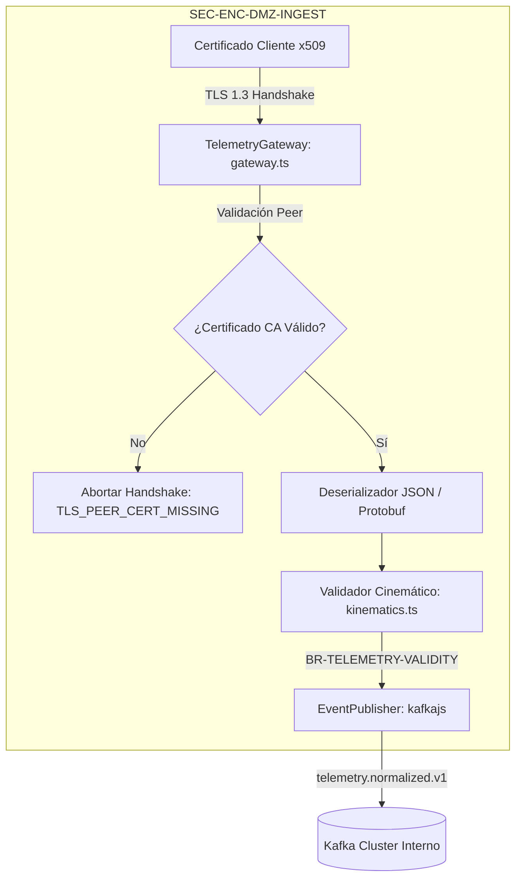

# Diseño Técnico: CHG-001-TELEMETRY-INGESTION

## 1. Mapeo Arquitectónico y Enclave Zero Trust
El componente se despliega en el enclave perimetral **`SEC-ENC-DMZ-INGEST`** y materializa el servicio **`SRV-TELEMETRY-INGEST`** (arc42 Sección 5 / NAF Services):



---

## 2. Contratos de Datos e Interfaces

### A. DTOs Principales (`src/telemetry/kinematics.ts`)
```typescript
export interface GeoPosition {
  latitude: number;
  longitude: number;
  altitudeMeters: number;
}

export interface TelemetryFrame {
  droneId: string;
  timestampMs: number;
  position: GeoPosition;
  speedMps: number;
}

export interface KinematicValidationResult {
  isValid: boolean;
  errorCode?: string;
  calculatedSpeedMps?: number;
}
```

### B. Contrato de Conexión Segura (`src/telemetry/gateway.ts`)
```typescript
export interface ClientCertificateInfo {
  authorized: boolean;
  subjectCommonName: string;
  hardwareUuid: string;
  issuerOrg: string;
}

export interface IngestionResponse {
  accepted: boolean;
  status: 'PROCESSED' | 'UNAUTHORIZED' | 'INVALID_KINEMATICS';
  errorCode?: string;
}
```

---

## 3. Protocolos de Manejo de Errores y Mitigación

1. **Fallo de Certificado Cliente (`SEC-TEST-001` / `SEC-TEST-002`)**:
   - Si no se suministra certificado o es inválido, `verifyTlsPeer()` aborta con `TLS_PEER_CERT_MISSING` o `UNKNOWN_CA`, retornando código HTTP `UNAUTHORIZED` y abortando el stream.
2. **Violación Cinemática (`BR-TELEMETRY-VALIDITY`)**:
   - Se evalúa la distancia ortodrómica (fórmula de Haversine) entre dos tramas sucesivas separadas por $\Delta t$. Si la velocidad aparente excede $150\text{ m/s}$, se descarta con `NACK-INVALID-KINEMATICS`.

---

## 4. Conformidad con la Política de Licencias (`license-policy.yaml`)
Todas las librerías empleadas en la implementación son de uso libre comercial:
- `ws`: MIT (Permitida)
- `pino`: MIT (Permitida)
- `kafkajs`: Apache-2.0 (Permitida)

---

## 5. Historial de Revisiones

| Versión | Fecha | Autor | Descripción del Cambio | Referencia |
| :--- | :--- | :--- | :--- | :--- |
| **1.0.0** | 2026-09-03 | Carlos Mendoza | Diseño técnico formal del gateway de telemetría | CHG-001 |
