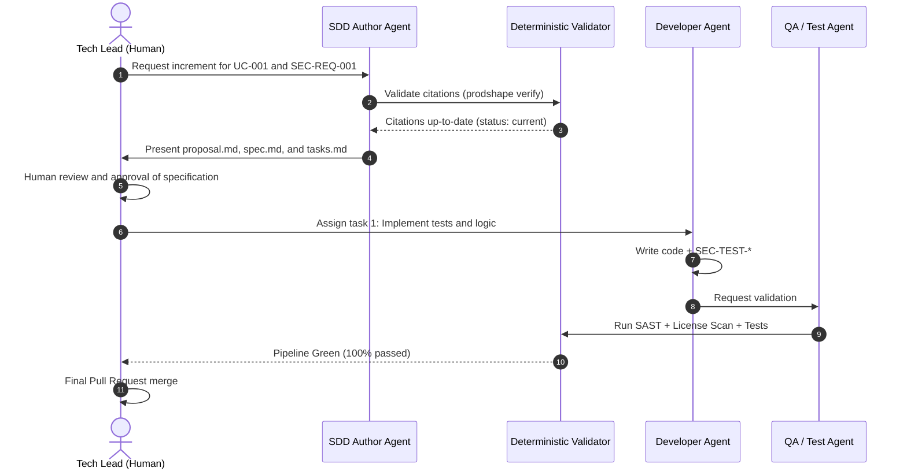

# 06. Delivery and Implementation: Spec-Driven Development (SDD)

## 1. The Bridge Between Definition and Code

Spec-Driven Development (SDD) is the standard ensuring that **AI agents never write code directly from ambiguous ideas or unstructured prompts**.

An SDD increment answers a well-bounded question:
> *How does this specific increment modify the software to fulfill the approved requirements?*

The SDD increment **inherits and cites** the canonical baseline (Product, Architecture, and Cybersecurity), establishes the concrete implementation design, and defines atomic tasks executable by agents.

---

## 2. Anatomy of an SDD Increment (Spec-Delta)

Each delivery change is organized in an isolated directory (`specs/changes/active/<change-id>/`) with four canonical documents and its sidecar file:

```
specs/changes/active/chg-001-telemetry-stream/
├── proposal.md       # Motivation, increment scope, and canonical links
├── spec.md           # Delivery requirements and test scenarios
├── design.md         # Low-level decisions, APIs, and data structures
├── tasks.md          # Sequential list of atomic tasks for agents
└── handoff.yaml      # Canonical PDaC sidecar (HOF-*) with subgraph and SHA-256 citations
```

> **Automated Scaffolding:**
> Rather than manually creating folders and copying templates, the composite command:
> ```bash
> npx aisdlc change new "<Name>" [--from <ID>]
> ```
> (or its alias `npx aisdlc sdd new ...`) deterministically generates the complete structure, computes the incremental sequence (`chg-XXX-...`), resolves or creates cited requirements calculating their real SHA-256 hashes, and deposits the `handoff.yaml` sidecar validated against JSON schemas.

### 1. `proposal.md`
- Change rationale, delivered value, and impact analysis.
- **Mandatory Citations**: IDs and digests of involved use cases (`UC-*`), functional requirements (`FR-*`), security requirements (`SEC-REQ-*`), and architecture building blocks (`SRV-*`).

### 2. `spec.md`
- Detailed expected behavior using executable specifications (Given-When-Then / Gherkin format or assertion scenarios).
- Explicitly includes **security mitigation scenarios** derived from abuse cases (`ABUSE-*`).

### 3. `design.md`
- Direct mapping to arc42 / NAF v4 architecture blocks (`SRV-*`, `SYS-*`).
- Interface signatures, data models, error handling, endpoints, and library selection permitted by `license-policy.yaml`.

### 4. `tasks.md`
- Structured breakdown of **atomic and 100% verifiable tasks** validated by `schemas/sdd/tasks.schema.json`.
- Each task mandatorily declares:
  1. **Complexity and Risk Level**: `LOW`, `MEDIUM`, `HIGH`, `CRITICAL`.
  2. **Human Autonomy Mode**:
     - `AUTONOMOUS`: Autonomous planning and execution by the AI agent.
     - `HUMAN_REVIEW_PLAN`: The agent creates the plan and pauses; requires human approval prior to coding.
     - `AMBIGUOUS`: Task blocked due to missing requirements or ambiguity; requires prior refinement with user.
     - `HIGH_RISK_MANUAL`: Critical risk task (destructive migrations, credentials); execution reserved exclusively to human engineers.
  3. **Concrete Verification Criterion**: Deterministic command or objective test marking the task complete (`npm test`, `npx cucumber-js`, `npx tsx scripts/verify-quality-gate.ts`).
- Automatically audited by [`scripts/verify-tasks-governance.ts`](file:///c:/Users/reypo/Documents/Workspace/AI-SDLC/scripts/verify-tasks-governance.ts).

---

## 3. Surgical Context Injection for AI Agents

A primary root cause of hallucinations in coding agents is context overload or contamination ("repo dumping").

The AI-SDLC citation model enables **surgical context injection**:
1. The developer agent receives **only**:
   - The current task's `spec.md` and `design.md`.
   - The verified canonical extract of cited artifacts (`FR-*`, `SEC-REQ-*`, `SRV-*`).
   - The licensing policy `license-policy.yaml`.
2. The agent never needs to search hundreds of scattered files or guess requirements; its operational context is strictly bounded and cryptographically coupled by hashes.

---

## 4. SDD Delivery Execution Lifecycle



---

## 5. Automated Requirements Integration with Cucumber (BDD)

To keep requirements from becoming passive documentation, AI-SDLC adopts **Gherkin** syntax as its native standard for acceptance criteria:

1. **Specification in Markdown**:
   - Each requirement (`FR-*`, `QR-*`, `SEC-REQ-*`) includes a ````gherkin ... ```` block with tags (`@FR-001`, `@automated`, `@smoke`).
2. **Automated Extraction by Convention**:
   - Using the deterministic extractor `npx aisdlc gherkin extract --all` or the unified pre-flight command `npx aisdlc check --fix`, the framework extracts or synchronizes Cucumber `.feature` files in `tests/features/` following folder conventions (e.g., `tests/features/product/<id>.feature`), without requiring tightly coupled physical paths in Markdown requirements.
3. **Execution and Closing the Loop**:
   - Developer and QA agents generate corresponding step definitions in Cucumber.js / Cucumber-JVM.
   - The CI/CD pipeline runs `cucumber-js` as a mandatory quality gate, guaranteeing that implemented software exactly satisfies product scenarios.
4. **Mandatory Pre-Flight Verification (`aisdlc check --fix`)**:
   - Prior to opening a Pull Request, the developer or agent runs `npx aisdlc check --fix` to automatically extract outdated scenarios, synchronize PDaC citation digests, and verify all Quality Gates pass in a single console dashboard.

---

## 6. Formal Adapters for SDD Ecosystems (OpenSpec and Spec Kit)

AI-SDLC structures its `specs/` directory connecting to established Spec-Driven Development ecosystems (OpenSpec and GitHub Spec Kit), depositing the product subgraph as sidecar files within the change workspace:

1. **OpenSpec and Spec Kit Integration**:
   - Employs formal adapters (`OpenSpecAdapter` and `SpecKitAdapter`, conceptually compatible with `@prodshape/integration-openspec` and `@prodshape/integration-speckit`) to deposit `handoff.yaml` inside `specs/changes/active/<change-id>/` or `specs/<change-id>/`.
   - Each `handoff.yaml` file encapsulates the immutable delivery subgraph emitted by PDaC, prefixed with `HOF-*` (e.g., `HOF-001-TELEMETRY-INGESTION`), declaring requirements (`FR-*`, `QR-*`, `SEC-REQ-*`), use cases (`UC-*`), business rules (`BR-*`), and citations with SHA-256 digests.

2. **Automated 360° Traceability via Inverted Lookup**:
   - The `aisdlc verify traceability` verifier and `scripts/verify-traceability.ts` eradicate brittle string-matching heuristics and decouple requirements from concrete implementation. They rigorously verify complete coverage across three dimensions via reverse lookup:
     - **Product (Upstream)**: Every requirement declares upstream dependencies (`derives-from: [UC-*]`, `mitigates: [ABUSE-*]`) and formally originates from a `HOF-*` package emitted by PDaC handoff.
     - **Architecture (Midstream)**: arc42 / NAF v4 architecture views where services (`SRV-*`) explicitly declare `satisfies-requirements: [FR-*, QR-*, SEC-REQ-*]`.
     - **Testing (Downstream)**: BDD/Gherkin suites (`.feature`) with scenarios tagged `@<reqId>` and test code suites (`.spec.*`, benchmarks) citing requirement IDs.
   - No requirement stores downstream pointers, shielding the canonical specification from SHA-256 hash drift when tests or services are refactored or reorganized.

3. **Post-Implementation Canonical Integration and CI/CD Automation**:
   - Once change implementation finishes and all tasks in `tasks.md` are verified `COMPLETED`:
     - Associated requirements in `specs/product/` are promoted to `active` status and receive a revision history entry referencing `changeId`.
     - Architecture specifications in `specs/architecture/` update their dependency maps and services satisfying requirements (`satisfies-requirements`).
     - The change directory is atomically archived to `specs/changes/completed/<change-id>/`.
     - If a specification proposal exists (`proposal.md`), its status is updated to `applied`.
   - **Unattended CI/CD Automation (`.github/workflows/sdd-integrate-on-merge.yml`)**:
     - To avoid misalignment from human omission prior to merge, the framework shifts canonical integration responsibility to the CI/CD pipeline following Pull Request merge into `main` or release branches (`release/*`).
     - **Automatic Detection Engine**: Deterministically identifies the active change analyzing hierarchically: PR source branch (`headRef`), PR title and body (`CHG-*`), modified files under `specs/changes/active/`, or the existence of a single active change with completed tasks.
     - **Git Security and Traceability**: Runs via GitHub Actions under least privilege permissions (`contents: write`). The bot (`github-actions[bot]`) makes an automated commit and push using conventional commits format `chore(sdd): integrate <change-id> into canonical baseline [skip ci]`.
     - **Developer Experience**: Engineers and agents do not need to manually run `sdd integrate` before opening a PR; once merged, running `git pull` locally synchronizes the updated canonical catalog.

4. **Operational CLI Commands**:
   - `npx aisdlc check [--fix] [--json]`: Executes the consolidated pre-flight suite across all Quality Gates with optional non-destructive auto-fix.
   - `npx aisdlc change new "<name>" [--from <id>] [--profile <patch|standard|critical>] [--json]`: Generates complete scaffolding for a new SDD change with the 4 templates and `handoff.yaml` sidecar.
   - `npx aisdlc sdd new "<name>"`: Convenient alias for `change new`.
   - `npx aisdlc sdd deposit --change <id> [--framework <openspec|speckit>] [--requirements <reqs>] [--json]`: Deposits the `handoff.yaml` sidecar into the active change.
   - `npx aisdlc sdd verify [--json]`: Audits conformity of all workspaces and handoff sidecars, running the duplicate pre-flight gate.
   - `npx aisdlc sdd integrate [--change <id>] [--auto] [--json]`: Integrates and promotes the completed change into canonical specifications (supports manual or auto-detection).
   - `npx aisdlc gherkin extract [--all] [--path <path>] [--json]`: Extracts and synchronizes Gherkin BDD scenarios to `.feature` files on disk.
   - `npx aisdlc init [directory] [--dry-run] [--ci <provider>] [--agents <list>] [--json]`: Initializes governance, schemas, and policies in a new repository.
   - `npx aisdlc verify all [--json]`: Executes all 9 deterministic Quality Gates outputting structured JSON or human-readable summary.

5. **Programmatic Consumption by AI Agents (`--json` and `AISDLC_FORMAT=json`)**:
   - **Pure JSON Output Without Escape Characters**: All commands (`check`, `sdd *`, `gherkin extract`, `init`, `verify *`) support `--json` or `-F, --format json`, strictly suppressing ANSI color codes (`picocolors`).
   - **Global Environment Variable**: Setting `export AISDLC_FORMAT=json` (or `AISDLC_OUTPUT=json`) activates structured JSON output across all CLI invocations transparently, allowing orchestrators, autonomous agents, and CI/CD pipelines to consume parseable payloads via `JSON.parse()` with standardized exit codes (0 = success, 1 = failure/violation).
