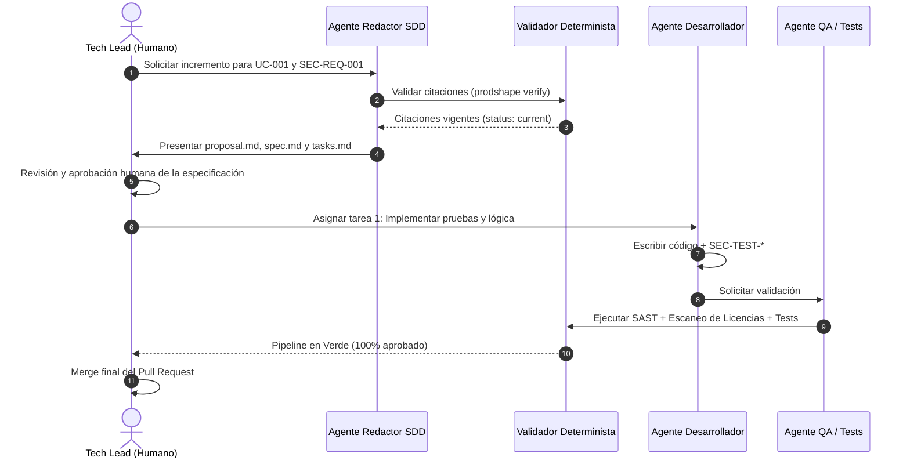

# 06. Entrega e Implementación: Spec-Driven Development (SDD)

## 1. El Puente entre la Definición y el Código

Spec-Driven Development (SDD) es el estándar que garantiza que **los agentes de IA nunca escriban código directamente a partir de ideas ambiguas o prompts desestructurados**. 

Un incremento SDD responde a una pregunta delimitada:
> *¿Cómo modifica este incremento específico el software para cumplir con los requerimientos aprobados?*

El incremento SDD **hereda y cita** la línea base canónica (Producto, Arquitectura y Ciberseguridad), establece el diseño concreto de implementación y define tareas atómicas ejecutables por agentes.

---

## 2. Anatomía de un Incremento SDD (Spec-Delta)

Cada cambio de entrega se organiza en un directorio aislado (`specs/changes/active/<change-id>/`) con cuatro documentos canónicos:

```
specs/changes/active/chg-001-telemetry-stream/
├── proposal.md       # Motivación, alcance del incremento y enlaces canónicos
├── spec.md           # Requisitos de la entrega y escenarios de prueba
├── design.md         # Decisiones de bajo nivel, APIs y estructuras de datos
└── tasks.md          # Lista secuencial de tareas atómicas para agentes
```

### 1. `proposal.md`
- Justificación del cambio, valor aportado y análisis de impacto.
- **Citaciones Obligatorias**: IDs y digests de los casos de uso (`UC-*`), requerimientos (`FR-*`), requisitos de seguridad (`SEC-REQ-*`) y bloques de arquitectura (`SRV-*`) involucrados.

### 2. `spec.md`
- Comportamiento esperado detallado mediante especificaciones ejecutables (formato Given-When-Then / Gherkin o escenarios de aserción).
- Incluye explícitamente **escenarios de mitigación de seguridad** derivados de los casos de abuso (`ABUSE-*`).

### 3. `design.md`
- Mapeo directo a los bloques de arquitectura arc42 / NAF v4 (`SRV-*`, `SYS-*`).
- Firma de interfaces, modelos de datos, manejo de errores, endpoints y selección de librerías permitidas por `license-policy.yaml`.

### 4. `tasks.md`
- Desglose estructurado de **tareas atómicas y 100% verificables** validadas por `schemas/delivery/tasks.schema.json`.
- Cada tarea declara obligatoriamente:
  1. **Nivel de Complejidad y Riesgo**: `LOW`, `MEDIUM`, `HIGH`, `CRITICAL`.
  2. **Modo de Autonomía Humana**:
     - `AUTONOMOUS`: Plan y ejecución autónoma por el agente de IA.
     - `HUMAN_REVIEW_PLAN`: El agente elabora el plan y se detiene; requiere aprobación humana previa antes de codificar.
     - `AMBIGUOUS`: Tarea bloqueada por falta de requisitos o ambigüedad; requiere refinamiento previo con el usuario.
     - `HIGH_RISK_MANUAL`: Tarea de riesgo crítico (migraciones destructivas, credenciales); ejecución reservada exclusivamente a ingenieros humanos.
  3. **Criterio de Verificación Concreto**: Comando determinista o prueba objetiva para dar la tarea por completada (`npm test`, `npx cucumber-js`, `verify-quality-gate.js`).
- Auditado automáticamente por [`scripts/verify-tasks-governance.js`](file:///c:/Users/reypo/Documents/Workspace/AI-SDLC/scripts/verify-tasks-governance.js).

---

## 3. Inyección de Contexto Quirúrgica para Agentes de IA

Uno de los mayores causantes de alucinaciones en agentes de codificación es la sobrecarga o contaminación de contexto ("dumping" de todo el repositorio). 

El modelo de citaciones del AI-SDLC permite una **inyección quirúrgica**:
1. El agente programador recibe **únicamente**:
   - El archivo `spec.md` y `design.md` de la tarea actual.
   - El extracto canónico verificado de los artefactos citados (`FR-*`, `SEC-REQ-*`, `SRV-*`).
   - La política de licencias `license-policy.yaml`.
2. El agente no necesita buscar en cientos de archivos dispersos ni inferir requisitos; su universo operativo está estrictamente acotado y acoplado por hashes criptográficos.

---

## 4. Ciclo de Ejecución de una Entrega SDD



---

## 5. Integración Automatizada de Requerimientos con Cucumber (BDD)

Para que los requerimientos no sean texto pasivo, el AI-SDLC adopta la sintaxis **Gherkin** como estándar nativo de criterios de aceptación:

1. **Especificación en Markdown**:
   - Cada requerimiento (`FR-*`, `QR-*`, `SEC-REQ-*`) incluye un bloque ````gherkin ... ```` con etiquetas (`@FR-001`, `@automated`, `@smoke`).
2. **Extracción Automatizada**:
   - Mediante el extractor determinista `node scripts/extract-gherkin.js <archivo|--all>`, el framework genera o sincroniza archivos `.feature` de Cucumber en `tests/features/`.
3. **Ejecución y Cierre de Ciclo**:
   - Los agentes desarrolladores y de QA generan los step definitions correspondientes en Cucumber.js / Cucumber-JVM.
   - El pipeline de CI/CD ejecuta `cucumber-js` como una puerta de paso obligatoria, garantizando que el software implementado satisface exactamente los escenarios definidos en el producto.
