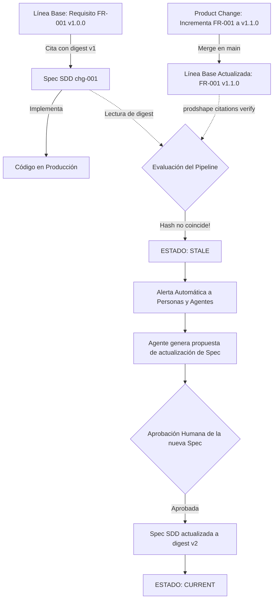

# 08. Contrato de Citación Criptográfica, Versionado Semántico y Detección de Deriva

## 1. El Modelo de Doble Versionado (Dual-Versioning Architecture)

Para garantizar la máxima trazabilidad en ecosistemas colaborativos donde intervienen personas, herramientas CLI y agentes de IA, el framework AI-SDLC implementa un **Modelo de Doble Versionado**:

```
┌────────────────────────────────────────────────────────────────────────┐
│                   MODELO DE DOBLE VERSIONADO AI-SDLC                   │
└────────────────────────────────────────────────────────────────────────┘

 1. VERSIONADO SEMÁNTICO Y AUDITABLE (SemVer + Changelog As-Code)
    ├── Campo 'version: "X.Y.Z"' en el frontmatter del artefacto.
    ├── Metadatos 'schema-version', 'supersedes' y 'superseded-by'.
    └── Tabla obligatoria de 'Historial de Revisiones' en el cuerpo Markdown.
    ► Propósito: Legibilidad humana inmediata, exportación de documentación,
                 y gestión del ciclo de vida (draft ➔ active ➔ deprecated ➔ retired).

 2. VERSIONADO CRIPTOGRÁFICO DETERMINISTA (Citations SHA-256)
    ├── Hash SHA-256 calculado sobre el contenido canónico normalizado (LF).
    └── Referencia en documentos consumidores: 'id + digest + anchor'.
    ► Propósito: Detección automática en CI/CD de derivas silenciosas (drift).
                 Si el texto cambia aunque la versión no se haya incrementado,
                 el pipeline detecta estado 'stale' de forma inmediata.

 3. HISTORIAL DE LÍNEA BASE EN CONTROL DE VERSIONES (Git)
    └── Commits firmados, PRs atómicos y tags de release en la rama principal.
```

---

## 2. Metadatos de Versionabilidad en Plantillas y Artefactos

Todo artefacto instanciado a partir de las plantillas de `templates/` debe declarar explícitamente sus metadatos de versión:

```yaml
---
id: ACT-DRONE-OPERATOR
type: actor
title: Operador de Vuelo de Drones
status: active
version: "1.0.0"          # SemVer obligatorio (MAJOR.MINOR.PATCH)
schema-version: "1.0"     # Versión de la especificación de esquema
supersedes: null          # Identificador del artefacto anterior si lo reemplaza
superseded-by: null       # Identificador del artefacto sucesor al pasar a retired
---
```

### Reglas SemVer para Artefactos:
- **MAJOR (`+1.0.0`)**: Modificación radical o ruptura de compatibilidad (ej. un caso de uso cambia su actor principal o precondiciones esenciales; una regla de negocio pasa de permisiva a estricta).
- **MINOR (`0.+1.0`)**: Extensión o enriquecimiento sin ruptura (ej. se añaden escenarios alternativos a un caso de uso, nuevos criterios de verificación a un requerimiento o interfaces a un servicio).
- **PATCH (`0.0.+1`)**: Aclaraciones editoriales, corrección de erratas sintácticas o refinamiento de redacción sin alterar el comportamiento normativo.

---

## 3. Tabla Obligatoria de Historial de Revisiones

Todo artefacto Markdown debe incluir al final de su cuerpo una sección estructurada:

```markdown
## Historial de Revisiones y Control de Versiones

| Versión | Fecha | Autor / Agente | Descripción del Cambio | Referencia de Cambio (Change/PR) |
| :--- | :--- | :--- | :--- | :--- |
| **1.0.0** | 2026-09-03 | Carlos Mendoza | Creación inicial de la línea base | CHG-INIT-001 |
| **1.1.0** | 2026-09-10 | Agente Analista | Incorporación de escenario de degradación | CHG-DEGRAD-002 |
```

Esta tabla permite que un agente de IA que analiza un archivo comprenda inmediatamente el contexto histórico y el motivo de las modificaciones sin necesidad de clonar o recorrer el historial complejo de Git.

---

## 4. Anatomía de una Citación Criptográfica

Un documento consumidor (una especificación SDD, un diseño técnico, un prompt de agente o una prueba de integración) **nunca reescribe el texto canónico**. En su lugar, emite un registro de citación:

```yaml
citations:
  - id: "FR-TELEMETRY-STREAM-001"
    digest: "sha256:50b17b58fc305bfd87f66c5d6c7f3496b24702b084e5b05495b7f1f79e9f4994"
    anchor: "SCENARIO-REALTIME-LATENCY"
    comment: "Garantiza la entrega de telemetría de drones en menos de 100ms."
  - id: "SEC-REQ-MTLS-STREAM"
    digest: "sha256:f756830542ce5b850f5042dba59b7e025efba889a5489051e086b7a9849dd33f"
    comment: "Autenticación mutua obligatoria mediante certificados x509."
```

### Componentes del Registro:
1. **`id`**: Identificador inmutable y canónico del artefacto citado (ej. `FR-001`, `UC-002`, `SRV-INGESTION`, `SEC-REQ-003`).
2. **`digest`**: Hash criptográfico **SHA-256** calculado sobre el contenido UTF-8 canónico del artefacto (normalizado con saltos de línea LF).
3. **`anchor` (Opcional)**: Ancla a un escenario específico dentro del artefacto (útil para pruebas concretas).
4. **`comment`**: Explicación breve contextual del motivo de la citación.

---

## 5. Estados de Verificación de una Citación

El validador determinista (`prodshape citations verify` o script del pipeline) recalcula los digests en tiempo real contra los archivos de la línea base y emite uno de los siguientes cuatro estados:

| Estado | Significado | Comportamiento del Sistema |
| :--- | :--- | :--- |
| **`current`** | El `id` existe y el hash `digest` coincide exactamente byte a byte con la línea base. | **Válido (Pass)**. La implementación está alineada con el producto y la arquitectura. |
| **`stale`** | El `id` existe, pero el hash `digest` difiere del actual en la línea base (el requisito cambió). | **Deriva detectada (Fail exit 2)**. La especificación debe reevaluarse antes de codificar. |
| **`unresolved`** | El `id` citado no existe en el grafo de producto ni de arquitectura. | **Enlace roto (Fail exit 1)**. Referencia a un artefacto inexistente o renombrado. |
| **`tampered`** | El registro de citación fue alterado manualmente sin reflejar la fuente original. | **Integridad violada (Fail exit 1)**. |

---

## 6. El Ciclo de Vida Libre de Deriva (Drift-Free Lifecycle)


