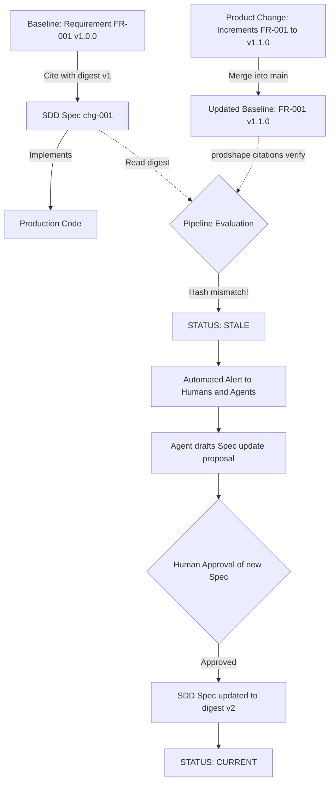

# 08. Cryptographic Citation Contract, Semantic Versioning, and Drift Detection

## 1. The Dual-Versioning Architecture

To ensure end-to-end traceability in collaborative environments involving humans, CLI tools, and AI agents, the AI-SDLC framework implements a **Dual-Versioning Architecture**:

```
┌────────────────────────────────────────────────────────────────────────┐
│                   AI-SDLC DUAL-VERSIONING ARCHITECTURE                 │
└────────────────────────────────────────────────────────────────────────┘

 1. AUDITABLE SEMANTIC VERSIONING (SemVer + Changelog As-Code)
    ├── Field 'version: "X.Y.Z"' in artifact frontmatter.
    ├── Metadata 'schema-version', 'supersedes', and 'superseded-by'.
    └── Mandatory 'Revision History' table in the Markdown body.
    ► Purpose: Immediate human readability, documentation export,
                 and lifecycle management (draft ➔ active ➔ deprecated ➔ retired).

 2. DETERMINISTIC CRYPTOGRAPHIC VERSIONING (SHA-256 Citations)
    ├── SHA-256 hash calculated over normalized canonical UTF-8 content (LF).
    └── Consumer document reference: 'id + digest + anchor'.
    ► Purpose: Automated CI/CD detection of silent semantic drift.
                 If text changes even without a version bump,
                 the pipeline flags a 'stale' state immediately.

 3. BASELINE HISTORY IN VERSION CONTROL (Git)
    └── Signed commits, atomic PRs, and release tags on the main branch.
```

---

## 2. Versioning Metadata in Templates and Artifacts

Every artifact instantiated from `templates/` must explicitly declare versioning metadata:

```yaml
---
id: ACT-DRONE-OPERATOR
type: actor
title: Drone Flight Operator
status: active
version: "1.0.0"          # Mandatory SemVer (MAJOR.MINOR.PATCH)
schema-version: "1.0"     # Schema specification version
supersedes: null          # Identifier of previous artifact if replaced
superseded-by: null       # Identifier of successor artifact when retired
---
```

### SemVer Rules for Artifacts:
- **MAJOR (`+1.0.0`)**: Radical modification or breaking change (e.g., a use case changes its primary actor or essential preconditions; a business rule shifts from permissive to strict).
- **MINOR (`0.+1.0`)**: Backward-compatible extension or enrichment (e.g., adding alternate scenarios to a use case, new verification criteria to a requirement, or interfaces to a service).
- **PATCH (`0.0.+1`)**: Editorial clarifications, syntax errata fixes, or wording refinements without altering normative behavior.

---

## 3. Mandatory Revision History Table

Every Markdown artifact must conclude with a structured revision history section:

```markdown
## Revision History and Version Control

| Version | Date | Author / Agent | Change Description | Change Reference (Change/PR) |
| :--- | :--- | :--- | :--- | :--- |
| **1.0.0** | 2026-09-03 | Carlos Mendoza | Initial baseline creation | CHG-INIT-001 |
| **1.1.0** | 2026-09-10 | Analyst Agent | Added degradation scenario | CHG-DEGRAD-002 |
```

This table allows an AI agent inspecting a file to immediately understand historical context and rationale without needing to clone or traverse Git commit history.

---

## 4. Anatomy of a Cryptographic Citation

A consuming document (an SDD specification, a technical design, an agent prompt, or an integration test) **never duplicates canonical text**. Instead, it emits a citation record:

```yaml
citations:
  - id: "FR-TELEMETRY-STREAM-001"
    digest: "sha256:50b17b58fc305bfd87f66c5d6c7f3496b24702b084e5b05495b7f1f79e9f4994"
    anchor: "SCENARIO-REALTIME-LATENCY"
    comment: "Guarantees drone telemetry delivery in under 100ms."
  - id: "SEC-REQ-MTLS-STREAM"
    digest: "sha256:f756830542ce5b850f5042dba59b7e025efba889a5489051e086b7a9849dd33f"
    comment: "Mandatory mutual authentication via x509 certificates."
```

### Citation Record Components:
1. **`id`**: Immutable canonical identifier of the cited artifact (e.g., `FR-001`, `UC-002`, `CMP-INGESTION`, `SEC-REQ-003`).
2. **`digest`**: Cryptographic **SHA-256** hash calculated over the normalized canonical UTF-8 content of the artifact (with LF line endings).
3. **`anchor` (Optional)**: Anchor pointing to a specific scenario inside the artifact (useful for targeted tests).
4. **`comment`**: Brief contextual explanation of citation rationale.

---

## 5. Citation Verification States

The deterministic validator (`prodshape citations verify` or pipeline scripts) recalculates digests in real-time against baseline files and outputs one of four verification states:

| State | Meaning | System Behavior |
| :--- | :--- | :--- |
| **`current`** | The `id` exists and the hash `digest` matches byte-for-byte with the baseline. | **Valid (Pass)**. Implementation is aligned with product and architecture. |
| **`stale`** | The `id` exists, but the hash `digest` differs from the baseline (requirement modified). | **Drift detected (Fail exit 2)**. Specification must be re-evaluated before coding. |
| **`unresolved`** | The cited `id` does not exist in the product or architecture graph. | **Broken link (Fail exit 1)**. References a non-existent or renamed artifact. |
| **`tampered`** | The citation record was manually altered without reflecting the original source. | **Integrity violation (Fail exit 1)**. |

---

## 6. The Drift-Free Lifecycle



---

## 7. Citation Packaging in Handoff Sidecars (`HOF-*`)

To decouple delivery agent workspaces (SDD) from scanning massive repositories, PDaC packages the subgraph and its canonical citations into a `handoff.yaml` sidecar file:

1. **Cryptographic Sidecar Structure**:
   - Each delivery receives a unique handoff identifier (`HOF-*`).
   - The file includes the canonical citation collection:
     ```yaml
     id: "HOF-001-TELEMETRY-INGESTION"
     citations:
       - id: "FR-TELEMETRY-STREAM-001"
         targetId: "FR-TELEMETRY-STREAM-001"
         digest: "sha256:50b17b58fc305bfd87f66c5d6c7f3496b24702b084e5b05495b7f1f79e9f4994"
     ```
2. **Invariance and Drift Detection**:
   - If a canonical baseline file is altered on `main`, the `aisdlc verify traceability` verifier detects the hash divergence against the active `handoff.yaml`, blocking delivery until handoff is re-emitted and approved.

3. **Immunity to False Drift via Inverted Traceability**:
   - Because canonical requirements do not store downstream pointers (such as concrete service or test file paths), product and security artifacts (`FR-*`, `QR-*`, `SEC-REQ-*`) remain unaffected by code refactoring or test reorganization.
   - This eliminates false drift alerts (*stale citations*) and ensures SHA-256 digests change only when real functional business specifications evolve.
