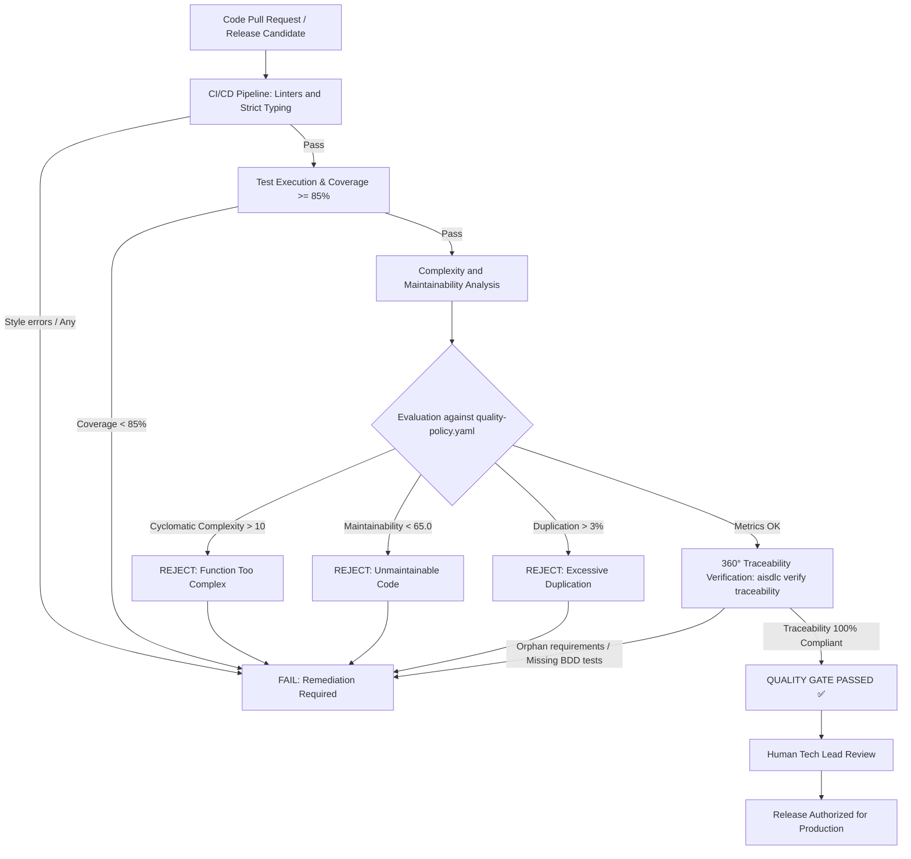

# 10. Quality Management, Coding Rules, and Release Gates

## 1. Quality Management in AI-SDLC: Software Quality as Code

The exponential speed with which AI agents generate code introduces severe risks of rapid structural degradation unless strict controls are enforced.

**In the AI-SDLC framework, software quality is not a subjective aspiration; it is an auditable, declarative policy enforced through deterministic tooling (`quality-policy.yaml`)**.

The quality model is structured into **three lines of defense**:
1. **Coding Rules**: Prevention at design and authoring time.
2. **Standard Maintainability and Complexity Metrics**: Quantitative analysis of internal code architecture.
3. **Release Gates**: Relentless CI/CD gates that automatically block any version falling below defined thresholds.

---

## 2. Automated Coding Rules

Both human engineers and coding agents (`agent-developer`) must adhere to the following automated standards:

### A. Static Inspection Engines
- **TypeScript / JavaScript**: ESLint (strict profile with `@typescript-eslint/recommended-requiring-type-checking`) and Prettier for deterministic formatting.
- **Python**: Ruff / Flake8 and Black.
- **Java / C# / Go**: SonarQube Quality Profile, Spotless / golangci-lint.

### B. Mandatory Coding Rules
1. **Zero Tolerance for Weak Typing (`no-explicit-any`)**: Insecure generic types or opaque casts are prohibited.
2. **Zero Tolerance for Dead Code (`no-dead-code`, `no-unused-vars`)**: Unreferenced variables, imports, or functions cause immediate compilation/linter failures.
3. **Function Length Limit**: No function may exceed **40 effective lines of code**. Longer functions must be decomposed into cohesive helper methods.
4. **Prohibition of Silent Suppressions**: Adding suppression comments (`// @ts-ignore`, `// eslint-disable`, `# noqa`) without formal justification (`ADR-TECH-DEBT-*`) is strictly prohibited.

---

## 3. Standard Software Metrics and Release Thresholds

The framework quantitatively evaluates all source code against industry metrics standardized by IEEE, SEI, and ISO/IEC 25010:

```
┌────────────────────────────────────────────────────────────────────────┐
│                 STANDARD METRICS AND RELEASE THRESHOLDS                │
└────────────────────────────────────────────────────────────────────────┘

 1. CYCLOMATIC COMPLEXITY (McCabe)
    ├── Definition: Number of linearly independent paths through code.
    ├── Maximum Threshold: 10 per function.
    └── Violation Action: IMMEDIATE MERGE / RELEASE BLOCK.

 2. COGNITIVE COMPLEXITY (SonarSource)
    ├── Definition: Human difficulty in understanding and reasoning about control flow.
    ├── Maximum Threshold: 15 per function.
    └── Violation Action: IMMEDIATE MERGE / RELEASE BLOCK.

 3. MAINTAINABILITY INDEX (SEI / Microsoft / ISO 25010)
    ├── Definition: Composite score 0-100 based on Halstead, McCabe, and LOC.
    ├── Formula: MI = 171 - 5.2*ln(HV) - 0.23*CC - 16.2*ln(LOC)
    ├── Minimum Acceptable Threshold: 65.0 / 100 (Target: > 85.0).
    └── Violation Action: IMMEDIATE MERGE / RELEASE BLOCK.

 4. CODE DUPLICATION
    ├── Definition: Percentage of identical or near-identical repeated lines.
    ├── Maximum Threshold: 3.0%.
    └── Violation Action: IMMEDIATE MERGE / RELEASE BLOCK.

 5. AUTOMATED TEST COVERAGE
    ├── Line: Minimum 85.0% | Branch: Minimum 80.0%.
    └── Violation Action: IMMEDIATE MERGE / RELEASE BLOCK.

 6. 360° TRACEABILITY MATRIX (DETERMINISTIC REVERSE-LOOKUP RTM)
    ├── Definition: Total coverage compiled via reverse lookup across PDaC packages (HOF-*),
    │   arc42/NAF v4 architecture (satisfies-requirements), and test suites (.feature and .spec).
    ├── Principle: Inverted Dependency (requirements store no downstream links).
    ├── Mandatory Threshold: 100% compliant requirements without orphans or drift.
    └── Violation Action: IMMEDIATE MERGE / RELEASE BLOCK.
```

---

## 3.1 Real AST-Based Static Analysis Engine (Polyglot AST Engine)

To guarantee high-precision complexity and maintainability measurements without false positives, **AI-SDLC** avoids brittle regex and naive brace counting `{ }`, adopting a **Real Abstract Syntax Tree (AST)** architecture:

```text
┌───────────────────────────────────────────────────────────────────────────────────┐
│                 REAL AST STATIC ANALYSIS ENGINE ARCHITECTURE                      │
└───────────────────────────────────────────────────────────────────────────────────┘
    Polyglot Source Code (.ts, .tsx, .js, .jsx, .py, .go, .rs, .java, .cs, .c)
                                        │
                     ┌──────────────────┴──────────────────┐
                     ▼                                     ▼
       [TypeScript / TSX / JS Engine]           [Polyglot Token-Aware Scanner]
           Powered by ts-morph                  (Go, Rust, Java, C#, C/C++, Python)
   ├── AST Nodes: Functions, Methods, Classes   ├── Lexer states: quotes, raw strings
   ├── CC count via real conditional nodes      ├── Complete comment isolation (//, /*, #)
   ├── Cognitive complexity by nesting level    ├── Exact block boundary matching
   └── Smells: semantic any (SyntaxKind.Any)    └── Standardized metrics (CC, Cog, LOC, MI)
                     │                                     │
                     └──────────────────┬──────────────────┘
                                        ▼
                         [Deterministic Quality Gate (STRICT)]
                          CC <= 10 | Cog <= 15 | MI >= 50
```

### Technical Advantages and False Positive Elimination:
1. **Modern TSX/JSX Components**: Precise demarcation of functional components and event handlers without interference from JSX tags or complex prop objects (e.g., `style={{ backgroundColor: 'red' }}`).
2. **Template Literals with Nested Interpolation**: Native support for multiline expressions like `${{ key: val }}`, where interior braces previously misled regex parsers.
3. **Closures and Nested Functions**: Inner callbacks do not corrupt the outer function's line count or complexity metrics.
4. **Polyglot Resilience**: In Go, Rust, Java, and C#, braces `{` or `}` inside string literals (e.g., embedded JSON or raw strings `r#"..."#`) or comments never skew block balance.
5. **Typed `any` Detection**: Through `SyntaxKind.AnyKeyword`, prohibited `any` usage in TypeScript is flagged without false alarms on variable names like `company` or descriptive comments.

---

## 4. The Release Gate Mechanism (Constraints on Release)

Promoting a version to production (or merging a PR into `main`) must satisfy this deterministic state machine:



> [!NOTE]
> **Inverted Traceability Model in the Release Gate**:
> To eliminate fragile coupling and Git merge conflicts, product requirements (`FR-*`, `QR-*`, `SEC-REQ-*`) do not declare which services implement them or which test files verify them. The `aisdlc verify traceability` step inspects architecture blocks (`satisfies-requirements`) and scans test suites (`.feature` and `.spec.*`) to inversely assemble the complete RTM. If any requirement lacks an implementing service or test coverage, the Release Gate deterministically blocks the pipeline.

### 4.1 Mandatory Documentary Release Deliverables (Manuals As-Code)

Before a release candidate is approved for production deployment by the Tech Lead or Release Manager, the repository must contain up-to-date documentation compliant with JSON schemas (`schemas/manuals/`):

1. **User Manual (`MAN-USER-*`)**:
   - **User Role Catalog**: Canonical definition of authorized roles (`allowed-roles`), access levels, and RBAC matrix.
   - **Version and Client Compatibility Matrix**: Compatibility across backend versions, CLI, SDKs, approved browsers, and configuration formats.
   - **Role-to-Journey Mapping**: Every Journey (`JRN-*`) must declare which roles can initiate and complete it, including preconditions and alternate flows.
   - **Configuration Guide**: Parameters, environment variables, commented configuration files, and required credentials.
   - **Message Catalog**: Structured classification of informational messages, warnings, and errors with remediation steps.

2. **Production and Operations Manual (`MAN-PROD-*`)**:
   - **Reproducible Builds**: Pinned build toolchains with versions and checksums, frozen lockfiles, and license validation (`license-policy.yaml`).
   - **Infrastructure Compatibility and Migration Matrix**: Kubernetes/runtime compatibility, $N-1$ schema support for zero-downtime deployments, component interoperability (`CMP-*`), and upgrade/rollback paths.
   - **CI/CD Architecture**: End-to-end pipeline workflow, triggers, and deterministic release gates.
   - **Deployment Strategy and Procedure**: Network enclaves (`SEC-ENC-*`), mTLS secrets/certificates, health checks, and rollback plans.
   - **Runbooks for Operational Incidents**: Step-by-step troubleshooting for production issues (mTLS, OOM leaks, disconnections, network saturation).

3. **Enterprise Security, Safety, and Domain Artifacts (`schemas/`)**:
   - **Zero Trust Network Enclaves (`SEC-ENC-*`)**: Compliant with `schemas/security/enclave.schema.json`, delimiting trust zones, boundary rules, and inbound/outbound components.
   - **Operational Hazards and Risk Analysis (`HAZ-*`)**: Compliant with `schemas/safety/hazard.schema.json`, categorizing severity, probability, and Fault Tolerant Time Interval (FTTI).
   - **User and Operator Journeys (`JRN-*`)**: Compliant with `schemas/product/journey.schema.json`, mapping stages, touchpoints, and linked use cases.
   - **Ubiquitous Language Glossary Terms (`TERM-*`)**: Compliant with `schemas/product/term.schema.json`, binding canonical definitions by bounded context.

### 4.2 Progressive Friction Quality Gates

Release gates adapt governance friction according to the `profile` field declared in `spec.md` frontmatter:

```
┌────────────────────────────────────────────────────────────────────────┐
│                 PROGRESSIVE FRICTION QUALITY GATES                     │
└────────────────────────────────────────────────────────────────────────┘

 1. PATCH PROFILE (Low Friction / Hotfixes & Cosmetic Refactoring)
    ├── Frontmatter: profile: patch in spec.md
    ├── Mandatory Gates:
    │   • Linters and Strict Typing (zero errors / zero any).
    │   • Successful execution of verification command in spec.md.
    │   • Deterministic Anti-Patch Bypass Guardrail (100% free of protected paths).
    └── Formal Exemptions:
        • Exempt from reverse 360° RTM (does not require handoff.yaml).
        • Exempt from formal STRIDE threat modeling.
        • Exempt from updating MAN-USER-* and MAN-PROD-* manuals.

 2. STANDARD PROFILE (Nominal Friction / Standard Business Use Cases)
    ├── Frontmatter: profile: standard in spec.md
    └── Mandatory Gates:
        • Full CI/CD suite: Linters, typing, and unit tests.
        • Code quality: CC <= 10, MI >= 50, Duplication <= 3%, Coverage >= 85%.
        • 360° RTM Compliant (reverse lookup across HOF-*, arc42, and .feature).
        • All tasks in tasks.md in COMPLETED state.

 3. CRITICAL PROFILE (High Friction / Cryptography, Secrets, and Enclaves)
    ├── Frontmatter: profile: critical in spec.md
    └── Mandatory Gates:
        • 100% of Standard Profile gates.
        • Approved formal STRIDE / OWASP ASVS threat model.
        • Formally approved Architecture Decision Record (ADR-*).
        • Zero Trust enclave verification (SEC-ENC-*).
        • Dual human sign-off on PR (Tech Lead + SecOps/Architect).

 4. DETERMINISTIC ANTI-PATCH BYPASS GUARDRAIL
    ├── Trigger: Change declared with profile: patch in spec.md.
    ├── Immediate Failure Condition: Diff touches any of:
    │   • schemas/**
    │   • quality-policy.yaml or license-policy.yaml
    │   • examples/security/** or enclaves SEC-ENC-*
    │   • Database migrations or persistent schema definitions
    └── Action: AUTOMATIC CI/CD REJECTION (EXIT 1) with reclassification requirement.
```

### 4.3 Unified Pre-Flight Command with Auto-Fix (`aisdlc check --fix`)

To prevent mechanical CI/CD failures caused by minor synchronization gaps (Gherkin scenarios edited in Markdown but unextracted to `.feature`, or minor SHA-256 digest shifts after formatting adjustments), engineers and AI agents run the pre-flight command before opening or updating a PR:

```bash
npx aisdlc check --fix
```

#### Execution Phases:
1. **Automated Non-Destructive Pre-Synchronization**:
   - **BDD Extraction**: Detects if ` ```gherkin ` blocks in product or security specifications differ from `.feature` files on disk and automatically synchronizes them.
   - **PDaC Anti-Drift Sync**: Synchronizes SHA-256 cryptographic digests of canonical citations (`citations: - id: ... digest: ...`) if target content exists and is valid.
2. **Consolidated Quality Gate Execution**:
   - Deterministically executes all master verifiers:
     - Code quality (CC $\le 10$, MI $\ge 50$, LOC $\le 40$).
     - 360° reverse RTM traceability (zero orphan requirements).
     - Task governance and autonomy modes (`tasks.md`).
     - Test coverage across requirements and tasks.
     - Open source license compliance with `license-policy.yaml`.
     - PDaC cryptographic integrity free of digest drift.
     - Formal JSON schema compliance (Draft 2020-12).
3. **Actionable Console Dashboard**:
   - Outputs a visual summary of gate statuses (`PASSED`, `AUTO-FIXED`, `FAILED`).
   - If non-recoverable blocking errors occur, details root causes and remediation commands with deterministic exit codes (0 on success, 1 on violations).

---

## 5. Exception Policy and Technical Debt Management

If for extreme performance reasons (e.g., graphics processing loops or low-level telemetry parsers) a function must exceed cyclomatic complexity of 10:
1. **Mandatory Procedure**:
   - A **Technical Debt ADR** must be registered (`docs/architecture/09_decisions/ADR-TECH-DEBT-*.md`).
   - The ADR must include: impact justification, comparative benchmark, and mitigation plan with refactoring milestone/deadline.
2. **Authority**:
   - Only the **Lead Architect** and **human Tech Lead** may grant an exception. AI agents cannot self-grant quality exemptions.

---

## 6. Automated Quality Report Generation (Quality Scorecard as Code)

The framework can **automatically generate formal quality reports** as soon as code is authored or modified by a developer or agent:

### A. Automatic Generation Command
```bash
# 1. Global project report
npx tsx scripts/generate-quality-report.ts

# 2. Scoped to a specific SDD change
npx tsx scripts/generate-quality-report.ts --change chg-001-telemetry-ingestion --target src/telemetry

# 3. Custom output destination
npx tsx scripts/generate-quality-report.ts --target src/ --output reports/SPRINT_QUALITY.md
```

### B. Generated Report Contents
The generated document (`reports/QUALITY_REPORT.md` or `specs/changes/active/<chg-id>/quality-report.md`) provides:
1. **Global Rating (SQALE Rating A-F)** based on weighted metrics.
2. **Deterministic Release Gate Verdict** (`AUTHORIZED (PASS)` or `BLOCKED (FAIL)`).
3. **Graphical Cyclomatic Complexity Distribution** (Low [1-5], Moderate [6-10], Critical [>10]).
4. **Per-Function Breakdown Table**: SLOC, Cyclomatic Complexity, Cognitive Complexity, Maintainability Index, and code smell detection.
5. **Actionable Refactoring Guidance**: If Release Gate fails, the report automatically provides decomposition prompts for AI agents to resolve violations without manual intervention.

---

## 7. Polyglot Quality Architecture (Polyglot Support)

The AI-SDLC framework is conceived as a **universal polyglot platform**. Neither methodology nor validation mechanisms are bound to a single programming language.

### A. Framework Neutrality Levels

```
┌────────────────────────────────────────────────────────────────────────┐
│                     POLYGLOT QUALITY ARCHITECTURE                      │
└────────────────────────────────────────────────────────────────────────┘

 1. METHODOLOGICAL & CONCEPTUAL LAYER (100% Language-Agnostic)
    ├── Product Definition: ProductShape in Markdown + JSON Schema
    ├── Systems Architecture: arc42 (12 sections) + NAF v4 Grid
    ├── Shift-Left Cybersecurity: STRIDE, OWASP ASVS, DMZ Enclaves
    ├── License Governance: SPDX, allowlist/denylist, CycloneDX SBOM
    └── BDD Criteria: Standard Gherkin (.feature) runnable on any test runtime

 2. NATIVE EMBEDDED ENGINE (Out-of-the-box in scripts/)
    ├── Universal parser for McCabe (CC), MI, and LOC metrics
    └── Supported languages:
        • TypeScript / JavaScript (.ts, .js)
        • Python (.py)
        • Java / Kotlin (.java, .kt)
        • Go (.go)
        • C# (.cs)
        • Rust (.rs)
        • C / C++ (.c, .cpp)

 3. NATIVE ECOSYSTEM ADAPTERS AND ENTERPRISE STANDARDS
    ├── Python: Ruff, Black, Radon, Xenon, PyTest, Coverage.py
    ├── Java: Checkstyle, SpotBugs, PMD, JUnit 5, JaCoCo
    ├── Go: golangci-lint, gocyclo, go test -cover
    ├── C#/.NET: dotnet format, Roslyn Analyzers, Coverlet
    ├── Rust: cargo clippy, rustfmt, cargo-tarpaulin
    └── Enterprise Aggregators: SonarQube / SonarCloud and SARIF format (OASIS)
```

### B. Ecosystem Mapping in `quality-policy.yaml`

The configuration file allows orchestrating language-specific linters and coverage engines while maintaining homogeneous quantitative thresholds (`CC <= 10`, `MI >= 50`, `Coverage >= 85%`).

### C. The Universal SARIF Standard (Static Analysis Results Interchange Format)
For enterprise integrations, AI-SDLC adopts the **SARIF (JSON OASIS)** standard. Any analyzer from any language ecosystem (Roslyn, Clang-Tidy, ESLint, Bandit, Flake8) can output diagnostics in SARIF format, seamlessly ingested by the release pipeline.

---

## 8. Commit Telemetry, KPI Aggregation, and Cost of Quality (Rework & DIR)

To govern human-agent co-development with economic and technical visibility, the framework implements an automated **Three-Tier Telemetry System**:

```text
┌────────────────────────────────────────────────────────────────────────┐
│               DETERMINISTIC TELEMETRY AND QUALITY CONTROL              │
└────────────────────────────────────────────────────────────────────────┘

 1. COMMIT LEVEL (Zero-Friction Injection via Git Hook)
    ├── Hook: .git/hooks/prepare-commit-msg (installed via `aisdlc git hook install`)
    ├── Authorship Detection: Human vs. Agent (LLM model)
    └── Immutable Trailers: Task-ID, Parent-Ref, Tokens (Prompt/Completion), Active-Time

 2. PULL REQUEST LEVEL (Automated Aggregation)
    ├── Command: `aisdlc kpi pr` (and GitHub Actions workflow pr-kpi-summary.yml)
    ├── Grouping: Breakdown of commits, lines (+/-), time, and tokens per author/model
    └── Injection: Section 8 in PULL_REQUEST_TEMPLATE.md bounded by markers

 3. RELEASE LEVEL (Consolidated Quality and Defect Report)
    ├── Command: `aisdlc kpi release --release <branch>`
    ├── Defect Injection Rate (DIR): Confirmed bugs per KLoC per model and human
    ├── Rework Ratios (Cost of Quality): % time and % tokens spent on defects
    └── Canonical Artifacts: reports/releases/RELEASE_KPIS_<release>.md and .json
```

### A. Standardized Git Trailers
Trailers are injected into every commit without manual friction:
```git
Task-ID: TSK-002
Parent-Ref: CHG-001
Author-Type: agent              # agent | human
AI-Model: claude-3-7-sonnet     # LLM model or n/a for humans
Prompt-Tokens: 14500
Completion-Tokens: 1850
Active-Time-Seconds: 420
```

### B. Observability and Rework Metrics
- **Defect Injection Rate (DIR)**: $\text{DIR} = \frac{\text{Bugs Introduced}}{\text{KLoC generated by author/model}}$.
- **Time Rework Ratio**: $\%T_{\text{rework}} = \frac{\sum T_{\text{bugs}}}{T_{\text{total\_release}}} \times 100$.
- **Token Rework Ratio**: $\%\text{Tokens}_{\text{rework}} = \frac{\sum \text{Tokens}_{\text{bugs}}}{\text{Tokens}_{\text{total\_release}}} \times 100$.

These metrics provide engineering leaders with empirical insight into LLM reliability and the real financial and temporal impact of defects across sprints.

---

## 9. Interactive Web Dashboard and PDaC / RTM Graph Visualizer (Cytoscape.js)

For non-technical stakeholders (Product Owners, CISOs, auditors, and engineering executives), exploring the complete product dependency network (`Actors ➔ Use Cases ➔ Business Rules ➔ Requirements ➔ arc42 Components ➔ BDD Tests`) across static Markdown documents introduces cognitive load.

The CLI command `npx aisdlc report dashboard` compiles the entire PDaC graph, 360° RTM matrix, quality metrics, and historical KPI telemetry into a self-contained HTML artifact (`reports/dashboard.html`):

```bash
# Generate dashboard at reports/dashboard.html
npx aisdlc report dashboard

# Generate and immediately open in default browser
npx aisdlc report dashboard --open

# Custom destination and title
npx aisdlc report dashboard --output dist/governance.html --title "SentinelCore Enterprise SDLC"
```

### Key Dashboard Features:
1. **Network Visualizer with Cytoscape.js (MIT)**:
   - Geometric and color-coded semantic layers: Product (cyan diamonds), Requirements (green/red rectangles), Architecture (indigo hexagons), and Testing (emerald ellipses).
   - Deterministic status coloring: 🟢 Green for compliant nodes; 🔴 Red for orphan requirements or nodes with cryptographic SHA-256 drift (`DRIFT`).
   - Navigation controls: Zoom, pan, center view, and switchable layouts (hierarchical layered, COSE, concentric, circular).
   - **Critical Path Highlighting**: Clicking any node illuminates its upstream and downstream dependencies while dimming unrelated elements.
2. **Interactive 360° Traceability Matrix**:
   - Real-time search and filterable table with bidirectional navigation focusing and centering selected nodes in the graph.
3. **Quality and Governance Metrics**:
   - Executive scorecards (Release Gate PASS/FAIL, SEI MI Maintainability, Cyclomatic Complexity, BDD Coverage).
   - Autonomy mode distribution breakdown (`AUTONOMOUS`, `HUMAN_REVIEW_PLAN`, `AMBIGUOUS`, `HIGH_RISK_MANUAL`).
4. **Active Telemetry and Historical KPIs**:
   - Active branch metrics (commits, lines added/deleted, active development time, token consumption, estimated USD compute cost).
   - Historical trend tables consolidated from `reports/releases/*.kpis.json` tracking KLoC, bugs, DIR, and rework across releases.
5. **Zero External Infrastructure (100% Offline)**:
   - Self-contained file embedding all scripts and styles, opening directly via local file protocol (`file:///...`) or hosted on static pages (GitHub Pages, GitLab Pages) without a backend.
