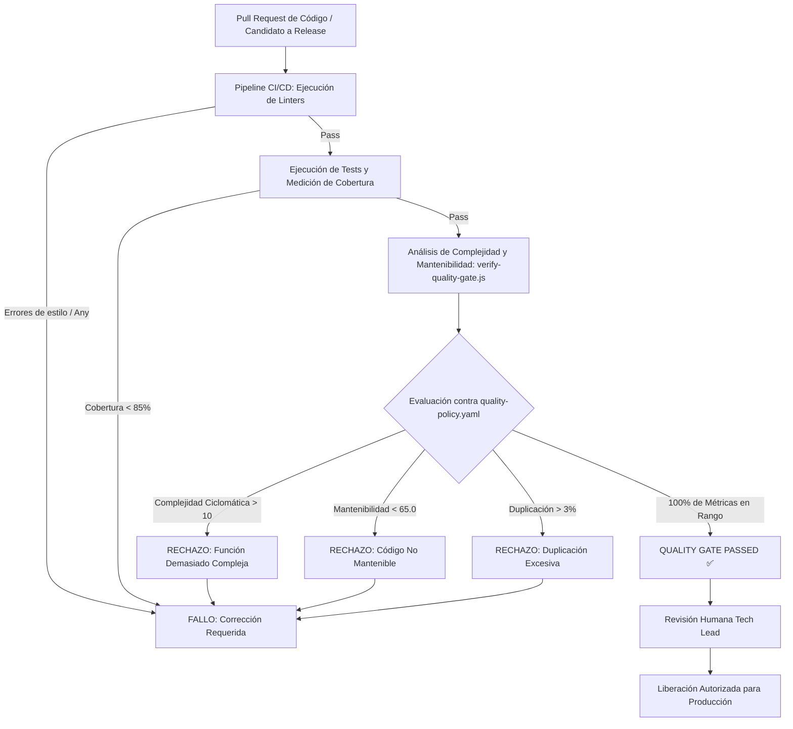

# 10. Gestión de Calidad, Reglas de Código y Puertas de Liberación (Release Gates)

## 1. Gestión de Calidad en el AI-SDLC: Software Quality as Code

La velocidad exponencial con la que los agentes de IA generan código plantea un riesgo de degradación estructural acelerada si no existen controles férreos. 

**En el framework AI-SDLC, la calidad del software no es una aspiración subjetiva; es una política declarativa auditable y ejecutable mediante herramientas deterministas (`quality-policy.yaml`)**.

El modelo de calidad se estructura en **tres niveles de defensa**:
1. **Reglas de Código y Estilo (Coding Rules)**: Prevención en tiempo de diseño y codificación.
2. **Métricas Estándar de Mantenibilidad y Complejidad**: Análisis cuantitativo de la arquitectura interna del código.
3. **Puertas de Liberación (Release Gates)**: Restricciones de paso en CI/CD que bloquean de forma automática e implacable cualquier versión que no cumpla con los umbrales mínimos.

---

## 2. Reglas de Código Automatizadas (Coding Rules)

Tanto los desarrolladores humanos como los agentes de codificación (`agent-developer`) están obligados a seguir los siguientes estándares automatizados:

### A. Motores de Inspección Estática
- **TypeScript / JavaScript**: ESLint (perfil estricto con `@typescript-eslint/recommended-requiring-type-checking`) y Prettier para formateo determinista.
- **Python**: Ruff / Flake8 y Black.
- **Java / C# / Go**: SonarQube Quality Profile, Spotless / golangci-lint.

### B. Reglas de Código Obligatorias
1. **Cero Tolerancia a Tipado Débil (`no-explicit-any`)**: Prohibido el uso de tipos genéricos no seguros o casts opacos.
2. **Cero Tolerancia a Código Muerto (`no-dead-code`, `no-unused-vars`)**: Variables, imports o funciones no referenciadas causan fallo inmediato de compilación.
3. **Límite de Longitud por Función**: Ninguna función puede superar las **40 líneas de código efectivo**. Funciones más extensas deben descomponerse en métodos auxiliares cohesivos.
4. **Prohibición de Supresiones Silenciosas**: Queda terminantemente prohibido para agentes o humanos añadir comentarios de supresión (`// @ts-ignore`, `// eslint-disable`, `# noqa`) sin un justificante formal (`ADR-TECH-DEBT-*`).

---

## 3. Métricas Estándar de Software y Umbrales de Liberación

El framework evalúa cuantitativamente todo el código fuente frente a cuatro métricas de la industria estandarizadas por IEEE, SEI e ISO/IEC 25010:

```
┌────────────────────────────────────────────────────────────────────────┐
│                   MÉTRICAS ESTÁNDAR Y UMBRALES DE RELEASE              │
└────────────────────────────────────────────────────────────────────────┘

 1. COMPLEJIDAD CICLOMÁTICA (McCabe)
    ├── Definición: Número de caminos linealmente independientes en el grafo de flujo.
    ├── Umbral Máximo: 10 por función.
    └── Acción ante Infracción: BLOQUEO INMEDIATO DE MERGE / RELEASE.

 2. COMPLEJIDAD COGNITIVA (SonarSource)
    ├── Definición: Dificultad humana para comprender y razonar sobre el flujo de control.
    ├── Umbral Máximo: 15 por función.
    └── Acción ante Infracción: BLOQUEO INMEDIATO DE MERGE / RELEASE.

 3. ÍNDICE DE MANTENIBILIDAD (SEI / Microsoft / ISO 25010)
    ├── Definición: Escala compuesta 0-100 basada en Halstead, McCabe y LOC.
    ├── Fórmula: MI = 171 - 5.2*ln(HV) - 0.23*CC - 16.2*ln(LOC)
    ├── Umbral Mínimo Aceptable: 65.0 / 100 (Objetivo: >85.0).
    └── Acción ante Infracción: BLOQUEO INMEDIATO DE MERGE / RELEASE.

 4. DUPLICACIÓN DE CÓDIGO
    ├── Definición: Porcentaje de líneas idénticas o casi idénticas repetidas en el proyecto.
    ├── Umbral Máximo: 3.0%.
    └── Acción ante Infracción: BLOQUEO INMEDIATO DE MERGE / RELEASE.

 5. COBERTURA DE PRUEBAS AUTOMATIZADAS
    ├── Línea: Mínimo 85.0% | Ramas (Branch): Mínimo 80.0%.
    └── Acción ante Infracción: BLOQUEO INMEDIATO DE MERGE / RELEASE.
```

---

## 4. El Mecanismo del Release Gate (Restricciones a la Liberación)

El paso de una versión a producción (o el merge de un PR hacia `main`) se somete a la siguiente máquina de estados determinista:



---

## 5. Política de Excepciones y Gestión de Deuda Técnica

Si por razones de rendimiento extremo (ej. bucle de procesamiento gráfico o parser telemétrico de bajo nivel) una función necesita superar la complejidad ciclomática de 10:
1. **Procedimiento Obligatorio**:
   - Se debe registrar un **ADR de Deuda Técnica** (`docs/architecture/09_decisions/ADR-TECH-DEBT-*.md`).
   - El ADR debe contener: justificación del impacto, benchmark comparativo y un plan de mitigación con fecha límite o hito de refactorización.
2. **Autoridad**:
   - Solo el **Lead Architect** y el **Tech Lead humano** pueden aprobar la excepción. Ningún agente de IA puede auto-concederse una excepción de calidad.

---

## 6. Generación Automática del Informe de Calidad (Quality Scorecard as Code)

El framework incorpora la capacidad de **generar automáticamente el informe formal de calidad** tan pronto como el código es escrito o modificado por un desarrollador o agente:

### A. Comando de Generación Automática
```bash
# 1. Informe global del proyecto
node scripts/generate-quality-report.js

# 2. Informe acotado a un incremento o cambio SDD específico
node scripts/generate-quality-report.js --change chg-001-telemetry-ingestion --target src/telemetry

# 3. Informe con destino personalizado
node scripts/generate-quality-report.js --target src/ --output reports/SPRINT_QUALITY.md
```

### B. Contenido del Informe Generado
El documento producido (`reports/QUALITY_REPORT.md` o `specs/changes/active/<chg-id>/quality-report.md`) incluye:
1. **Calificación Global (SQALE Rating A-F)** basada en métricas ponderadas.
2. **Veredicto Determinista del Release Gate** (`AUTORIZADO (PASS)` o `BLOQUEADO (FAIL)`).
3. **Distribución Gráfica de Complejidad Ciclomática** (Baja [1-5], Moderada [6-10], Crítica [>10]).
4. **Tabla Desglosada por Función**: SLOC, Complejidad Ciclomática, Complejidad Cognitiva, Índice de Mantenibilidad y detección de code smells.
5. **Instrucciones Accionables de Refactorización**: Si el Release Gate falla, el informe emite automáticamente los prompts y pautas de descomposición para que el agente de IA lo subsane sin intervención manual.

---

## 7. Arquitectura de Calidad Multilenguaje (Polyglot Support)

El framework AI-SDLC está concebido como una **plataforma políglota universal**. Ni la metodología ni los mecanismos de validación están atados a un único lenguaje de programación.

### A. Niveles de Neutralidad del Framework

```
┌────────────────────────────────────────────────────────────────────────┐
│                   ARQUITECTURA DE CALIDAD POLÍGLOTA                    │
└────────────────────────────────────────────────────────────────────────┘

 1. CAPA CONCEPTUAL Y METODOLÓGICA (100% Agnóstica de Lenguaje)
    ├── Definición de Producto: ProductShape en Markdown + JSON Schema
    ├── Arquitectura de Sistemas: arc42 (12 secciones) + NAF v4 Grid
    ├── Ciberseguridad Shift-Left: STRIDE, OWASP ASVS, Enclaves DMZ
    ├── Gobernanza de Licencias: SPDX, allowlist/denylist, SBOM CycloneDX
    └── Criterios BDD: Gherkin estándar (.feature) ejecutable en cualquier runtime

 2. MOTOR NATIVO EMBEBIDO (Out-of-the-box en scripts/)
    ├── Analizador sintáctico universal para métricas McCabe (CC), MI y LOC
    └── Lenguajes soportados directamente:
        • TypeScript / JavaScript (.ts, .js)
        • Python (.py)
        • Java / Kotlin (.java, .kt)
        • Go (.go)
        • C# (.cs)
        • Rust (.rs)
        • C / C++ (.c, .cpp)

 3. ADAPTADORES DE ECOSISTEMA NATIVO Y ESTÁNDARES EMPRESARIALES
    ├── Python: Ruff, Black, Radon, Xenon, PyTest, Coverage.py
    ├── Java: Checkstyle, SpotBugs, PMD, JUnit 5, JaCoCo
    ├── Go: golangci-lint, gocyclo, go test -cover
    ├── C#/.NET: dotnet format, Roslyn Analyzers, Coverlet
    ├── Rust: cargo clippy, rustfmt, cargo-tarpaulin
    └── Agregadores Empresariales: SonarQube / SonarCloud y formato SARIF (OASIS)
```

### B. Mapeo de Ecosistemas en `quality-policy.yaml`

El archivo de configuración permite orquestar linters y motores de cobertura específicos para cada lenguaje manteniendo umbrales cuantitativos homogéneos (`CC <= 10`, `MI >= 50`, `Coverage >= 85%`).

### C. El Estándar Universal SARIF (Static Analysis Results Interchange Format)
Para integraciones complejas en grandes organizaciones, el AI-SDLC adopta el estándar **SARIF (JSON OASIS)**. Cualquier analizador de cualquier lenguaje (Roslyn, Clang-Tidy, ESLint, Bandit, Flake8) puede volcar sus diagnósticos a formato SARIF, siendo consolidado de forma transparente por el pipeline de release.
