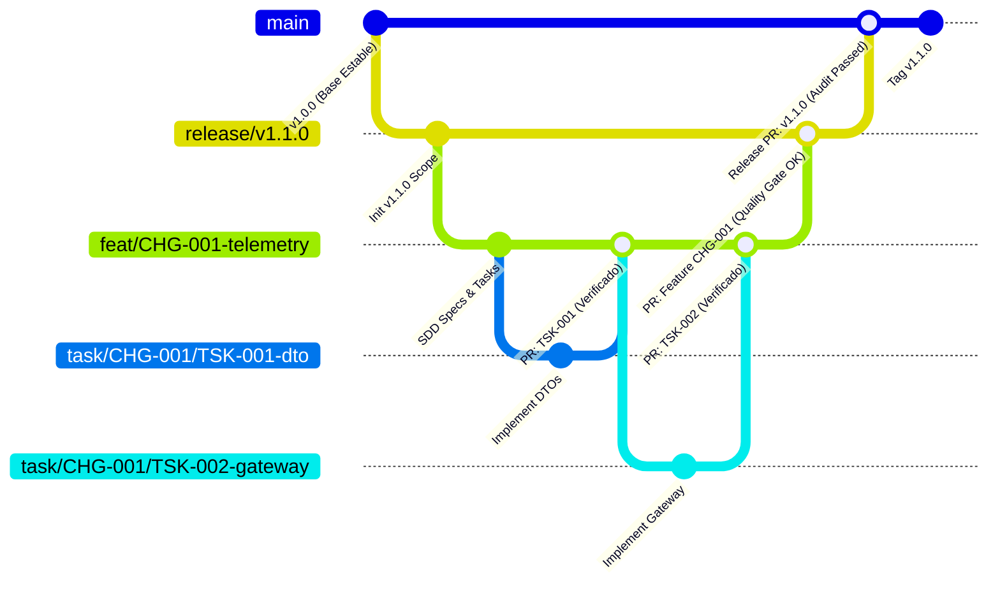

# 11. Modelo de Ramas Git Jerárquico (4-Tier Git Branching Model)

## 1. Principios del Modelo de Ramificación

Para gobernar el desarrollo colaborativo entre humanos y agentes de IA con máxima estabilidad y trazabilidad, el framework AI-SDLC implementa un **modelo jerárquico estricto de 4 niveles de ramas Git**:

```
┌────────────────────────────────────────────────────────────────────────┐
│               JERARQUÍA DE RAMAS GIT EN EL AI-SDLC (4 TIERS)          │
└────────────────────────────────────────────────────────────────────────┘

 TIER 1: main (Última versión estable en producción)
   │
   └── TIER 2: release/vX.Y.Z (Rama de versión abierta)
         │
         └── TIER 3: feat/<FEAT-ID>-<slug> | bug/<BUG-ID>-<slug> (Feature o Bug)
               │
               └── TIER 4: task/<PARENT-ID>/<TSK-ID>-<slug> (Tarea atómica)
```

---

## 2. Anatomía de los Cuatro Niveles de Ramas

### Tier 1: Rama `main` (Línea Base Estable)
- **Propósito**: Contiene exclusivamente el código en su última versión estable desplegada o lista para producción.
- **Reglas de Acceso**:
  - **Protegida (Protected Branch)**: Prohibido cualquier `push` directo.
  - Solo acepta código mediante **Pull Request** fusionado desde una rama de versión abierta (`release/vX.Y.Z`).
  - Cada merge hacia `main` va acompañado de una etiqueta Git inmutable de versión semántica (ej. `v1.0.0`, `v1.1.0`).

---

### Tier 2: Rama de Versión Abierta (`release/vX.Y.Z` o `version/vX.Y.Z`)
- **Propósito**: Agrupa todas las features, mejoras y correcciones programadas para una versión específica (milestone/release).
- **Origen**: Se bifurca (`fork`) directamente a partir de `main`.
- **Nomenclatura Estándar**: `release/v<MAJOR>.<MINOR>.<PATCH>` (ej. `release/v1.1.0`).
- **Ciclo de Vida**:
  - Permanece abierta durante el ciclo de desarrollo de la versión.
  - Recibe los merges de las ramas de features y bugs asignados al release.
  - Una vez superado el **Release Gate** y la auditoría final, se fusiona hacia `main` y se archiva o elimina.

---

### Tier 3: Rama de Feature o Bug (`feat/...` o `bug/...`)
- **Propósito**: Desarrolla una funcionalidad (`feature`) o resuelve un defecto (`bug`) específico asignado a la versión.
- **Origen**: Se bifurca **obligatoriamente a partir de la rama de versión abierta** a la que pertenece (ej. a partir de `release/v1.1.0`).
- **Nomenclatura Estándar**:
  - Features: `feat/<VERSION>/<FEAT-ID>-<slug>` o `feat/<FEAT-ID>-<slug>`
    - Ejemplos: `feat/CHG-001-telemetry-ingestion`, `feat/v1.1.0/FEAT-002-collision-detector`
  - Bugs: `bug/<VERSION>/<BUG-ID>-<slug>` o `bug/<BUG-ID>-<slug>`
    - Ejemplos: `bug/BUG-042-timestamp-drift`, `bug/v1.1.0/BUG-015-memory-leak`
- **Ciclo de Vida**:
  - Contiene la especificación de entrega SDD (`proposal.md`, `spec.md`, `design.md`, `tasks.md`).
  - Recibe los merges de las tareas atómicas que componen la feature.
  - Se fusiona de vuelta a la rama de versión mediante Pull Request con Quality Gate aprobado.

---

### Tier 4: Rama de Tarea Atómica (`task/...`)
- **Propósito**: Unidad mínima de trabajo ejecutable por un desarrollador o agente de IA (`agent-developer`).
- **Origen**: Se bifurca **obligatoriamente a partir de la rama de feature o bug** correspondiente.
- **Nomenclatura Estándar**: `task/<PARENT-ID>/<TSK-ID>-<slug>`
  - Ejemplos:
    - `task/CHG-001/TSK-001-dto-interfaces`
    - `task/CHG-001/TSK-002-wss-mtls-gateway`
    - `task/BUG-042/TSK-001-fix-clock-sync`
- **Ciclo de Vida**:
  - Un desarrollador o agente implementa el código y las pruebas específicas de esa tarea.
  - Se valida localmente ejecutando el comando de verificación declarado en `tasks.md`.
  - Se fusiona hacia la rama de feature mediante PR atómico.

---

## 3. Diagrama de Flujo de Ramas y Merges



---

## 4. Puertas de Calidad y Criterios de Merge por Nivel (PR Gates)

Cada nivel de integración cuenta con criterios de validación crecientes:

| Nivel de Merge | Origen ➔ Destino | Requisitos Obligatorios para Autorizar Merge |
| :--- | :--- | :--- |
| **Paso 1 (Tarea)** | `task/*` ➔ `feat/*` / `bug/*` | 1. Cumplimiento del comando de verificación declarado en `tasks.md`.<br>2. Pruebas unitarias de la tarea pasando al 100%.<br>3. Cero errores de sintaxis y linter. |
| **Paso 2 (Feature)** | `feat/*` / `bug/*` ➔ `release/*` | 1. Todas las tareas de `tasks.md` en estado `COMPLETED`.<br>2. Ejecución exitosa de escenarios BDD Cucumber (`.feature`).<br>3. Quality Gate superado (`verify-quality-gate.js`): CC $\le 10$, MI $\ge 50$.<br>4. Auditoría de licencias aprobada (`license-policy.yaml`).<br>5. Revisión humana aprobada del Tech Lead. |
| **Paso 3 (Release)** | `release/*` ➔ `main` | 1. Matriz de trazabilidad 360° al 100% (`verify-traceability.js`).<br>2. Informe de calidad consolidado generado (`generate-quality-report.js`).<br>3. Generación y firma de SBOM CycloneDX/SPDX.<br>4. Aprobación final formal de Product Owner y Release Manager. |

---

## 5. Guardrails y Reglas para Agentes de IA

1. **Aislamiento Estricto de Ramas**:
   - Los agentes de codificación (`agent-developer`) **solo pueden operar y realizar commits dentro de ramas `task/*`**.
   - Queda terminantemente bloqueado que un agente realice commits directos sobre `feat/*`, `release/*` o `main`.
2. **Creación Automática y Verificación de Origen**:
   - Antes de crear una rama de tarea, el agente debe verificar que la rama base sea la rama de feature correspondiente.
   - Antes de crear una rama de feature, debe validarse que se derive de la rama de release activa.
3. **Respeto de Modos de Autonomía**:
   - Si la tarea es `HUMAN_REVIEW_PLAN`, el agente solo puede crear la rama de tarea **después** de que el humano haya aprobado el plan en el issue o PR de la feature.
