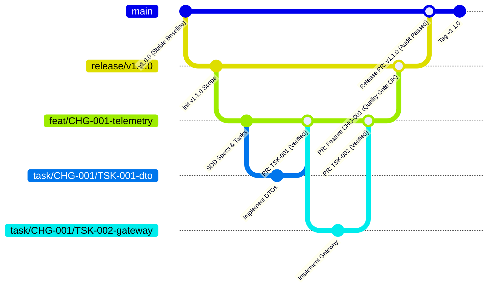

# 11. Hierarchical Git Branching Model (4-Tier Git Branching Model)

## 1. Principles of the Branching Model

To govern collaborative development between humans and AI agents with maximum stability and traceability, the AI-SDLC framework implements a **strict hierarchical 4-tier Git branching model**:

```
┌────────────────────────────────────────────────────────────────────────┐
│               GIT BRANCH HIERARCHY IN AI-SDLC (4 TIERS)                │
└────────────────────────────────────────────────────────────────────────┘

 TIER 1: main (Latest stable production release)
   │
   └── TIER 2: release/vX.Y.Z (Open version branch)
         │
         └── TIER 3: feat/<FEAT-ID>-<slug> | bug/<BUG-ID>-<slug> (Feature or Bug)
               │
               └── TIER 4: task/<PARENT-ID>/<TSK-ID>-<slug> (Atomic task)
```

---

## 2. Anatomy of the Four Branch Tiers

### Tier 1: `main` Branch (Stable Baseline)
- **Purpose**: Exclusively contains code in its latest stable release deployed or ready for production.
- **Access Rules**:
  - **Protected Branch**: Direct `push` is strictly forbidden.
  - Accepts code solely via **Pull Request** merged from an open version branch (`release/vX.Y.Z`).
  - Every merge into `main` is tagged with an immutable semantic version Git tag (e.g. `v1.0.0`, `v1.1.0`).

---

### Tier 2: Open Version Branch (`release/vX.Y.Z` or `version/vX.Y.Z`)
- **Purpose**: Aggregates all features, improvements, and bug fixes scheduled for a specific version milestone.
- **Origin**: Forked directly from `main`.
- **Standard Naming**: `release/v<MAJOR>.<MINOR>.<PATCH>` (e.g. `release/v1.1.0`).
- **Lifecycle**:
  - Remains open throughout the version's active development cycle.
  - Receives merges from feature and bug branches assigned to the release.
  - Once the **Release Gate** and final audits pass, it merges into `main` and is archived or deleted.

---

### Tier 3: Feature, Bug, or Patch Branch (`feat/...`, `bug/...`, `patch/...`, `fix/...`)
- **Purpose**: Develops a functionality (`feature`), resolves a defect (`bug`), or applies a minor patch (`patch`/`fix`).
- **Origin**: Forked from the open version branch (`release/vX.Y.Z`) or directly from the corresponding base branch.
- **Standard Naming**:
  - Features: `feat/<VERSION>/<FEAT-ID>-<slug>` or `feat/<FEAT-ID>-<slug>`
    - Examples: `feat/CHG-001-telemetry-ingestion`, `feat/v1.1.0/FEAT-002-collision-detector`
  - Bugs / Patches: `bug/<BUG-ID>-<slug>`, `fix/<BUG-ID>-<slug>`, or `patch/<PATCH-ID>-<slug>`
    - Examples: `bug/BUG-042-timestamp-drift`, `patch/PATCH-002-linter-fix`, `fix/CHG-003-typo`
- **Lifecycle and Progressive Friction**:
  - **Standard / Critical Profile**: Contains full SDD scaffolding (`proposal.md`, `spec.md`, `design.md`, `tasks.md`). Receives merges from Tier 4 (`task/*`) branches and merges into the version branch with full Quality Gate verification.
  - **Patch Profile (Streamlined Flow)**: Contains only concise `spec.md`. **Exempt from Tier 4 (`task/*`) branches**: engineers and AI agents work directly on `patch/*` or `fix/*` branches and open direct Pull Requests.

---

### Tier 4: Atomic Task Branch (`task/...`)
- **Purpose**: Minimal executable unit of work for a developer or AI agent (`agent-developer`).
- **Origin**: Forked **mandatorily from the corresponding feature or bug branch**.
- **Standard Naming**: `task/<PARENT-ID>/<TSK-ID>-<slug>`
  - Examples:
    - `task/CHG-001/TSK-001-dto-interfaces`
    - `task/CHG-001/TSK-002-wss-mtls-gateway`
    - `task/BUG-042/TSK-001-fix-clock-sync`
- **Lifecycle**:
  - Developer or agent implements code and specific tests for that task.
  - Locally validated by running the verification command declared in `tasks.md`.
  - Merged into the feature branch via atomic PR.

---

## 3. Branch and Merge Flow Diagram



---

## 4. Quality Gates and Merge Criteria by Tier (PR Gates)

Each integration level carries progressively rigorous validation criteria:

| Merge Level | Source ➔ Destination | Mandatory Merge Authorization Requirements |
| :--- | :--- | :--- |
| **Step 1 (Task)** | `task/*` ➔ `feat/*` / `bug/*` | 1. Verification command declared in `tasks.md` passes.<br>2. Unit tests for task 100% passing.<br>3. Zero syntax or linter errors (`pnpm run typecheck`).<br>4. Pull Request documented using `.github/PULL_REQUEST_TEMPLATE.md`. |
| **Step 2 (Feature)** | `feat/*` / `bug/*` ➔ `release/*` | 1. Institutional template `.github/PULL_REQUEST_TEMPLATE.md` exhaustively completed.<br>2. Plan Execution Matrix (`X` vs `O`) approved by Tech Lead (all items included; zero unjustified `[O]`).<br>3. All tasks in `tasks.md` in `COMPLETED` state.<br>4. Successful execution of Cucumber BDD scenarios (`.feature`).<br>5. Quality Gate passed (`verify:quality`): CC $\le 10$, MI $\ge 50$.<br>6. License audit approved (`verify:licenses`).<br>7. Mandatory human review and approval from Tech Lead. |
| **Step 3 (Release)** | `release/*` ➔ `main` | 1. Institutional Pull Request `.github/PULL_REQUEST_TEMPLATE.md` with 100% verified pre-flight checklist.<br>2. 360° Traceability matrix at 100% (`verify:traceability`).<br>3. Consolidated quality report generated (`report:quality`).<br>4. CycloneDX/SPDX SBOM generated and cryptographically signed.<br>5. Formal final approval from Product Owner and Release Manager. |

---

## 5. Guardrails and Rules for AI Agents

1. **Strict Branch Isolation**:
   - In `standard` and `critical` changes, coding agents (`agent-developer`) **may only operate and commit inside `task/*` branches**.
   - In changes with `profile: patch` (streamlined flow), the agent is formally authorized to operate and commit directly on `patch/*` or `fix/*` branches, exempt from creating Tier 4 branches.
   - Committing directly to `release/*` or `main` is strictly blocked for agents.
2. **Automatic Creation and Base Verification**:
   - Before creating a task branch, the agent must verify the base branch is the corresponding feature branch.
   - Before creating a feature branch, it must validate it derives from the active release branch.
3. **Respecting Autonomy Modes**:
   - If a task is `HUMAN_REVIEW_PLAN`, the agent may only create the task branch **after** a human approves the plan in the feature issue or PR.

---

## 6. Branch Automation with the CLI (`aisdlc git checkout`)

To eliminate operational friction and prevent typographical errors across the 4 tiers, the framework provides automatic navigation and branching:

```bash
npx aisdlc git checkout <task-id>
```

### Deterministic Behavior and Guarantees:
1. **Task Resolution**: Scans active changes in `specs/changes/active/*/tasks.md` identifying the active change (`CHG-*`) containing the specified task.
2. **Version Detection**: Resolves the associated semantic version or active `release/vX.Y.Z` branch.
3. **Cascading Branching**:
   - If `release/vX.Y.Z` (Tier 2) does not exist locally or on remote origin, it is created from `main` (Tier 1).
   - If feature branch `feat/CHG-*` (Tier 3) does not exist, it is created from the version branch (Tier 2).
   - If atomic task branch `task/<PARENT-ID>/<TSK-ID>-<slug>` (Tier 4) does not exist, it is created from the feature branch (Tier 3).
4. **Immediate Checkout**: Executes automatic branch switch (`git checkout`), placing developer or AI agent directly on Tier 4 atomic task branch.
5. **Error Handling**: If task is not found in active changes, outputs clear diagnosis listing available tasks with active change IDs.

---

## 7. Multi-Platform Continuous Integration (Multi-CI Ecosystem)

The AI-SDLC framework is CI/CD provider-agnostic, guaranteeing strict parity for Quality Gate execution and automated post-merge promotion across corporate environments:

### Supported Providers and Canonical Environment Variables

| CI/CD Provider | Branch / Head Ref Variables | Pull / Merge Request Variables | Output Mechanism | Canonical Template |
| :--- | :--- | :--- | :--- | :--- |
| **GitHub Actions** | `PR_HEAD_REF`, `GITHUB_HEAD_REF`, `GITHUB_REF_NAME` | `PR_TITLE`, `PR_BODY`, `PR_NUMBER` | `$GITHUB_OUTPUT` | `templates/ci/github-workflows/` |
| **GitLab CI/CD** | `CI_MERGE_REQUEST_SOURCE_BRANCH_NAME`, `CI_COMMIT_REF_NAME`, `CI_COMMIT_BRANCH` | `CI_MERGE_REQUEST_TITLE`, `CI_MERGE_REQUEST_DESCRIPTION`, `CI_MERGE_REQUEST_IID` | `sdd-integrate.env` / `$GITLAB_ENV` | `templates/ci/.gitlab-ci.yml` |
| **Azure DevOps Pipelines** | `SYSTEM_PULLREQUEST_SOURCEBRANCH`, `BUILD_SOURCEBRANCH`, `BUILD_SOURCEBRANCHNAME` | `SYSTEM_PULLREQUEST_PULLREQUESTTITLE`, `SYSTEM_PULLREQUEST_PULLREQUESTID` | `##vso[task.setvariable]` | `templates/ci/azure-pipelines.yml` |
| **Bitbucket Pipelines** | `BITBUCKET_BRANCH`, `BITBUCKET_PR_DESTINATION_BRANCH` | `BITBUCKET_PR_ID` | `sdd-integrate.env` / `$CI_OUTPUT_FILE` | `templates/ci/bitbucket-pipelines.yml` |

### Pipeline Execution Flow

1. **Pre-Flight & Quality Gates (PR / MR / Branch)**:
   - Every change proposal runs `npx aisdlc check` and `npx aisdlc verify all`.
   - Deterministic blocking on cyclomatic complexity, orphan traceability, detected secrets, or prohibited licenses.
2. **Post-Merge Canonical Promotion & Integration (`sdd-integrate-ci.ts`)**:
   - Upon consolidating a Pull Request or Merge Request into `main` or `release/vX.Y.Z` branches, the runner invokes `npx tsx scripts/sdd-integrate-ci.ts`.
   - The script detects active SDD changes from provider environment variables, validates all tasks in `tasks.md` are `COMPLETED`, consolidates canonical requirements and components, and archives the change to `specs/changes/completed/`.
3. **Quick Scaffolding via CLI**:
   ```bash
   # Initialize project with specific CI pipeline
   npx aisdlc init --ci gitlab
   npx aisdlc init --ci azure
   npx aisdlc init --ci bitbucket
   npx aisdlc init --ci github
   ```
