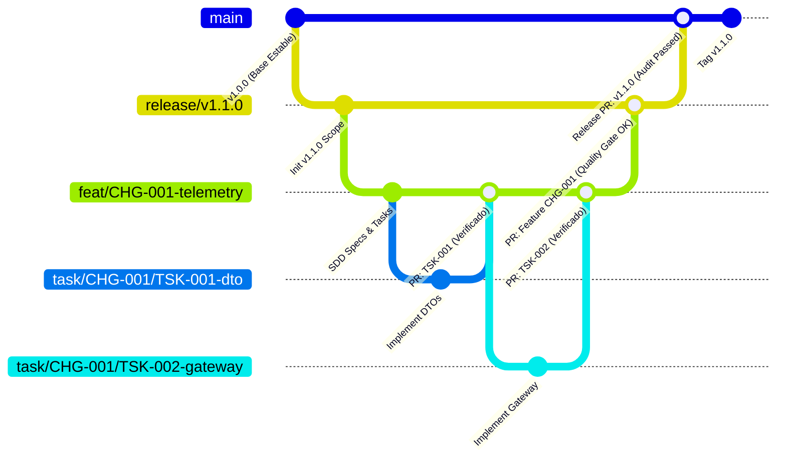

# 11. Modelo de Ramas Git Jerárquico (4-Tier Git Branching Model)

## 1. Principios del Modelo de Ramificación

Para gobernar el desarrollo colaborativo entre humanos y agentes de IA con máxima estabilidad y trazabilidad, el framework AI-SDLC implementa un **modelo jerárquico estricto de 4 niveles de ramas Git**:

```
┌────────────────────────────────────────────────────────────────────────┐
│               JERARQUÍA DE RAMAS GIT EN EL AI-SDLC (4 TIERS)          │
└────────────────────────────────────────────────────────────────────────┘

 TIER 1: main (Última versión estable en producción)
   │
   └── TIER 2: release/vX.Y.Z (Rama de versión abierta)
         │
         └── TIER 3: feat/<FEAT-ID>-<slug> | bug/<BUG-ID>-<slug> (Feature o Bug)
               │
               └── TIER 4: task/<PARENT-ID>/<TSK-ID>-<slug> (Tarea atómica)
```

---

## 2. Anatomía de los Cuatro Niveles de Ramas

### Tier 1: Rama `main` (Línea Base Estable)
- **Propósito**: Contiene exclusivamente el código en su última versión estable desplegada o lista para producción.
- **Reglas de Acceso**:
  - **Protegida (Protected Branch)**: Prohibido cualquier `push` directo.
  - Solo acepta código mediante **Pull Request** fusionado desde una rama de versión abierta (`release/vX.Y.Z`).
  - Cada merge hacia `main` va acompañado de una etiqueta Git inmutable de versión semántica (ej. `v1.0.0`, `v1.1.0`).

---

### Tier 2: Rama de Versión Abierta (`release/vX.Y.Z` o `version/vX.Y.Z`)
- **Propósito**: Agrupa todas las features, mejoras y correcciones programadas para una versión específica (milestone/release).
- **Origen**: Se bifurca (`fork`) directamente a partir de `main`.
- **Nomenclatura Estándar**: `release/v<MAJOR>.<MINOR>.<PATCH>` (ej. `release/v1.1.0`).
- **Ciclo de Vida**:
  - Permanece abierta durante el ciclo de desarrollo de la versión.
  - Recibe los merges de las ramas de features y bugs asignados al release.
  - Una vez superado el **Release Gate** y la auditoría final, se fusiona hacia `main` y se archiva o elimina.

---

### Tier 3: Rama de Feature, Bug o Parche (`feat/...`, `bug/...`, `patch/...`, `fix/...`)
- **Propósito**: Desarrolla una funcionalidad (`feature`), resuelve un defecto (`bug`) o aplica un parche menor (`patch`/`fix`).
- **Origen**: Se bifurca a partir de la rama de versión abierta (`release/vX.Y.Z`) o directamente desde la rama base correspondiente.
- **Nomenclatura Estándar**:
  - Features: `feat/<VERSION>/<FEAT-ID>-<slug>` o `feat/<FEAT-ID>-<slug>`
    - Ejemplos: `feat/CHG-001-telemetry-ingestion`, `feat/v1.1.0/FEAT-002-collision-detector`
  - Bugs / Parches: `bug/<BUG-ID>-<slug>`, `fix/<BUG-ID>-<slug>` o `patch/<PATCH-ID>-<slug>`
    - Ejemplos: `bug/BUG-042-timestamp-drift`, `patch/PATCH-002-linter-fix`, `fix/CHG-003-typo`
- **Ciclo de Vida y Fricción Progresiva**:
  - **Perfil Standard / Critical**: Contiene el andamiaje SDD completo (`proposal.md`, `spec.md`, `design.md`, `tasks.md`). Recibe merges desde ramas Tier 4 (`task/*`) y se fusiona hacia la versión con Quality Gate completo.
  - **Perfil Patch (Flujo Simplificado)**: Contiene únicamente `spec.md` condensado. **Exento de ramas Tier 4 (`task/*`)**: los ingenieros y agentes de IA pueden trabajar directamente sobre la rama `patch/*` o `fix/*` y abrir el Pull Request directo.

---

### Tier 4: Rama de Tarea Atómica (`task/...`)
- **Propósito**: Unidad mínima de trabajo ejecutable por un desarrollador o agente de IA (`agent-developer`).
- **Origen**: Se bifurca **obligatoriamente a partir de la rama de feature o bug** correspondiente.
- **Nomenclatura Estándar**: `task/<PARENT-ID>/<TSK-ID>-<slug>`
  - Ejemplos:
    - `task/CHG-001/TSK-001-dto-interfaces`
    - `task/CHG-001/TSK-002-wss-mtls-gateway`
    - `task/BUG-042/TSK-001-fix-clock-sync`
- **Ciclo de Vida**:
  - Un desarrollador o agente implementa el código y las pruebas específicas de esa tarea.
  - Se valida localmente ejecutando el comando de verificación declarado en `tasks.md`.
  - Se fusiona hacia la rama de feature mediante PR atómico.

---

## 3. Diagrama de Flujo de Ramas y Merges



---

## 4. Puertas de Calidad y Criterios de Merge por Nivel (PR Gates)

Cada nivel de integración cuenta con criterios de validación crecientes:

| Nivel de Merge | Origen ➔ Destino | Requisitos Obligatorios para Autorizar Merge |
| :--- | :--- | :--- |
| **Paso 1 (Tarea)** | `task/*` ➔ `feat/*` / `bug/*` | 1. Cumplimiento del comando de verificación declarado en `tasks.md`.<br>2. Pruebas unitarias de la tarea pasando al 100%.<br>3. Cero errores de sintaxis y linter (`pnpm run typecheck`).<br>4. Pull Request documentado con `.github/PULL_REQUEST_TEMPLATE.md`. |
| **Paso 2 (Feature)** | `feat/*` / `bug/*` ➔ `release/*` | 1. Plantilla institucional `.github/PULL_REQUEST_TEMPLATE.md` cumplimentada exhaustivamente.<br>2. Matriz de Ejecución del Plan (`X` vs `O`) aprobada por el Tech Lead (todos los ítems incluidos; cero `[O]` no justificados).<br>3. Todas las tareas de `tasks.md` en estado `COMPLETED`.<br>4. Ejecución exitosa de escenarios BDD Cucumber (`.feature`).<br>5. Quality Gate superado (`verify:quality`): CC $\le 10$, MI $\ge 50$.<br>6. Auditoría de licencias aprobada (`verify:licenses`).<br>7. Revisión y aprobación humana mandataria del Tech Lead. |
| **Paso 3 (Release)** | `release/*` ➔ `main` | 1. Pull Request institucional `.github/PULL_REQUEST_TEMPLATE.md` con checklist de pre-vuelo 100% verificado.<br>2. Matriz de trazabilidad 360° al 100% (`verify:traceability`).<br>3. Informe de calidad consolidado generado (`report:quality`).<br>4. Generación y firma de SBOM CycloneDX/SPDX.<br>5. Aprobación final formal de Product Owner y Release Manager. |

---

## 5. Guardrails y Reglas para Agentes de IA

1. **Aislamiento Estricto de Ramas**:
   - En cambios `standard` y `critical`, los agentes de codificación (`agent-developer`) **solo pueden operar y realizar commits dentro de ramas `task/*`**.
   - En cambios con `profile: patch` (flujo simplificado), el agente está formalmente autorizado a operar y comitear directamente en la rama `patch/*` o `fix/*`, quedando exento de crear ramas Tier 4.
   - Queda terminantemente bloqueado que un agente realice commits directos sobre `release/*` o `main`.
2. **Creación Automática y Verificación de Origen**:
   - Antes de crear una rama de tarea, el agente debe verificar que la rama base sea la rama de feature correspondiente.
   - Antes de crear una rama de feature, debe validarse que se derive de la rama de release activa.
3. **Respeto de Modos de Autonomía**:
   - Si la tarea es `HUMAN_REVIEW_PLAN`, el agente solo puede crear la rama de tarea **después** de que el humano haya aprobado el plan en el issue o PR de la feature.

---

## 6. Automatización de Ramas con el CLI (`aisdlc git checkout`)

Para eliminar la fricción operativa y prevenir errores tipográficos en la nomenclatura de los 4 tiers, el framework proporciona navegación y bifurcación automática:

```bash
npx aisdlc git checkout <task-id>
```

### Comportamiento Determinista y Garantías:
1. **Localización de Tarea**: Escanea los cambios activos en `specs/changes/active/*/tasks.md` identificando el cambio activo (`CHG-*`) al que pertenece la tarea especificada.
2. **Detección de Versión**: Resuelve la versión semántica asociada o la rama `release/vX.Y.Z` activa.
3. **Creación en Cascada (Cascading Branching)**:
   - Si la rama `release/vX.Y.Z` (Tier 2) no existe localmente ni en origen remoto, se crea a partir de `main` (Tier 1).
   - Si la rama de feature `feat/CHG-*` (Tier 3) no existe, se crea a partir de la rama de versión (Tier 2).
   - Si la rama de tarea atómica `task/<PARENT-ID>/<TSK-ID>-<slug>` (Tier 4) no existe, se crea a partir de la rama de feature (Tier 3).
4. **Checkout Inmediato**: Ejecuta el cambio automático de rama (`git checkout`), dejando al desarrollador o agente de IA directamente en su rama atómica de trabajo Tier 4.
5. **Manejo de Errores**: Si la tarea no se encuentra en ningún cambio activo, emite un diagnóstico claro y enumera las tareas disponibles con sus respectivos cambios activos.

---

## 7. Integración Continua Multi-Plataforma (Multi-CI Ecosystem)

El framework AI-SDLC es formalmente agnóstico al proveedor de CI/CD, garantizando paridad estricta de ejecución de Quality Gates y promoción automatizada post-merge en entornos corporativos heterogéneos:

### Proveedores Soportados y Variables de Entorno Canónicas

| Proveedor CI/CD | Variables de Rama / Head Ref | Variables de Pull / Merge Request | Emisión de Outputs | Plantilla Canónica |
| :--- | :--- | :--- | :--- | :--- |
| **GitHub Actions** | `PR_HEAD_REF`, `GITHUB_HEAD_REF`, `GITHUB_REF_NAME` | `PR_TITLE`, `PR_BODY`, `PR_NUMBER` | `$GITHUB_OUTPUT` | `templates/ci/github-workflows/` |
| **GitLab CI/CD** | `CI_MERGE_REQUEST_SOURCE_BRANCH_NAME`, `CI_COMMIT_REF_NAME`, `CI_COMMIT_BRANCH` | `CI_MERGE_REQUEST_TITLE`, `CI_MERGE_REQUEST_DESCRIPTION`, `CI_MERGE_REQUEST_IID` | `sdd-integrate.env` / `$GITLAB_ENV` | `templates/ci/.gitlab-ci.yml` |
| **Azure DevOps Pipelines** | `SYSTEM_PULLREQUEST_SOURCEBRANCH`, `BUILD_SOURCEBRANCH`, `BUILD_SOURCEBRANCHNAME` | `SYSTEM_PULLREQUEST_PULLREQUESTTITLE`, `SYSTEM_PULLREQUEST_PULLREQUESTID` | `##vso[task.setvariable]` | `templates/ci/azure-pipelines.yml` |
| **Bitbucket Pipelines** | `BITBUCKET_BRANCH`, `BITBUCKET_PR_DESTINATION_BRANCH` | `BITBUCKET_PR_ID` | `sdd-integrate.env` / `$CI_OUTPUT_FILE` | `templates/ci/bitbucket-pipelines.yml` |

### Flujo de Ejecución en Pipelines

1. **Pre-vuelo y Quality Gates (PR / MR / Branch)**:
   - Toda propuesta de cambio ejecuta `npx aisdlc check` y `npx aisdlc verify all`.
   - Bloqueo determinista ante violaciones de complejidad ciclomática, trazabilidad huérfana, secretos detectados o licencias prohibidas.
2. **Promoción e Integración Canónica Post-Merge (`sdd-integrate-ci.ts`)**:
   - Al consolidar un Pull Request o Merge Request hacia `main` o ramas `release/vX.Y.Z`, el runner invoca `npx tsx scripts/sdd-integrate-ci.ts`.
   - El script detecta de manera agnóstica el cambio SDD activo basándose en las variables del proveedor, verifica que todas las tareas en `tasks.md` estén `COMPLETED`, consolida los requerimientos y componentes canónicos, y archiva el cambio a `specs/changes/completed/`.
3. **Andamiaje Rápido con el CLI**:
   ```bash
   # Inicializar proyecto con pipeline específico
   npx aisdlc init --ci gitlab
   npx aisdlc init --ci azure
   npx aisdlc init --ci bitbucket
   npx aisdlc init --ci github
   ```


