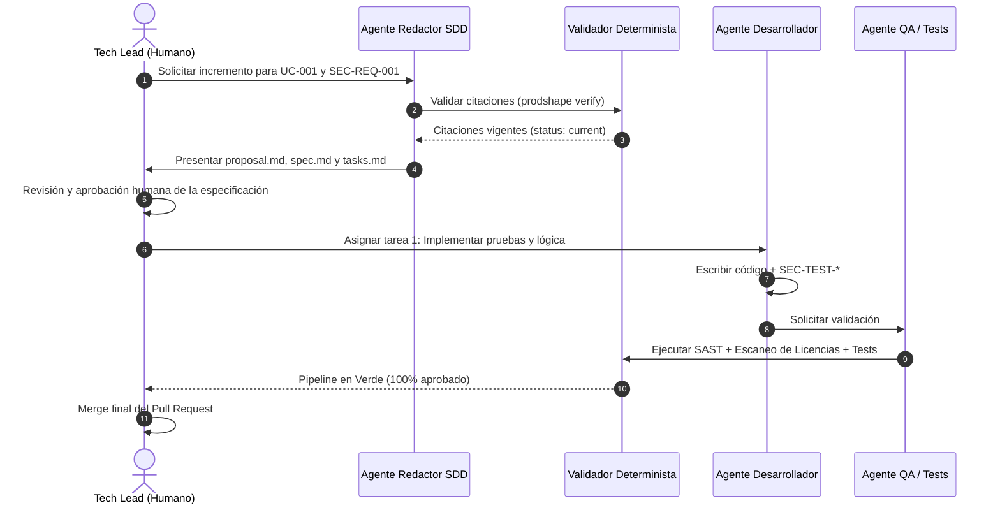
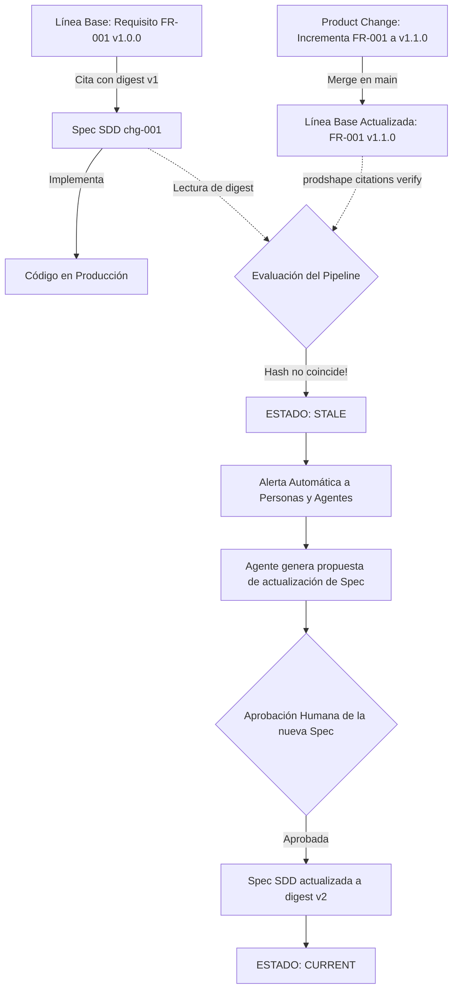
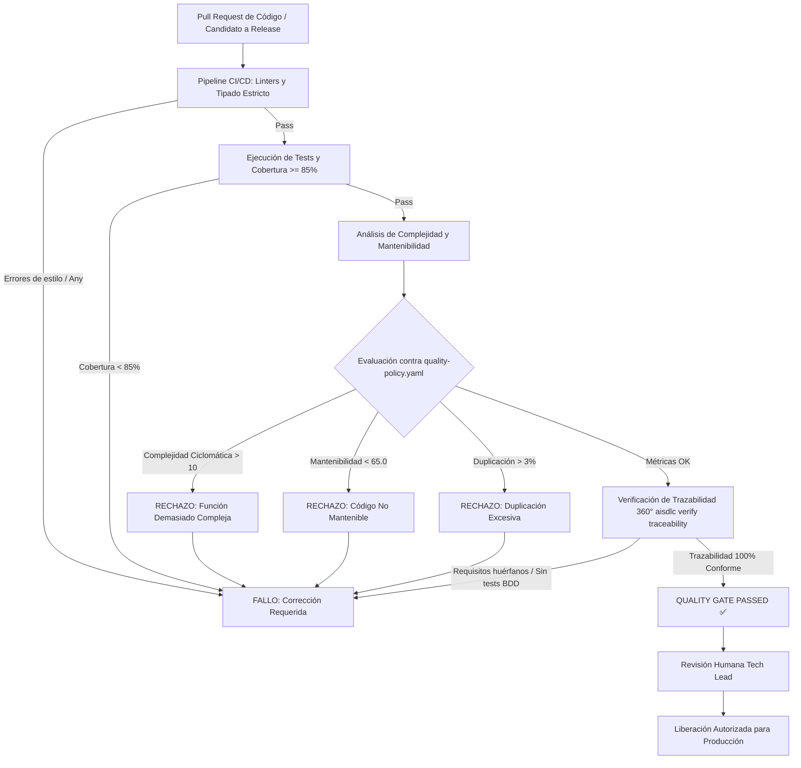
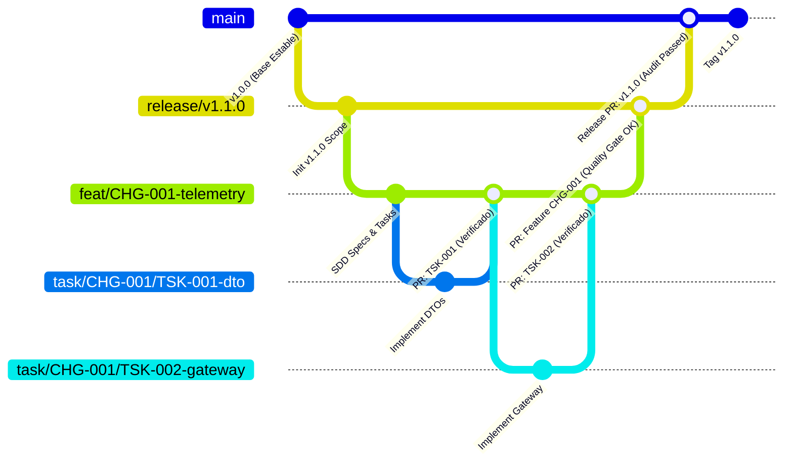
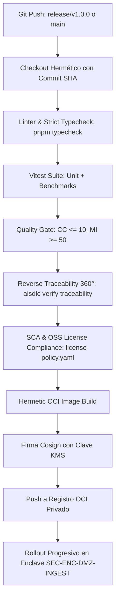

# AI-SDLC: Especificación Normativa, Metodología y Manuales As-Code

> **Dossier y Documento Maestro Consolidado de AI-SDLC**  
> Framework de Desarrollo Híbrido para Personas y Agentes de IA  
> *Fecha de Compilación:* `2026-09-17 05:49:58 UTC` | *Módulos y Manuales Integrados:* `15`  

---

## 📑 Índice General

### 🏛️ Parte I: Introducción y Arquitectura del Framework

- [**AI-SDLC: Framework de Desarrollo Híbrido para Personas y Agentes**](#doc-readme) *(Fuente: `README.md`)*
  - [🎯 Visión y Propósito](#doc-readme-vision-y-proposito)
  - [🏛️ Los 5 Pilares del Framework](#doc-readme-los-5-pilares-del-framework)
  - [📂 Estructura del Repositorio](#doc-readme-estructura-del-repositorio)
  - [⚡ Tutorial 1: Creación Rápida de una Funcionalidad (Quickstart en 5 Minutos)](#doc-readme-tutorial-1-creacion-rapida-de-una-funcionalidad-quickstart-en-5-minutos)
  - [📖 Tutorial 2: Flujo Detallado Paso a Paso (End-to-End Deep Dive)](#doc-readme-tutorial-2-flujo-detallado-paso-a-paso-end-to-end-deep-dive)
  - [🔬 Tutorial 3: Análisis Estático con AST Real y Soporte Multilenguaje](#doc-readme-tutorial-3-analisis-estatico-con-ast-real-y-soporte-multilenguaje)
  - [🛡️ Tutorial 4: Escaneo Dinámico de Licencias y Generación de SBOM (SCA)](#doc-readme-tutorial-4-escaneo-dinamico-de-licencias-y-generacion-de-sbom-sca)
  - [🚀 Guía Rápida para Equipos Humanos](#doc-readme-guia-rapida-para-equipos-humanos)
  - [🤖 Guía Operativa para Agentes de IA](#doc-readme-guia-operativa-para-agentes-de-ia)
  - [📜 Licencia](#doc-readme-licencia)

### 📘 Parte II: Especificación Normativa del Framework

- [**00. Manifiesto y Principios Fundamentales del AI-SDLC**](#cap-00-principles-and-manifesto) *(Fuente: `process/00_principles_and_manifesto.md`)*
  - [1. El Manifiesto del AI-SDLC](#cap-00-principles-and-manifesto-1-el-manifiesto-del-ai-sdlc)
  - [2. Los 7 Principios Rectores](#cap-00-principles-and-manifesto-2-los-7-principios-rectores)

- [**01. Gobernanza, Roles y Matriz de Colaboración Persona-Agente**](#cap-01-governance-and-roles) *(Fuente: `process/01_governance_and_roles.md`)*
  - [1. Modelo de Doble Ciudadanía (Human-Agent Dual-Citizen)](#cap-01-governance-and-roles-1-modelo-de-doble-ciudadania-human-agent-dual-citizen)
  - [2. Catálogo de Roles](#cap-01-governance-and-roles-2-catalogo-de-roles)
  - [3. Matriz RACI: Ciclo Completo de Desarrollo](#cap-01-governance-and-roles-3-matriz-raci-ciclo-completo-de-desarrollo)
  - [4. Modelo Operativo "AI as Scribe, Humano como Revisor, Aprobador e Implementador Crítico"](#cap-01-governance-and-roles-4-modelo-operativo-ai-as-scribe-humano-como-revisor-aprobador-e-implementador-critico)
  - [5. Protocolo de Traspaso (Hand-off) y Contratos de Trabajo](#cap-01-governance-and-roles-5-protocolo-de-traspaso-hand-off-y-contratos-de-trabajo)
  - [6. Matriz de Clasificación de Tareas y Modos de Autonomía Humana](#cap-01-governance-and-roles-6-matriz-de-clasificacion-de-tareas-y-modos-de-autonomia-humana)
  - [7. Modelo de Fricción Progresiva (Progressive Friction Governance)](#cap-01-governance-and-roles-7-modelo-de-friccion-progresiva-progressive-friction-governance)
  - [8. Protocolo de Revisión y Gobernanza de Pull Requests (Balance `X`/`O` y Puntos Débiles)](#cap-01-governance-and-roles-8-protocolo-de-revision-y-gobernanza-de-pull-requests-balance-xo-y-puntos-debiles)

- [**02. Definición del Producto: Metodología ProductShape (PDaC)**](#cap-02-product-definition) *(Fuente: `process/02_product_definition.md`)*
  - [1. Fundamentos de Product Definition as Code](#cap-02-product-definition-1-fundamentos-de-product-definition-as-code)
  - [2. Familias de Artefactos de Producto](#cap-02-product-definition-2-familias-de-artefactos-de-producto)
  - [3. El Grafo de Producto y Regla de Dirección Canónica](#cap-02-product-definition-3-el-grafo-de-producto-y-regla-de-direccion-canonica)
  - [4. Ciclo de Operaciones de Producto](#cap-02-product-definition-4-ciclo-de-operaciones-de-producto)
  - [5. Estructura de Carpetas de Producto en el Repositorio](#cap-02-product-definition-5-estructura-de-carpetas-de-producto-en-el-repositorio)
  - [6. Paquetes de Handoff Formal hacia SDD (`HOF-*` Sidecars)](#cap-02-product-definition-6-paquetes-de-handoff-formal-hacia-sdd-hof--sidecars)
  - [7. Extracción y Catálogo Consolidado de Requerimientos Activos](#cap-02-product-definition-7-extraccion-y-catalogo-consolidado-de-requerimientos-activos)
  - [8. Responsabilidad Única (SRP), Evolución In-Place y Control de Duplicados](#cap-02-product-definition-8-responsabilidad-unica-srp-evolucion-in-place-y-control-de-duplicados)

- [**03. Ciberseguridad Shift-Left: Security-by-Design as Code**](#cap-03-security-by-design) *(Fuente: `process/03_security_by_design.md`)*
  - [1. Visión y Enfoque Shift-Left](#cap-03-security-by-design-1-vision-y-enfoque-shift-left)
  - [2. Familias de Artefactos de Ciberseguridad](#cap-03-security-by-design-2-familias-de-artefactos-de-ciberseguridad)
  - [3. Trazabilidad Criptográfica de la Mitigación](#cap-03-security-by-design-3-trazabilidad-criptografica-de-la-mitigacion)
  - [4. Estructura de Carpetas de Seguridad](#cap-03-security-by-design-4-estructura-de-carpetas-de-seguridad)

- [**04. Gobernanza y Cumplimiento de Licencias Open Source: Libre Uso vs. Adquisición Comercial**](#cap-04-open-source-license-compliance) *(Fuente: `process/04_open_source_license_compliance.md`)*
  - [1. Visión y Riesgo de Propiedad Intelectual](#cap-04-open-source-license-compliance-1-vision-y-riesgo-de-propiedad-intelectual)
  - [2. Taxonomía de Licencias en 5 Categorías](#cap-04-open-source-license-compliance-2-taxonomia-de-licencias-en-5-categorias)
  - [3. Guardrails para Agentes de IA en la Selección de Paquetes](#cap-04-open-source-license-compliance-3-guardrails-para-agentes-de-ia-en-la-seleccion-de-paquetes)
  - [4. Flujo de Adquisición de Licencia Comercial](#cap-04-open-source-license-compliance-4-flujo-de-adquisicion-de-licencia-comercial)
  - [5. Validación Determinista en CI/CD y Generación de SBOM](#cap-04-open-source-license-compliance-5-validacion-determinista-en-cicd-y-generacion-de-sbom)
  - [6. Tutorial Práctico: Auditoría Dinámica de Licencias y Generación de SBOM](#cap-04-open-source-license-compliance-6-tutorial-practico-auditoria-dinamica-de-licencias-y-generacion-de-sbom)

- [**05. Arquitectura de Sistemas: Fusión de arc42 y NAF v4**](#cap-05-architecture-arc42-nafv4) *(Fuente: `process/05_architecture_arc42_nafv4.md`)*
  - [1. Visión y Necesidad de la Arquitectura en la Era de los Agentes](#cap-05-architecture-arc42-nafv4-1-vision-y-necesidad-de-la-arquitectura-en-la-era-de-los-agentes)
  - [2. La Matriz de Fusión: arc42 Enriquecido con NAF v4](#cap-05-architecture-arc42-nafv4-2-la-matriz-de-fusion-arc42-enriquecido-con-naf-v4)
  - [3. Detalle de Secciones Clave en el Paradigma As-Code](#cap-05-architecture-arc42-nafv4-3-detalle-de-secciones-clave-en-el-paradigma-as-code)
  - [4. Estructura de Carpetas de Arquitectura](#cap-05-architecture-arc42-nafv4-4-estructura-de-carpetas-de-arquitectura)
  - [5. Trazabilidad 360° e Integración Canónica Post-Implementación](#cap-05-architecture-arc42-nafv4-5-trazabilidad-360-e-integracion-canonica-post-implementacion)

- [**06. Entrega e Implementación: Spec-Driven Development (SDD)**](#cap-06-spec-driven-development) *(Fuente: `process/06_spec_driven_development.md`)*
  - [1. El Puente entre la Definición y el Código](#cap-06-spec-driven-development-1-el-puente-entre-la-definicion-y-el-codigo)
  - [2. Anatomía de un Incremento SDD (Spec-Delta)](#cap-06-spec-driven-development-2-anatomia-de-un-incremento-sdd-spec-delta)
  - [3. Inyección de Contexto Quirúrgica para Agentes de IA](#cap-06-spec-driven-development-3-inyeccion-de-contexto-quirurgica-para-agentes-de-ia)
  - [4. Ciclo de Ejecución de una Entrega SDD](#cap-06-spec-driven-development-4-ciclo-de-ejecucion-de-una-entrega-sdd)
  - [5. Integración Automatizada de Requerimientos con Cucumber (BDD)](#cap-06-spec-driven-development-5-integracion-automatizada-de-requerimientos-con-cucumber-bdd)
  - [6. Adaptadores Formales para Ecosistemas SDD (OpenSpec y Spec Kit)](#cap-06-spec-driven-development-6-adaptadores-formales-para-ecosistemas-sdd-openspec-y-spec-kit)

- [**07. Validación Determinista: Ciberseguridad, Licencias y Puertas de Calidad en CI/CD**](#cap-07-security-and-license-validation) *(Fuente: `process/07_security_and_license_validation.md`)*
  - [1. El Principio de Verificación Multinivel](#cap-07-security-and-license-validation-1-el-principio-de-verificacion-multinivel)
  - [2. Las 8 Puertas Deterministas de CI/CD (Pipeline Gates)](#cap-07-security-and-license-validation-2-las-8-puertas-deterministas-de-cicd-pipeline-gates)
  - [3. La Capa de Auditoría Adversarial por Agentes de IA (`sec:audit`)](#cap-07-security-and-license-validation-3-la-capa-de-auditoria-adversarial-por-agentes-de-ia-secaudit)
  - [4. Códigos de Salida Estandarizados (Exit Codes)](#cap-07-security-and-license-validation-4-codigos-de-salida-estandarizados-exit-codes)

- [**08. Contrato de Citación Criptográfica, Versionado Semántico y Detección de Deriva**](#cap-08-citation-contract-and-drift) *(Fuente: `process/08_citation_contract_and_drift.md`)*
  - [1. El Modelo de Doble Versionado (Dual-Versioning Architecture)](#cap-08-citation-contract-and-drift-1-el-modelo-de-doble-versionado-dual-versioning-architecture)
  - [2. Metadatos de Versionabilidad en Plantillas y Artefactos](#cap-08-citation-contract-and-drift-2-metadatos-de-versionabilidad-en-plantillas-y-artefactos)
  - [3. Tabla Obligatoria de Historial de Revisiones](#cap-08-citation-contract-and-drift-3-tabla-obligatoria-de-historial-de-revisiones)
  - [Historial de Revisiones y Control de Versiones](#cap-08-citation-contract-and-drift-historial-de-revisiones-y-control-de-versiones)
  - [4. Anatomía de una Citación Criptográfica](#cap-08-citation-contract-and-drift-4-anatomia-de-una-citacion-criptografica)
  - [5. Estados de Verificación de una Citación](#cap-08-citation-contract-and-drift-5-estados-de-verificacion-de-una-citacion)
  - [6. El Ciclo de Vida Libre de Deriva (Drift-Free Lifecycle)](#cap-08-citation-contract-and-drift-6-el-ciclo-de-vida-libre-de-deriva-drift-free-lifecycle)
  - [7. Empaquetamiento de Citaciones en Sidecars de Handoff (`HOF-*`)](#cap-08-citation-contract-and-drift-7-empaquetamiento-de-citaciones-en-sidecars-de-handoff-hof-)

- [**09. Protocolos de Agentes de IA, Prompts de Sistema y Guardrails**](#cap-09-agent-protocols) *(Fuente: `process/09_agent_protocols.md`)*
  - [1. Principios de Operación para Agentes de IA](#cap-09-agent-protocols-1-principios-de-operacion-para-agentes-de-ia)
  - [2. Los 5 Mandamientos Inquebrantables de los Agentes (Guardrails)](#cap-09-agent-protocols-2-los-5-mandamientos-inquebrantables-de-los-agentes-guardrails)
  - [3. Catálogo de Prompts de Sistema para Agentes Especializados](#cap-09-agent-protocols-3-catalogo-de-prompts-de-sistema-para-agentes-especializados)
  - [4. Protocolo Operativo "AI as Scribe" (Redacción Técnica Asistida)](#cap-09-agent-protocols-4-protocolo-operativo-ai-as-scribe-redaccion-tecnica-asistida)

- [**10. Gestión de Calidad, Reglas de Código y Puertas de Liberación (Release Gates)**](#cap-10-quality-management-and-release-gates) *(Fuente: `process/10_quality_management_and_release_gates.md`)*
  - [1. Gestión de Calidad en el AI-SDLC: Software Quality as Code](#cap-10-quality-management-and-release-gates-1-gestion-de-calidad-en-el-ai-sdlc-software-quality-as-code)
  - [2. Reglas de Código Automatizadas (Coding Rules)](#cap-10-quality-management-and-release-gates-2-reglas-de-codigo-automatizadas-coding-rules)
  - [3. Métricas Estándar de Software y Umbrales de Liberación](#cap-10-quality-management-and-release-gates-3-metricas-estandar-de-software-y-umbrales-de-liberacion)
  - [3.1 Motor de Análisis Estático Basado en AST Real (Polyglot AST Engine)](#cap-10-quality-management-and-release-gates-31-motor-de-analisis-estatico-basado-en-ast-real-polyglot-ast-engine)
  - [4. El Mecanismo del Release Gate (Restricciones a la Liberación)](#cap-10-quality-management-and-release-gates-4-el-mecanismo-del-release-gate-restricciones-a-la-liberacion)
  - [5. Política de Excepciones y Gestión de Deuda Técnica](#cap-10-quality-management-and-release-gates-5-politica-de-excepciones-y-gestion-de-deuda-tecnica)
  - [6. Generación Automática del Informe de Calidad (Quality Scorecard as Code)](#cap-10-quality-management-and-release-gates-6-generacion-automatica-del-informe-de-calidad-quality-scorecard-as-code)
  - [7. Arquitectura de Calidad Multilenguaje (Polyglot Support)](#cap-10-quality-management-and-release-gates-7-arquitectura-de-calidad-multilenguaje-polyglot-support)

- [**11. Modelo de Ramas Git Jerárquico (4-Tier Git Branching Model)**](#cap-11-git-branching-and-lifecycle) *(Fuente: `process/11_git_branching_and_lifecycle.md`)*
  - [1. Principios del Modelo de Ramificación](#cap-11-git-branching-and-lifecycle-1-principios-del-modelo-de-ramificacion)
  - [2. Anatomía de los Cuatro Niveles de Ramas](#cap-11-git-branching-and-lifecycle-2-anatomia-de-los-cuatro-niveles-de-ramas)
  - [3. Diagrama de Flujo de Ramas y Merges](#cap-11-git-branching-and-lifecycle-3-diagrama-de-flujo-de-ramas-y-merges)
  - [4. Puertas de Calidad y Criterios de Merge por Nivel (PR Gates)](#cap-11-git-branching-and-lifecycle-4-puertas-de-calidad-y-criterios-de-merge-por-nivel-pr-gates)
  - [5. Guardrails y Reglas para Agentes de IA](#cap-11-git-branching-and-lifecycle-5-guardrails-y-reglas-para-agentes-de-ia)
  - [6. Automatización de Ramas con el CLI (`aisdlc git checkout`)](#cap-11-git-branching-and-lifecycle-6-automatizacion-de-ramas-con-el-cli-aisdlc-git-checkout)

### 📖 Parte III: Manuales As-Code del Sistema

- [**MAN-USER-SENTINELCORE: Manual de Usuario - SentinelCore**](#man-user-sentinelcore) *(Fuente: `examples/manuals/MAN-USER-SENTINELCORE.md`)*
  - [1. Propósito del Sistema y Audiencia](#man-user-sentinelcore-1-proposito-del-sistema-y-audiencia)
  - [2. Catálogo de Roles de Usuario y Matriz de Permisos (RBAC)](#man-user-sentinelcore-2-catalogo-de-roles-de-usuario-y-matriz-de-permisos-rbac)
  - [3. Matriz de Compatibilidad de Versiones y Plataformas de Usuario](#man-user-sentinelcore-3-matriz-de-compatibilidad-de-versiones-y-plataformas-de-usuario)
  - [4. Instalación, Acceso y Configuración de la Aplicación](#man-user-sentinelcore-4-instalacion-acceso-y-configuracion-de-la-aplicacion)
  - [5. Guía de Ejecución de Journeys (`JRN-*`)](#man-user-sentinelcore-5-guia-de-ejecucion-de-journeys-jrn-)
  - [6. Catálogo de Mensajes del Sistema y Códigos de Respuesta](#man-user-sentinelcore-6-catalogo-de-mensajes-del-sistema-y-codigos-de-respuesta)
  - [7. Preguntas Frecuentes (FAQ) y Soporte](#man-user-sentinelcore-7-preguntas-frecuentes-faq-y-soporte)
  - [8. Historial de Revisiones](#man-user-sentinelcore-8-historial-de-revisiones)

- [**MAN-PROD-SENTINELCORE: Manual de Producción y Operaciones - SentinelCore**](#man-prod-sentinelcore) *(Fuente: `examples/manuals/MAN-PROD-SENTINELCORE.md`)*
  - [1. Regeneración Determinista de Releases (Reproducible Builds)](#man-prod-sentinelcore-1-regeneracion-determinista-de-releases-reproducible-builds)
  - [2. Matriz de Compatibilidad de Versiones, Infraestructura y Migración](#man-prod-sentinelcore-2-matriz-de-compatibilidad-de-versiones-infraestructura-y-migracion)
  - [3. Arquitectura y Pipelines de CI/CD](#man-prod-sentinelcore-3-arquitectura-y-pipelines-de-cicd)
  - [4. Estrategia y Procedimiento de Despliegue a Producción](#man-prod-sentinelcore-4-estrategia-y-procedimiento-de-despliegue-a-produccion)
  - [5. Resolución de Errores Probables y Troubleshooting (Runbooks)](#man-prod-sentinelcore-5-resolucion-de-errores-probables-y-troubleshooting-runbooks)
  - [6. Historial de Revisiones](#man-prod-sentinelcore-6-historial-de-revisiones)

---

<a id="doc-readme"></a>

> 📂 **Módulo 1 de 15 [Parte I: Introducción y Arquitectura del Framework]:** `README.md`

# AI-SDLC: Framework de Desarrollo Híbrido para Personas y Agentes

> **Ciclo de Vida de Software de Nueva Generación basado en Git, "As-Code", ProductShape, NAF v4, arc42, Ciberseguridad Integral y Gobernanza de Licencias Open Source.**

---

<a id="doc-readme-vision-y-proposito"></a>

## 🎯 Visión y Propósito

En la era de la ingeniería asistida por Inteligencia Artificial, la velocidad de escritura de código ha dejado de ser el cuello de botella. **El factor crítico se ha desplazado hacia la izquierda:**
- ¿Qué es exactamente el producto y para quién se construye?
- ¿Qué comportamientos y reglas de negocio lo gobiernan?
- ¿Qué arquitectura técnica garantiza su escalabilidad, seguridad e interoperabilidad?
- ¿Cómo prevenimos vulnerabilidades y modelamos las amenazas desde el día cero?
- ¿Qué licencias de terceros son de uso libre y cuáles exigen adquisición comercial o violan la propiedad intelectual?
- ¿Cómo entregamos contexto preciso, atómico y verificable a los agentes de IA para que no alucinen código?

**AI-SDLC** es una metodología y marco operativo diseñado para que **personas (ingenieros, arquitectos, product managers, oficiales de seguridad)** y **agentes de IA (analistas, arquitectos, programadores, auditores)** colaboren simétricamente con rigor industrial y sin fricción.

---

<a id="doc-readme-los-5-pilares-del-framework"></a>

## 🏛️ Los 5 Pilares del Framework

```
┌────────────────────────────────────────────────────────────────────────┐
│                   AI-SDLC: ARQUITECTURA DEL PROCESO                    │
└────────────────────────────────────────────────────────────────────────┘

 [1. DEFINICIÓN DE PRODUCTO] (ProductShape - PDaC)
  ├── Actores (ACT-*) & Journeys (JRN-*)
  ├── Casos de Uso (UC-*) & Reglas de Negocio (BR-*)
  └── Bounded Contexts (BC-*) & Requisitos (FR-*, QR-*, CON-*)
                            │
                            ▼ (Cita canónica: id + SHA256 digest + anchor)
 [2. CIBERSEGURIDAD BY DESIGN] (STRIDE / ASVS / NAF Security)
  ├── Actores Maliciosos (ACT-THREAT-*) & Casos de Abuso (ABUSE-*)
  ├── Requisitos de Seguridad (SEC-REQ-*) & Políticas Zero Trust (SEC-POL-*)
  └── Enclaves de Seguridad y Zonas de Confianza (SEC-ENC-*)
                            │
                            ▼ (Cita canónica)
 [3. GOBERNANZA DE LICENCIAS OSS] (Legal & IP Compliance as Code)
  ├── Categorización: Permisivas (Libre) vs. Comerciales/Duales (Pago) vs. Virales (AGPL)
  ├── license-policy.yaml & Guardrails de Agentes
  └── Generación de SBOM (CycloneDX) y Verificación en CI/CD
                            │
                            ▼ (Cita canónica)
 [4. GESTIÓN DE CALIDAD Y RELEASE GATES] (Software Quality as Code)
  ├── Coding Rules (Clean Code, Tipado Estricto, Cero Dead Code, ESLint/Prettier)
  ├── Métricas Estándar: Complejidad Ciclomática (<=10), Cognitiva (<=15), Mantenibilidad (>=50)
  └── quality-policy.yaml & Verificador Determinista de Release Gate
                            │
                            ▼ (Cita canónica)
 [5. ARQUITECTURA DE SISTEMAS] (arc42 + NAF v4)
  ├── Contexto y Estrategia (arc42 Sec. 1-4 + NAF Operational)
  ├── Bloques y Componentes (arc42 Sec. 5 + NAF Services & Systems CMP-*)
  ├── Runtime y Despliegue (arc42 Sec. 6-7 + NAF Behaviour & Resources)
  └── Conceptos Transversales y ADRs (arc42 Sec. 8-9 + NAF Governance)
                            │
                            ▼ (Cita canónica)
 [6. ENTREGA E IMPLEMENTACIÓN] (Spec-Driven Development - SDD)
  ├── Incrementos acotados (Changes: Proposal, Spec, Design, Tasks)
  ├── Criterios de Aceptación Gherkin & Pruebas BDD Cucumber
  ├── Programación por Agentes de IA + Pruebas Unitarias y de Mitigación
  └── CI/CD Gates Deterministas: Quality Gate, SAST, SCA, SBOM, Licencias y PR Humano
```

---

<a id="doc-readme-estructura-del-repositorio"></a>

## 📂 Estructura del Repositorio

```text
AI-SDLC/
├── README.md                                 # Esta guía
├── license-policy.yaml                       # Política declarativa de licencias permitidas/bloqueadas
│
├── packages/                                 # Monorepo Workspace (pnpm + Changesets)
│   ├── core/                                 # @ai-sdlc/core: Motor de dominio, verificadores puros y reporters
│   └── cli/                                  # @ai-sdlc/cli: CLI ejecutable binario (npx aisdlc)
│
├── process/                                  # Especificación Normativa del Proceso
│   ├── 00_principles_and_manifesto.md        # Manifiesto y principios fundamentales
│   ├── 01_governance_and_roles.md            # Matriz RACI Persona-Agente y autorizaciones
│   ├── 02_product_definition.md              # Guía ProductShape (Actores, Casos de Uso, Requisitos)
│   ├── 03_security_by_design.md              # Modelado de amenazas, Abuse Cases y Requisitos de Seguridad
│   ├── 04_open_source_license_compliance.md  # Clasificación de licencias, uso libre y adquisición comercial
│   ├── 05_architecture_arc42_nafv4.md        # Estructura arc42 potenciada por el grid NAF v4
│   ├── 06_spec_driven_development.md         # Ciclo de entrega SDD citando Producto y Arquitectura
│   ├── 07_security_and_license_validation.md # Gates de CI/CD: SAST, Secret Scan, SBOM y Licencias
│   ├── 08_citation_contract_and_drift.md     # Protocolo criptográfico anti-deriva
│   ├── 09_agent_protocols.md                 # Prompts, contratos de skills y guardrails para LLMs
│   ├── 10_quality_management_and_release_gates.md # Reglas de código, Complejidad Ciclomática y Release Gates
│   └── 11_git_branching_and_lifecycle.md     # Modelo de ramas Git de 4 tiers (main, release, feat/bug, task)
│
├── schemas/                                  # Esquemas JSON (Validación Determinista)
│   ├── product/                              # Schemas: actor, use-case, requirement, business-rule
│   ├── security/                             # Schemas: threat-actor, abuse-case, security-req
│   ├── compliance/                           # Schemas: license-policy, dependency-manifest
│   ├── architecture/                         # Schemas: component, adr
│   ├── sdd/                                  # Schemas: tasks, handoff
│   └── manuals/                              # Schemas: user-manual, production-manual
│
├── templates/                                # Plantillas estándar Markdown con YAML frontmatter
│   ├── product/                              # Plantillas ACT, JRN, UC, BR, FR, QR, CON
│   ├── security/                             # Plantillas THREAT, ABUSE, SEC-REQ, SEC-POL
│   ├── compliance/                           # Plantillas CON-LIC, ADR-LIC, Solicitud de Compra
│   ├── architecture/                         # Plantillas arc42 (01-12) enriquecidas con NAF v4
│   ├── sdd/                                  # Plantillas SDD (Proposal, Spec, Design, Tasks, Handoff)
│   └── manuals/                              # Plantillas MAN-USER (Manual de Usuario), MAN-PROD (Manual de Producción)
│
├── reports/                                  # Informes formales autogenerados (RTM 360°, Calidad, Requerimientos Activos)
│
└── examples/                                 # Caso de Estudio Realista: "SentinelCore" (SaaS Telemétrico Crítico)
    ├── product/                              # Modelo canónico de producto
    ├── security/                             # Modelado de amenazas y mitigaciones
    ├── compliance/                           # Manifiesto de dependencias evaluadas
    ├── architecture/                         # Arquitectura arc42 + NAF v4 con enclaves
    ├── specs/                                # Especificación de entrega SDD con citaciones criptográficas
    ├── manuals/                              # Manual de Usuario y de Producción del caso de estudio
    ├── src/                                  # Implementación del caso de estudio (TS, Go, Python)
    └── tests/                                # Pruebas unitarias, BDD y benchmarks del caso de estudio
```

---

<a id="doc-readme-tutorial-1-creacion-rapida-de-una-funcionalidad-quickstart-en-5-minutos"></a>

## ⚡ Tutorial 1: Creación Rápida de una Funcionalidad (Quickstart en 5 Minutos)

Este flujo acelerado describe cómo crear, implementar, verificar e integrar una nueva funcionalidad desde cero utilizando exclusivamente los **comandos simplificados** del CLI (`aisdlc` o scripts de `pnpm`).

### 1. Prerrequisitos
- **Node.js** (v18.0 o superior): `node -v`
- **pnpm** (v9 o v10+): `pnpm -v`
- **Git** (v2.30 o superior): `git --version`

### 2. Flujo Rápido en 6 Pasos con Comandos Simplificados

```bash
# 1. Crear el andamiaje del cambio SDD y su sidecar PDaC (handoff.yaml) automáticamente
pnpm run change:new "Notificaciones de Alerta en Tiempo Real" --from UC-STREAM-TELEMETRY
# o vía npx: npx aisdlc change new "Notificaciones de Alerta en Tiempo Real" --from UC-STREAM-TELEMETRY

# 2. Navegar y crear automáticamente la rama de tarea en la jerarquía de 4 tiers de Git
pnpm run git:checkout TSK-001
# o vía npx: npx aisdlc git checkout TSK-001

# 3. Implementar la funcionalidad y sus pruebas (TDD) en src/ y tests/
#    (El desarrollador o agente implementa código y tests unitarios / BDD)

# 4. Pre-vuelo determinista con auto-fix (sincroniza Gherkin a .feature y digests SHA-256)
pnpm run check:fix
# o vía npx: npx aisdlc check --fix

# 5. Ejecutar la suite consolidada de CI/CD (7 Gates de calidad y gobernanza)
pnpm run verify:all
# o vía npx: npx aisdlc verify all

# 6. Integrar el cambio a la línea base canónica (promoción de requisitos y arquitectura)
npx aisdlc sdd integrate --auto
# o especificando el ID: npx aisdlc sdd integrate --change chg-002-notificaciones-de-alerta-en-tiempo-real
```

> [!TIP]
> **Integración Desatendida en CI/CD**: En flujos con Pull Request, el paso 6 (`sdd integrate`) se ejecuta automáticamente al fusionar el PR mediante el workflow de GitHub Actions [`.github/workflows/sdd-integrate-on-merge.yml`](.github/workflows/sdd-integrate-on-merge.yml).

### 3. Resumen de Comandos Simplificados del CLI (`aisdlc`)

| Herramienta / Comando CLI | Comando pnpm equivalente | Fase del Ciclo de Vida | Salida / Acción Realizada |
|---|---|---|---|
| `npx aisdlc change new <nombre>` | `pnpm run change:new -- <nombre>` | **Andamiaje SDD** | Genera `proposal.md`, `spec.md`, `design.md`, `tasks.md` y sidecar `handoff.yaml` (`HOF-*`) con digests SHA-256 |
| `npx aisdlc git checkout <TSK-ID>` | `pnpm run git:checkout <TSK-ID>` | **Gestión Git 4-Tiers** | Resuelve versión y crea en cascada: `main` ➔ `release/vX.Y.Z` ➔ `feat/CHG-*` ➔ `task/CHG-*/TSK-*` |
| `npx aisdlc git plan` | `pnpm run git:plan` | **Planificación Git** | Renderiza el árbol visual de jerarquía de ramas antes de trabajar |
| `npx aisdlc git validate <rama>` | `pnpm run git:validate <rama>` | **Gobierno Git** | Valida la nomenclatura estricta de cualquier rama según su Tier (1 a 4) |
| `npx aisdlc check [--fix]` | `pnpm run check` / `check:fix` | **Pre-vuelo Unificado** | Sincroniza bloques Gherkin a `.feature`, actualiza digests SHA-256 PDaC y verifica Quality Gates |
| `npx aisdlc verify all` | `pnpm run verify:all` | **Suite CI/CD Consolidada** | Evalúa los 8 Quality Gates (Calidad AST, Trazabilidad 360°, Tareas, Tests, Licencias/SCA, PDaC, Schemas, Duplicados) |
| `npx aisdlc verify quality` | `pnpm run verify:quality` | **Release Gate de Código** | Evalúa Complejidad Ciclomática ($\le 10$), Cognitiva ($\le 15$) y Mantenibilidad ($\ge 50$) |
| `npx aisdlc verify traceability` | `pnpm run verify:traceability` | **Matriz 360° RTM** | Valida triangulación obligatoria: Producto (`HOF-*`) ➔ Arquitectura (`CMP-*`) ➔ Tests (`.feature`) |
| `npx aisdlc verify governance` | `pnpm run verify:governance` | **Gobierno de Tareas** | Audita modos de autonomía (`AUTONOMOUS`, `HUMAN_REVIEW_PLAN`, `HIGH_RISK_MANUAL`, `AMBIGUOUS`) |
| `npx aisdlc verify testing` | `pnpm run verify:testing` | **Auditoría de Tests** | Comprueba que el 100% de requerimientos y tareas cuentan con pruebas verificables en disco |
| `npx aisdlc verify licenses [opciones]` | `pnpm run verify:licenses` | **Gobernanza IP / OSS y SCA** | Escaneo dinámico de dependencias y generación de SBOM CycloneDX 1.5 y avisos de terceros (`THIRD_PARTY_NOTICES.md`) frente a `license-policy.yaml` |
| `npx aisdlc verify pdac` | `pnpm run verify:pdac` | **Integridad Criptográfica**| Detecta derivas (*drift*) en el grafo PDaC comparando hashes SHA-256 |
| `npx aisdlc verify schemas` | `pnpm run verify:schemas` | **Conformidad Estructural** | Valida artefactos Markdown frente a esquemas JSON canónicos (Draft 2020-12) |
| `npx aisdlc sdd verify` | - | **Conformidad SDD** | Audita que los cambios activos cumplan la especificación y contengan sidecars válidos |
| `npx aisdlc sdd integrate [--auto]` | - | **Promoción a Baseline** | Promueve requerimientos a `active`, enlaza arquitectura, marca propuesta `applied` y archiva el cambio |
| `npx aisdlc report quality` | `pnpm run report:quality` | **Reporting Formal** | Genera informe detallado de métricas en `reports/QUALITY_REPORT.md` |
| `npx tsx scripts/export-active-requirements.ts` | `pnpm run report:requirements` | **Catálogo de Producto** | Genera catálogo consolidado de requerimientos en `reports/ACTIVE_REQUIREMENTS.md` |
| `npx tsx scripts/bundle-documentation.ts` | `pnpm run report:docs` | **Dossier Maestro** | Compila documentación y manuales con TOC interactiva en `reports/AI_SDLC_SPECIFICATION_FULL.md` |
| `npx aisdlc init [dir]` | - | **Inicialización** | Inicializa un nuevo repo con la arquitectura de carpetas, esquemas y políticas AI-SDLC |


---

<a id="doc-readme-tutorial-2-flujo-detallado-paso-a-paso-end-to-end-deep-dive"></a>

## 📖 Tutorial 2: Flujo Detallado Paso a Paso (End-to-End Deep Dive)

Este tutorial exhaustivo describe cómo construir una nueva funcionalidad desde cero utilizando todas las fases, plantillas y controles deterministas de **AI-SDLC**, aprovechando los **comandos simplificados** del CLI para agilizar cada etapa con cero derivas y máxima trazabilidad.

```text
┌────────────────────────────────────────────────────────────────────────────────────────┐
│               FLUJO DETALLADO DE CREACIÓN DE UNA NUEVA FUNCIONALIDAD                   │
└────────────────────────────────────────────────────────────────────────────────────────┘
  [1. Producto & BDD]    ➔ Modelar UC/FR/BR y sincronizar Gherkin (.feature) vía `check:fix`
  [2. Threat Modeling]   ➔ Modelar ABUSE, requisitos SEC-REQ y enclaves Zero Trust
  [3. Licencias OSS]     ➔ Validar dependencias con `verify:licenses` y license-policy.yaml
  [4. Andamiaje SDD]     ➔ Scaffolding automatizado con `change:new` y sidecar HOF-*
  [5. 4-Tier Branching]  ➔ Crear ramas en cascada: main ➔ release ➔ feat ➔ task con `git checkout`
  [6. Coder / Agent]     ➔ Implementación TDD e inyección quirúrgica de contexto
  [7. Pre-vuelo & Calidad]➔ `check:fix` para sincronizar digests y `verify:quality` para métricas
  [8. Trazabilidad 360°] ➔ Matriz RTM (`verify:traceability`), suite completa (`verify:all`) y PR
  [9. Integración SDD]   ➔ `sdd integrate --auto` para promover a baseline y archivar el cambio
```

---

### Fase 1: Definición Canónica de Producto y Criterios Gherkin (BDD)

Toda nueva funcionalidad parte de una necesidad de negocio canónica:

1. **Definir o Derivar el Requerimiento Funcional**:
   Puedes crear el archivo en `specs/product/` utilizando la plantilla de `templates/product/requirement.template.md` (o dejar que el comando de andamiaje `aisdlc change new` de la Fase 4 lo genere automáticamente como borrador si se trata de un desarrollo *greenfield*):
   ```markdown
   ---
   id: "FR-002-ALERT-NOTIFICATIONS-001"
   type: "requirement"
   title: "Notificaciones de Alerta en Tiempo Real"
   status: "draft"
   version: "1.0.0"
   schema-version: "1.0"
   category: "functional"
   derives-from:
     - "UC-STREAM-TELEMETRY"
   verifiable-by: "cucumber-bdd"
   acceptance-format: "gherkin"
   cucumber-tags:
     - "@FR-002-ALERT-NOTIFICATIONS-001"
     - "@automated"
   ---

   # FR-002-ALERT-NOTIFICATIONS-001: Notificaciones de Alerta en Tiempo Real

   ## 1. Enunciado Normativo
   El sistema DEBE emitir alertas en tiempo real con latencia inferior a 500ms ante anomalías telemétricas detectadas.

   ---

   ## 2. Criterios de Aceptación (Gherkin BDD)

   ```gherkin
   @FR-002-ALERT-NOTIFICATIONS-001 @automated
   Feature: Notificaciones de Alerta en Tiempo Real
     Scenario: Disparo de alerta ante desviación crítica de altitud
       Given un dron transmitiendo telemetría con altitud fuera del límite seguro
       When el motor de telemetría procesa la trama de datos
       Then se genera una notificación de severidad CRITICAL
       And la alerta se entrega a los suscriptores en menos de 500 ms
   ```
   ```

2. **Sincronización Automática con Cucumber (.feature)**:
   En lugar de copiar o extraer manualmente los escenarios, ejecuta el comando simplificado de pre-vuelo:
   ```bash
   pnpm run check:fix
   # o específicamente: pnpm run extract:gherkin:all (npx aisdlc gherkin extract --all)
   ```
   *Efecto*: Escanea los documentos de producto, extrae los bloques ````gherkin```` y genera o actualiza de forma determinista los archivos `.feature` en `tests/features/`.

3. **Validación Estructural de Esquemas**:
   ```bash
   pnpm run verify:schemas
   # o: npx aisdlc verify schemas --path specs/product
   ```
   *Efecto*: Valida que el frontmatter YAML y el contenido cumplan con el esquema JSON canónico de producto (Draft 2020-12).

---

### Fase 2: Ciberseguridad Shift-Left y Modelado de Amenazas

1. **Modelar Amenazas con STRIDE / ASVS**:
   Identifica los vectores de ataque y casos de abuso utilizando las plantillas de `templates/security/`:
   - Actor malicioso: `templates/security/threat-actor.template.md` (ej. `specs/security/ACT-THREAT-INJECTOR.md`)
   - Caso de abuso: `templates/security/abuse-case.template.md` (ej. `specs/security/ABUSE-ALERT-INJECTION.md`)
   - Requisito de seguridad: `templates/security/security-req.template.md` (ej. `specs/security/SEC-REQ-ALERT-HMAC.md`)

2. **Vincular Mitigaciones a Enclaves Zero Trust**:
   ```markdown
   ---
   id: "SEC-REQ-ALERT-HMAC"
   title: "Firma HMAC Obligatoria para Mensajes de Alerta"
   status: "approved"
   category: "integrity"
   mitigates:
     - "ABUSE-ALERT-INJECTION"
   enclaves:
     - "SEC-ENC-DMZ-INGEST"
   verifiable-by: "unit-test"
   ---
   ```

3. **Validar Conformidad de Artefactos de Seguridad**:
   ```bash
   npx aisdlc verify schemas --path specs/security
   ```

---

### Fase 3: Gobernanza de Licencias Open Source (IP & Legal as Code)

Antes de incorporar cualquier dependencia o paquete de terceros:
1. **Consultar `license-policy.yaml`**:
   - 🟢 **Permisivas (Aprobadas)**: `MIT`, `Apache-2.0`, `BSD-3-Clause`, `ISC`, `MS-PL` (uso libre en cualquier capa).
   - 🟡 **Copyleft Débil (Condicionadas)**: `LGPL-3.0`, `MPL-2.0`, `MS-RL` (solo consumo como librería dinámica, sin modificaciones internas).
   - 🔴 **Virales (Prohibidas)**: `GPL-2.0`, `GPL-3.0`, `AGPL-3.0` (bloqueadas para proteger la propiedad intelectual del código propietario y SaaS).
   - ⚠️ **Comerciales / Duales (Pago Requerido)**: `BSL-1.1`, `SSPL-1.0` (requieren aprobación y formulario formal en `templates/compliance/commercial-acquisition-request.template.md`).

2. **Auditar Licencias y Composición de Software (SCA) con el Comando Simplificado**:
   ```bash
   pnpm run verify:licenses
   # o: npx aisdlc verify licenses
   
   # Opcional: Generar SBOM CycloneDX 1.5 y Notices de Atribución en un solo paso
   npx aisdlc verify licenses --sbom reports/sbom.cdx.json --notices THIRD_PARTY_NOTICES.md
   ```
   *Efecto*:
   - Ejecuta un escaneo dinámico determinista sobre los paquetes reales instalados en `node_modules` y `.pnpm` (o mediante `--tool trivy` / `--tool syft` si están instalados).
   - Bloquea la entrega si detecta licencias prohibidas o comerciales no homologadas.
   - Genera `reports/LICENSE_COMPLIANCE_REPORT.md` con el estado formal del Quality Gate.
   - Si se solicita `--sbom`, exporta el inventario estándar en formato CycloneDX 1.5 JSON.
   - Si se solicita `--notices`, consolida las atribuciones legales y textos de copyright en Markdown.

---

### Fase 4: Andamiaje de Entrega SDD y Gobernanza de Autonomía

Para implementar la funcionalidad, genera el paquete del cambio SDD de forma automatizada en un único comando:

1. **Crear el Cambio con el Comando Simplificado**:
   ```bash
   pnpm run change:new "Notificaciones de Alerta en Tiempo Real" --from UC-STREAM-TELEMETRY
   # o: npx aisdlc change new "Notificaciones de Alerta en Tiempo Real" --from UC-STREAM-TELEMETRY --profile standard
   ```
   *Efecto Determinista*:
   - Crea el directorio del cambio en `specs/changes/active/chg-002-notificaciones-de-alerta-en-tiempo-real/`.
   - Genera el cuarteto SDD preconfigurado:
     - `proposal.md`: Justificación, impacto y citaciones inmutables con hashes SHA-256.
     - `spec.md`: Escenarios funcionales y de mitigación de seguridad.
     - `design.md`: DTOs, interfaces, endpoints y arquitectura arc42 / NAF v4.
     - `tasks.md`: Plan de tareas atómicas gobernadas y verificables.
   - Genera y deposita automáticamente el sidecar PDaC formal `handoff.yaml` (`HOF-002-NOTIFICACIONES-DE-ALERTA-EN-TIEMPO-REAL`) con los hashes SHA-256 de los artefactos citados.
   - *(Si no se proporciona `--from`, el comando crea automáticamente un requerimiento borrador `FR-*-001.md` en `specs/product/`)*.

2. **Configurar Tareas y Modos de Autonomía en `tasks.md`**:
   Cada tarea define su nivel de riesgo y modo de supervisión humana:
   - `AUTONOMOUS`: Tarea de bajo riesgo; el agente planifica e implementa de forma autónoma.
   - `HUMAN_REVIEW_PLAN`: Tarea de riesgo medio; el agente propone el diseño y espera confirmación antes de codificar.
   - `HIGH_RISK_MANUAL`: Tarea crítica (credenciales, migraciones destructivas); reservada a humanos.
   - `AMBIGUOUS`: Tarea bloqueada por ambigüedad de requisitos; requiere refinamiento previo.

   *Ejemplo en `tasks.md`:*
   ```yaml
   - id: "TSK-001"
     title: "Definición de DTOs e Interfaces de Alerta"
     complexity: "LOW"
     risk-level: "LOW"
     autonomy-mode: "AUTONOMOUS"
     assigned-to: "agent-developer"
     verification:
       method: "quality-gate"
       command-or-criteria: "pnpm run verify:quality"

   - id: "TSK-002"
     title: "Implementación del Motor de Alerta y Firma HMAC"
     complexity: "MEDIUM"
     risk-level: "MEDIUM"
     autonomy-mode: "HUMAN_REVIEW_PLAN"
     assigned-to: "agent-developer"
     verification:
       method: "automated-unit-test"
       command-or-criteria: "pnpm test -- tests/unit/alert_engine.spec.ts"
   ```

3. **Auditar el Gobierno de Tareas y Conformidad SDD**:
   ```bash
   pnpm run verify:governance                    # o: npx aisdlc verify governance
   npx aisdlc sdd verify                         # Audita sidecars HOF-*, espacios SDD y colisiones pre-vuelo
   ```
   *Salida*: Genera `reports/TASKS_GOVERNANCE_REPORT.md` validando que no existan tareas sin verificación o asignaciones indebidas.

4. **Compuerta Pre-Implementación de Duplicados (Shift-Left Pre-Flight Gate)**:
   ```bash
   pnpm run verify:duplicates                    # o: npx aisdlc verify duplicates
   ```
   *Efecto*: Audita que los nuevos requisitos no colisionen en ID, textos normativos idénticos, títulos redundantes ($\ge 85\%$) ni pruebas BDD con la línea base activa. Respeta el Principio de Responsabilidad Única (SRP) permitiendo múltiples requisitos atómicos por Caso de Uso (`UC-*`) y admite evolución *in-place*. Bloquea el proceso antes de gastar recursos de computación y tokens en código.

---

### Fase 5: Gestión Automatizada de Ramas Git (Modelo de 4 Tiers)

1. **Navegación y Creación en Cascada por Tarea (Comando Simplificado Recomendado)**:
   ```bash
   pnpm run git:checkout TSK-001
   # o: npx aisdlc git checkout TSK-001
   ```
   *Qué hace el CLI bajo el capó*:
   - Localiza `TSK-001` dentro de `specs/changes/active/*/tasks.md`.
   - Resuelve la versión de release asociada y construye la jerarquía estricta de 4 tiers:
     `Tier 1: main` ➔ `Tier 2: release/vX.Y.Z` ➔ `Tier 3: feat/CHG-XXX` ➔ `Tier 4: task/CHG-XXX/TSK-001-...`
   - Crea en cascada las ramas intermedias que no existan y sitúa la sesión de trabajo directamente en la rama de la tarea.

2. **Herramientas de Planificación y Validación de Ramas**:
   ```bash
   # Visualizar la jerarquía de ramas antes de iniciar
   pnpm run git:plan                             # o: npx aisdlc git plan --release v1.2.0 --feature CHG-002-alerting --tasks TSK-001,TSK-002

   # Validar la nomenclatura de cualquier rama activa
   pnpm run git:validate task/CHG-002/TSK-001-alert-dto # o: npx aisdlc git validate <rama>
   ```

---

### Fase 6: Implementación con TDD y Auditoría de Pruebas

1. **Inyección Quirúrgica de Contexto**:
   El desarrollador o agente de IA (`agent-developer`) solo debe recibir como contexto `spec.md`, `design.md` y `license-policy.yaml`. Esto evita distracciones y alucinaciones.
2. **Test-Driven Development (TDD)**:
   Se desarrollan las pruebas unitarias y de mitigación (`SEC-TEST-*`) en `tests/` antes o junto con la implementación en `src/`.
3. **Auditar la Cobertura Total de Pruebas**:
   ```bash
   pnpm run verify:testing
   # o: npx aisdlc verify testing
   ```
   *Salida*: Genera `reports/TEST_VERIFICATION_AUDIT.md`. Bloquea la entrega si algún requisito o tarea carece de pruebas verificables en disco.

---

### Fase 7: Release Gate de Calidad Multilenguaje y Pre-Vuelo

Verifica que el código cumpla con los umbrales de calidad definidos en `quality-policy.yaml`:
- **Complejidad Ciclomática (McCabe)**: $\le 10$ por función.
- **Complejidad Cognitiva**: $\le 15$ por función.
- **Índice de Mantenibilidad (SEI MI)**: $\ge 50.0$ (Objetivo: $>65.0$).
- **Longitud Máxima de Función**: $\le 40$ líneas.

1. **Ejecutar Pre-Vuelo con Auto-Fix**:
   ```bash
   pnpm run check:fix
   # o: npx aisdlc check --fix
   ```
   *Efecto*: Sincroniza escenarios Gherkin, recalcula digests PDaC SHA-256 de las citaciones y verifica los gates de calidad.

2. **Evaluar el Release Gate de Calidad**:
   ```bash
   pnpm run verify:quality
   # o: npx aisdlc verify quality
   ```

3. **Generar Informe Formal de Calidad**:
   ```bash
   pnpm run report:quality
   # o: npx aisdlc report quality
   ```
   *Salida*: Genera `reports/QUALITY_REPORT.md` analizando TypeScript, JavaScript, Python, Go, Java, C#, Rust, C/C++.

---

### Fase 8: Matriz de Trazabilidad 360° Automatizada y Pull Request

1. **Auditar Trazabilidad 360° sin Fragilidad Textual**:
   ```bash
   pnpm run verify:traceability
   # o: npx aisdlc verify traceability
   ```
   *Salida*: Genera `reports/TRACEABILITY_MATRIX.md` verificando deterministamente la triangulación obligatoria:
   - **Producto (Upstream)**: Handoff PDaC (`HOF-*`) con subgrafo de casos de uso (`UC-*`), reglas (`BR-*`) y casos de abuso (`ABUSE-*`).
   - **Arquitectura (Midstream)**: Vistas arc42 / NAF v4 (`CMP-*`, `ADR-*`, `SEC-ENC-*`).
   - **Pruebas (Downstream)**: Suites BDD/Gherkin (`.feature`) y pruebas unitarias correspondientes.

2. **Ejecución Consolidada de la Suite de CI/CD (8 Quality Gates)**:
   ```bash
   pnpm run verify:all
   # o: npx aisdlc verify all
   ```
   *Compuertas evaluadas*: 1) Quality Gate de Complejidad, 2) Trazabilidad 360° (RTM), 3) Gobierno de Tareas, 4) Cobertura de Pruebas, 5) Licencias Open Source, 6) PDaC & Deriva Criptográfica SHA-256, 7) Esquemas JSON, 8) Verificación de Duplicados (Shift-Left Gate).


3. **Pull Request y Aprobación Humana**:
   - Se abre el Pull Request de la tarea hacia la rama feature, y luego hacia la rama release.
   - **Intervención Humana Innegociable**: El Tech Lead humano inspecciona el diff y los informes autogenerados en `reports/` antes de autorizar el merge final a producción.

> [!TIP]
> **Modelo de Trazabilidad Invertida (Inverted Traceability)**:
> Los requerimientos (`FR-*`, `QR-*`, `SEC-REQ-*`) no acoplan rutas de implementación ni de tests descendentes. Son los componentes (`satisfies-requirements`) y las pruebas (`@<REQ-ID>` o citaciones en tests) los que referencian hacia arriba a los requerimientos. La herramienta compila la matriz 360° deterministamente mediante resolución inversa (*Reverse Lookup*), protegiendo la inmutabilidad y los hashes SHA-256 de las especificaciones canónicas de producto.

---

### Fase 9: Integración Canónica Post-Implementación a la Línea Base

Una vez concluida la implementación del cambio y verificado que todas las tareas en `tasks.md` están en estado `COMPLETED`:

1. **Automatización Desatendida en CI/CD (Recomendado)**:
   - Al fusionar (*merge*) el Pull Request hacia `main` o ramas `release/*`, el workflow de GitHub Actions [`.github/workflows/sdd-integrate-on-merge.yml`](.github/workflows/sdd-integrate-on-merge.yml) se ejecuta automáticamente.
   - Detecta deterministamente el cambio activo asociado a la rama o commit del PR, ejecuta la integración canónica de forma segura y realiza commit y push automatizado con mensaje `chore(sdd): integrate <change-id> into canonical baseline [skip ci]`.
   - **Para el desarrollador**: solo es necesario ejecutar `git pull` en su rama local para ver los cambios reflejados.

2. **Ejecución Local / Manual (Comando Simplificado)**:
   ```bash
   # Detección y resolución automática del cambio activo completado:
   npx aisdlc sdd integrate --auto

   # O indicando explícitamente el ID del cambio:
   npx aisdlc sdd integrate --change chg-002-notificaciones-de-alerta-en-tiempo-real
   ```

   *Efectos y Transformaciones Deterministas*:
   - **Requerimientos de Producto**: Se promueven automáticamente a estado `active` en `specs/product/` y se añade una entrada en su historial de revisiones referenciando el `changeId`.
   - **Arquitectura**: Se actualizan los bloques de componente en `specs/architecture/` enlazando los requerimientos recién satisfechos en `satisfies-requirements`.
   - **Archivado Atómico**: El directorio del cambio se mueve de `specs/changes/active/<id>/` a `specs/changes/completed/<id>/`.
   - **Propuesta**: Se actualiza `proposal.md` fijando `status: applied`.

---

<a id="doc-readme-tutorial-3-analisis-estatico-con-ast-real-y-soporte-multilenguaje"></a>

## 🔬 Tutorial 3: Análisis Estático con AST Real y Soporte Multilenguaje

AI-SDLC incluye un motor de análisis estático basado en **Árbol de Sintaxis Abstracta (AST) Real** para medir con precisión matemática la Complejidad Ciclomática (McCabe), Complejidad Cognitiva (SonarQube), Líneas de Código (LOC) e Índice de Mantenibilidad (MI), erradicando por completo los falsos positivos derivados de expresiones regulares heurísticas o conteo ingenuo de llaves.

### 1. Arquitectura Multilenguaje Híbrida

- **TypeScript, JavaScript, TSX y JSX**: Analizados mediante [`ts-morph`](https://github.com/dsherret/ts-morph) (licencia MIT) directamente sobre el AST en memoria.
  - Reconoce con precisión componentes React funcionales, callbacks, closures, getters/setters y constructores.
  - Inmune a plantillas con llaves anidadas `${{ a: 1 }}`, atributos JSX (`style={{ ... }}`) y comentarios.
  - Detecta el uso prohibido de `any` semántico (`SyntaxKind.AnyKeyword`) sin falsos positivos en variables como `company`.
- **Go, Rust, Java, C#, C, C++ y Python**: Analizados mediante un escáner léxico token-aware determinista.
  - Aísla comentarios de línea (`//`, `#`) y bloque (`/* ... */`, `""" ... """`).
  - Protege cadenas de texto, caracteres escapados y raw strings (ej. `r#"..."#` en Rust o backticks en Go).

### 2. Ejemplos Prácticos de Referencia en el Repositorio

El directorio [`examples/ast-analysis/`](examples/ast-analysis/) contiene casos de prueba y módulos representativos en cada lenguaje:
- [`examples/ast-analysis/component.tsx`](examples/ast-analysis/component.tsx): Componente TSX con hooks, closures y templates anidados.
- [`examples/ast-analysis/gateway.go`](examples/ast-analysis/gateway.go): Módulo Go con JSON embebido y comentarios con llaves.
- [`examples/ast-analysis/pipeline.rs`](examples/ast-analysis/pipeline.rs): Módulo Rust con raw strings JSON y pattern matching.
- [`examples/ast-analysis/analytics.py`](examples/ast-analysis/analytics.py): Módulo Python con docstrings multilínea conteniendo llaves.
- [`examples/ast-analysis/OrderService.cs`](examples/ast-analysis/OrderService.cs): Servicio C# con interpolación de strings.
- [`examples/ast-analysis/TelemetryHandler.java`](examples/ast-analysis/TelemetryHandler.java): Clase Java con métodos y try-with-resources.

### 3. Comandos de Verificación de Calidad

Para evaluar la calidad de todo el código del repositorio frente a `quality-policy.yaml`:

```bash
# Ejecutar verificación de calidad aislada
pnpm run verify:quality
# o mediante npx:
npx aisdlc verify quality

# Ejecutar el pre-vuelo consolidado que incluye la compuerta de calidad AST
pnpm run check
```

---

<a id="doc-readme-tutorial-4-escaneo-dinamico-de-licencias-y-generacion-de-sbom-sca"></a>

## 🛡️ Tutorial 4: Escaneo Dinámico de Licencias y Generación de SBOM (SCA)

AI-SDLC incluye un motor de análisis de composición de software (SCA) y gobernanza de licencias dinámico con capacidad de introspección directa sobre el árbol instalado de dependencias (`node_modules` / `.pnpm`), generación de SBOM estándar **CycloneDX 1.5** y consolidación automática de atribuciones legales (`THIRD_PARTY_NOTICES.md`).

### 1. Modos de Escaneo: Nativo Zero-Install y Conectores de Terceros

- **Escaneo Dinámico Nativo (Por Defecto)**:
  - Inspecciona deterministamente las dependencias reales instaladas en disco (`node_modules` y carpetas de monorepos pnpm), resolviendo paquetes físicos y enlaces simbólicos.
  - Extrae metadatos precisos de `package.json`, resuelve expresiones compuestas (`AND` / `OR`) y detecta ficheros de licencia físicos (`LICENSE`, `COPYING`, `NOTICE`) para incorporar los textos completos de atribución.
  - No requiere la instalación de binarios externos ni herramientas adicionales.
- **Conectores Opcionales Bring-Your-Own-Tool (`--tool`)**:
  - Si el entorno dispone de herramientas corporativas como **Trivy** (`--tool trivy`) o **Syft** (`--tool syft`), AI-SDLC se conecta a sus salidas JSON/CycloneDX nativas.
  - Implementa *graceful fallback*: si el binario especificado no se encuentra en el sistema, retrocede automáticamente al escáner nativo sin romper el pipeline.

### 2. Comandos y Generación de Entregables de Compliance

```bash
# Verificación estándar de licencias dinámicas frente a license-policy.yaml
pnpm run verify:licenses
# o mediante npx:
npx aisdlc verify licenses

# Generar SBOM en formato CycloneDX 1.5 JSON para auditorías o inventario
npx aisdlc verify licenses --sbom reports/sbom.cdx.json

# Generar el dossier legal consolidado de atribución THIRD_PARTY_NOTICES.md
npx aisdlc verify licenses --notices THIRD_PARTY_NOTICES.md

# Generar simultáneamente SBOM y Notices limitando el escaneo a dependencias directas
npx aisdlc verify licenses --sbom reports/sbom.cdx.json --notices THIRD_PARTY_NOTICES.md --depth direct

# Integrar con Trivy o Syft en runners corporativos de CI/CD
npx aisdlc verify licenses --tool trivy --sbom reports/trivy-sbom.cdx.json
```

### 3. Salidas y Artefactos Producidos

- **`reports/LICENSE_COMPLIANCE_REPORT.md`**: Informe formal con desglose por categoría (Permisivas, Copyleft, Comerciales, Prohibidas), dependencias analizadas y estado del Quality Gate.
- **`reports/sbom.cdx.json`**: Software Bill of Materials (CycloneDX 1.5) con metadatos completos de componentes, hashes y licencias SPDX.
- **`THIRD_PARTY_NOTICES.md`**: Archivo de atribución legal que agrupa paquetes por licencia y reproduce los textos íntegros de copyright requeridos por licencias MIT, Apache-2.0, BSD, etc.

---

<a id="doc-readme-guia-rapida-para-equipos-humanos"></a>

## 🚀 Guía Rápida para Equipos Humanos

1. **Definir la Intención del Producto**:
   - Usa plantillas en `templates/product/` para modelar Actores (`ACT-*`), Casos de Uso (`UC-*`) y Reglas de Negocio (`BR-*`).
   - Apóyate en agentes analistas (`ps:explore`) para identificar lagunas y requerimientos derivados (`FR-*`, `QR-*`).
2. **Incorporar Ciberseguridad Shift-Left**:
   - Modela actores maliciosos (`ACT-THREAT-*`) y casos de abuso (`ABUSE-*`).
   - Define requisitos de seguridad (`SEC-REQ-*`) y restricciones Zero Trust antes de diseñar la solución técnica.
3. **Modelar la Arquitectura arc42 / NAF v4**:
   - Modela los límites de contexto, componentes (`CMP-*`) y enclaves de red (`SEC-ENC-*`).
   - Cada componente debe citar los casos de uso que implementa.
4. **Verificar Cumplimiento de Licencias**:
   - Consulta `license-policy.yaml`. Si se necesita una librería comercial o dual, tramita la solicitud formal (`ADR-LIC-*`).
5. **Revisión y Aprobación Humana**:
   - Toda propuesta de cambio se valida con linters/schemas en CI. La aprobación y merge es prerrogativa humana exclusiva.

---

<a id="doc-readme-guia-operativa-para-agentes-de-ia"></a>

## 🤖 Guía Operativa para Agentes de IA

1. **Lectura de Contexto mediante Citaciones**:
   - Nunca asumas comportamientos ni inventes reglas. Lee los artefactos canónicos citados en la especificación (`SPEC-*`).
2. **Respeto a los Guardrails de Seguridad**:
   - Todo código generado debe cumplir con los principios OWASP Secure Coding.
   - Si la tarea implementa un `SEC-REQ-*`, debes generar obligatoriamente la prueba automatizada correspondiente (`SEC-TEST-*`).
3. **Inspección Previa de Licencias de Dependencias**:
   - Antes de modificar manifiestos de paquetes (`package.json`, etc.), consulta la licencia del paquete.
   - Si la licencia es GPL/AGPL (viral) o BSL/SSPL (comercial de pago), DETÉN la adición y notifica al usuario en el PR proponiendo una alternativa permisiva (MIT/Apache 2.0).
4. **Validación Determinista**:
   - Al finalizar, ejecuta los linters y verificadores de esquemas. Nunca intentes auto-aprobar o forzar el merge de un PR.

---

<a id="doc-readme-licencia"></a>

## 📜 Licencia

Este framework está publicado bajo licencia [MIT](https://opensource.org/licenses/MIT).

---

<a id="cap-00-principles-and-manifesto"></a>

> 📂 **Módulo 2 de 15 [Parte II: Especificación Normativa del Framework]:** `process/00_principles_and_manifesto.md`

# 00. Manifiesto y Principios Fundamentales del AI-SDLC

<a id="cap-00-principles-and-manifesto-1-el-manifiesto-del-ai-sdlc"></a>

## 1. El Manifiesto del AI-SDLC

Durante décadas, la fase más lenta y costosa del desarrollo de software fue la escritura manual de código. Los equipos estructuraron sus procesos alrededor de ese cuello de botella: historias de usuario condensadas, tickets de Jira efímeros, especificaciones "just-in-time" y conocimiento del producto disperso en la memoria de un par de ingenieros veteranos.

**El auge de la ingeniería asistida por Inteligencia Artificial y agentes autónomos transforma radicalmente la ecuación:**
> *Un agente de IA capaz de generar miles de líneas de código en minutos amplifica el entendimiento que recibe. Si se le entrega un ticket ambiguo o descontextualizado, producirá código rápido, seguro de sí mismo y verosímil... para un producto que nadie definió y con una arquitectura incoherente.*

El recurso escaso ya no es la capacidad de teclear código; **el recurso escaso es una definición de producto y una arquitectura de sistemas rigurosa, trazable y digna de ser implementada**.

---

<a id="cap-00-principles-and-manifesto-2-los-7-principios-rectores"></a>

## 2. Los 7 Principios Rectores

### Principio 1: Todo "As-Code" y Versionado en Git
Tanto la definición del producto, como la arquitectura técnica, las políticas de ciberseguridad, las reglas de licencias y las especificaciones de entrega residen en el repositorio Git como texto plano estructurado (Markdown con metadatos en YAML frontmatter). No existen fuentes de verdad dispersas en wikis externas o bases de datos aisladas.

### Principio 2: Operabilidad Simétrica para Personas y Agentes (Dual-Citizenship)
Cualquier documento o artefacto generado en el proceso debe cumplir una doble condición:
- **Ser transparente y legible para un humano** (prosa clara en Markdown, diagramas visuales en Mermaid).
- **Ser estrictamente computable para un agente de IA** (esquemas JSON formales, identificadores inmutables normalizados, campos tipados).

### Principio 3: Separación entre Núcleo Determinista y Razonamiento de IA
- **El núcleo determinista gobierna la estructura:** Validación de esquemas, resolución de IDs, cálculo de hashes criptográficos SHA-256, detección de ciclos en grafos y linters son 100% deterministas. Producen el mismo resultado exacto en cualquier máquina.
- **La IA gobierna la semántica:** Exploración de ideas, análisis de impacto conceptual, modelado inicial de casos de uso y generación de código de prueba son tareas semánticas donde los agentes destacan como copilotos o ejecutores autónomos bajo supervisión.

### Principio 4: Autoridad Humana Irrenunciable en Aprobación y Fusión
Los agentes de IA tienen capacidad de:
- Explorar y proponer deltas (`Product Changes`, `Specs`, `Code PRs`).
- Validar esquemas y ejecutar pruebas.
- Identificar riesgos y violaciones de políticas.

**Sin embargo, ningún agente ni herramienta de software tiene permitido auto-aprobarse, auto-fusionarse (`merge`) ni tomar decisiones de negocio/riesgo en nombre de la organización.** La aprobación de un cambio de producto y el merge de un PR a la rama principal es una responsabilidad exclusivamente humana.

### Principio 5: Contratos de Citación Criptográfica (Drift-Free Architecture)
Los documentos de entrega (especificaciones SDD, tareas de agentes, código) nunca reescriben ni duplican los requisitos o las reglas de negocio. En su lugar, los **citan** mediante su identificador único (`id`) y el digest criptográfico (`SHA-256`) del contenido canónico. Si un requerimiento cambia en la rama principal, cualquier citación dependiente queda marcada automáticamente como obsoleta (`stale`), eliminando la deriva silenciosa.

### Principio 6: Ciberseguridad Shift-Left por Defecto
La ciberseguridad no es un control reactivo al final del ciclo de desarrollo. Desde la concepción del producto se modelan los actores maliciosos (`ACT-THREAT-*`), los casos de abuso (`ABUSE-*`) y los requisitos de mitigación (`SEC-REQ-*`). En la validación, los gates deterministas (SAST, SCA, Secret Scanning) y los agentes de auditoría adversarial verifican cada cambio antes de su despliegue.

### Principio 7: Gobernanza Proactiva de Licencias Open Source
El software externo utilizado se evalúa formalmente frente a políticas declarativas (`license-policy.yaml`). Los agentes tienen prohibido incorporar dependencias con licencias virales (GPL/AGPL) o que requieran pago comercial sin la autorización y adquisición formal de licencias por parte de los responsables legales y técnicos humanos.

---

<a id="cap-01-governance-and-roles"></a>

> 📂 **Módulo 3 de 15 [Parte II: Especificación Normativa del Framework]:** `process/01_governance_and_roles.md`

# 01. Gobernanza, Roles y Matriz de Colaboración Persona-Agente

<a id="cap-01-governance-and-roles-1-modelo-de-doble-ciudadania-human-agent-dual-citizen"></a>

## 1. Modelo de Doble Ciudadanía (Human-Agent Dual-Citizen)

El framework AI-SDLC organiza a las personas y a los agentes de IA dentro de un modelo de gobernanza claro y equilibrado. Los agentes actúan como multiplicadores de fuerza técnica y cognitiva, mientras que los humanos actúan como garantes estratégicos, éticos, legales y de negocio.

---

<a id="cap-01-governance-and-roles-2-catalogo-de-roles"></a>

## 2. Catálogo de Roles

### A. Roles Humanos
1. **Product Owner / Product Manager (PO)**:
   - Define la visión, los objetivos estratégicos y prioriza el backlog.
   - Tiene la autoridad exclusiva para **aprobar cambios en el modelo de producto** (`Product Changes`).
2. **Lead Architect / Arquitecto de Software**:
   - Define la estrategia de solución técnica, límites de contexto y patrones estructurales (arc42 + NAF v4).
   - Aprueba los Registros de Decisión Arquitectónica (`ADR-*`).
3. **Security Officer / CISO / SecOps**:
   - Valida el modelado de amenazas, aprueba requisitos de seguridad (`SEC-REQ-*`) y revisa excepciones de riesgo.
4. **Legal / IP & Compliance Officer**:
   - Valida el uso de licencias de terceros, aprueba la adquisición de licencias comerciales o excepciones de copyleft.
5. **Tech Lead / Senior Developer**:
   - Revisa el código generado por los agentes en los Pull Requests utilizando obligatoriamente la plantilla institucional (`.github/PULL_REQUEST_TEMPLATE.md`).
   - Evalúa la **Matriz de Ejecución del Plan y Estado de Pruebas (`X` vs `O`)**:
     - Exige la inclusión de **todos y cada uno** de los puntos identificados para implementar en la entrega.
     - Aplica el **criterio de bloqueo inmediato**: rechaza cualquier PR que contenga ítems planificados omitidos o ítems marcados con `[O]` (Problema / Bloqueo) que carezcan de justificación obligatoria (causa raíz, impacto, mitigación y referencia a issue de seguimiento o `ADR-TECH-DEBT-*`).
   - Audita exhaustivamente el **Mapa de Puntos Débiles (Weak Points Hotspots)**:
     - Inspecciona los "Hotspots de Complejidad" para garantizar el cumplimiento estricto de `quality-policy.yaml`.
     - Evalúa de forma crítica las "Asunciones de la IA" para erradicar alucinaciones, heurísticas arbitrarias o atajos técnicos antes de autorizar el merge final.

### B. Roles de Agentes de IA (Especializados por Persona)
1. **Agente Analista de Producto (`agent-product-analyst`)**:
   - Ejecuta habilidades de exploración (`ps:explore`), redacta borradores de artefactos de producto (`ACT-*`, `UC-*`, `BR-*`, `FR-*`), y detecta ambigüedades.
2. **Agente Modelador de Amenazas y Seguridad (`agent-threat-modeler`)**:
   - Aplica STRIDE y OWASP ASVS sobre los casos de uso, proponiendo actores maliciosos (`ACT-THREAT-*`), casos de abuso (`ABUSE-*`) y requisitos de seguridad (`SEC-REQ-*`).
3. **Agente Arquitecto de Sistemas (`agent-system-architect`)**:
   - Genera diagramas de secuencia Mermaid, especificaciones OpenAPI, modelos de datos y propuestas de descomposición en bloques (`SRV-*`, `SYS-*`).
4. **Agente Desarrollador / Coder (`agent-developer`)**:
   - Lee especificaciones de entrega SDD y genera código fuente limpio, modular y con tipado estricto, respetando los contratos de arquitectura.
5. **Agente de Pruebas / QA (`agent-test-engineer`)**:
   - Genera pruebas unitarias, de integración, pruebas de contrato y tests de mitigación de seguridad (`SEC-TEST-*`).
6. **Agente Auditor de Código y Seguridad (`agent-security-auditor`)**:
   - Realiza revisiones adversariales del código en el PR buscando vulnerabilidades lógicas, inyecciones y fallos de autorización.
7. **Agente de Cumplimiento de Licencias (`agent-compliance-checker`)**:
   - Inspecciona manifiestos de dependencias contra `license-policy.yaml`, alerta sobre licencias comerciales y genera borradores de atribución.

---

<a id="cap-01-governance-and-roles-3-matriz-raci-ciclo-completo-de-desarrollo"></a>

## 3. Matriz RACI: Ciclo Completo de Desarrollo

> **Leyenda RACI:**
> - **R (Responsible)**: Quien ejecuta la tarea.
> - **A (Accountable)**: Quien tiene la autoridad final de aprobación (único).
> - **C (Consulted)**: Quien aporta información y contexto.
> - **I (Informed)**: Quien recibe la notificación del resultado.

| **Fase / Actividad** | PO (Humano) | Arquitecto (Humano) | SecOps (Humano) | Legal (Humano) | Tech Lead / Dev (Humano) | Agente IA Especializado | Guardrail / Regla Determinista |
| :--- | :---: | :---: | :---: | :---: | :---: | :---: | :--- |
| **Exploración y Redacción PDaC (Scribe)** | A | C | C | I | C | R (Analista Scribe) | IA redacta borrador conforme; no aprueba |
| **Aprobación de Product Change** | **A** | C | C | I | I | - | **Prohibido para agentes (Solo humano)** |
| **Modelado de Amenazas (Scribe)** | C | C | A | I | C | R (Threat Modeler Scribe) | Inferencia STRIDE/ASVS; validación de esquemas |
| **Diseño Arquitectónico (arc42/NAF)** | I | **A** | C | I | C | R (Arquitecto) | Bloques deben citar casos de uso `UC-*` válidos |
| **Aprobación de ADRs** | C | **A** | C | I | C | - | **Solo humanos aprueban decisiones técnicas** |
| **Evaluación de Licencias OSS** | I | C | I | **A** | C | R (Compliance) | Detección automática en `license-policy.yaml` |
| **Compra de Licencia Comercial** | I | I | I | **A** | C | - | **Agentes no firman contratos ni pagan licencias** |
| **Elaboración de Spec SDD** | I | C | C | I | A | R (Desarrollador) | Citación criptográfica obligatoria (`id + digest`) y sidecar `handoff.yaml` |
| **Generación de Código & Tests** | I | I | I | I | A | R (Coder / QA) | Linter y compilación estricta sin errores |
| **Tareas de Alto Riesgo (`HIGH_RISK_MANUAL`)** | I | A | A | I | **R (Ejecutor Humano Exclusivo)** | - | **Bloqueada para IA. Solo implementación humana** |
| **Tareas Interactivas (`HUMAN_REVIEW_PLAN`)** | I | C | C | I | **A (Aprobador Paso a Paso)** | R (Planificador / Co-implementador) | El agente se detiene en cada paso; el humano aprueba |
| **Auditoría de Vulnerabilidades** | I | I | A | I | C | R (Security Auditor) | SAST determinista + Agente adversarial |
| **Integración Canónica SDD** | C | C | I | I | **A** | R (Desarrollador / CLI) | Todas las tareas en `tasks.md` deben estar `COMPLETED` |
| **Revisión de PR y Balance del Plan (`X`/`O`)** | I | C | C | I | **A (Garante y Aprobador)** | R (Declara matriz, puntos débiles y asunciones) | Obligatoria inclusión de todos y cada uno de los puntos; justificación de todo `[O]` |
| **Merge del Pull Request** | I | I | I | I | **A** | - | **Prohibido auto-merge por IA (Bloqueado por CI)** |

---

<a id="cap-01-governance-and-roles-4-modelo-operativo-ai-as-scribe-humano-como-revisor-aprobador-e-implementador-critico"></a>

## 4. Modelo Operativo "AI as Scribe, Humano como Revisor, Aprobador e Implementador Crítico"

### A. Inversión de Carga Operativa Mecánica (The Scribe Paradigm)
Tradicionalmente, la redacción de especificaciones de producto y modelos de seguridad impone una severa fricción burocrática sobre los equipos de ingeniería: copiar plantillas Markdown (`templates/product/`, `templates/security/`), recordar taxonomías de IDs (`ACT-*`, `UC-*`, `FR-*`, `SEC-REQ-*`), estructurar frontmatters YAML con tipado estricto y redactar a mano escenarios ejecutables BDD/Gherkin con matrices `Examples`.

El modelo **AI as Scribe** invierte esta carga operativa:
1. **Intención en Lenguaje Natural**: El Product Owner, Tech Lead o SecOps describe la necesidad funcional o técnica en un prompt simple o descripción breve.
2. **Redacción Técnica Automatizada (AI as Scribe)**:
   - Los agentes especializados (`agent-product-analyst` y `agent-threat-modeler`) actúan como amanuenses técnicos:
     * Asignan automáticamente IDs correlativos inmutables libres de colisiones.
     * Completan el frontmatter YAML exacto conforme con el esquema JSON canónico (Draft 2020-12), marcándolo inicialmente con `status: draft`.
     * Redactan el enunciado normativo y los criterios de aceptación en Gherkin ejecutable (`Feature`, `Background`, `Scenario`, `Scenario Outline` con tabla de datos `Examples`).
     * Calculan los digests criptográficos SHA-256 para las citaciones de artefactos ascendentes (Upstream).
3. **Auto-Validación Determinista Inmediata**:
   - Antes de presentar el borrador al humano, el agente ejecuta internamente `aisdlc verify schemas`. Si detecta cualquier violación de esquema o tipo, autocorrige la sintaxis de forma inmediata, garantizando **0 fallos sintácticos** al llegar a la revisión humana.
4. **Revisión y Aprobación Exclusiva Humana**:
   - El humano no pierde tiempo maquetando YAML ni depurando sintaxis; inspecciona el borrador evaluando exclusivamente el valor de negocio, la viabilidad técnica y la suficiencia de las mitigaciones.
   - Una vez conforme, el humano cambia el estado a `status: approved` / `status: active` o aprueba el Pull Request correspondiente.

### B. Preservación Innegociable del Humano como Implementador
La automatización de borradores mecánicos **no desplaza ni sustituye al ser humano como implementador**. En AI-SDLC, el rol del humano como implementador activo es innegociable a través de tres pilares de gobernanza:

1. **Tareas de Alto Riesgo (`HIGH_RISK_MANUAL`) - Implementación Exclusivamente Humana**:
   - En tareas críticas donde un error puede comprometer la seguridad, integridad o continuidad del negocio (migraciones de datos en producción, manipulación de secretos o claves maestras criptográficas, aprovisionamiento de infraestructura productiva, código de seguridad del núcleo), **está estrictamente prohibida la ejecución autónoma por IA**.
   - Estas tareas son **ejecutadas única y directamente por ingenieros humanos**. La IA puede actuar como asistente de consulta o verificador de soporte, pero las modificaciones las realiza el humano.
2. **Pair-Programming Guiado Paso a Paso (`HUMAN_REVIEW_PLAN`)**:
   - En tareas de riesgo medio o con impacto arquitectónico, el agente de IA **debe detenerse** tras formular el plan de acción detallado.
   - El humano aprueba cada paso de manera interactiva o co-implementa junto con el agente, pudiendo asumir el control del teclado en cualquier momento para modificar el código o los artefactos.
3. **Soberanía y Autoría Directa de la Ingeniería**:
   - Cualquier ingeniero humano tiene siempre el derecho y la libertad de crear, editar o refactorizar directamente cualquier archivo de producto, arquitectura o código fuente sin intermediación de agentes. El framework AI-SDLC valida deterministamente el resultado mediante `aisdlc verify all`, garantizando la misma calidad y trazabilidad con independencia del autor.

---

<a id="cap-01-governance-and-roles-5-protocolo-de-traspaso-hand-off-y-contratos-de-trabajo"></a>

## 5. Protocolo de Traspaso (Hand-off) y Contratos de Trabajo

Para evitar pérdidas de contexto o asunciones no válidas:

1. **De Definición a Arquitectura**:
   - El arquitecto (humano o agente) solo puede consumir artefactos de producto que hayan sido aprobados y fusionados en la rama principal (`docs/product/model/`). No se modela arquitectura sobre borradores no aprobados.
2. **De Definición de Producto a Ecosistemas SDD (Handoff PDaC Formal y Sidecars)**:
   - El producto emite formalmente un subgrafo de entrega inmutable con identificador `HOF-*` (casos de uso, requerimientos, reglas de negocio y citaciones SHA-256).
   - Los adaptadores formales de ecosistemas SDD (OpenSpec y GitHub Spec Kit) o el generador de cambios (`aisdlc change new`) depositan este subgrafo como un archivo de acompañamiento `handoff.yaml` dentro del espacio del cambio (`specs/changes/active/<id>/` o `specs/<id>/`).
3. **De Arquitectura a Especificación SDD**:
   - Cada entrega SDD debe referenciar un subconjunto acotado de requerimientos (`FR-*`, `SEC-REQ-*`), bloques de arquitectura (`SRV-*`, `SYS-*`) y suites BDD (`.feature`).
4. **Integración Canónica Post-Implementación**:
   - Al concluir la implementación y superar la verificación determinista, el cambio se integra en la especificación canónica mediante `aisdlc sdd integrate`, actualizando el estado de los requerimientos y los mapas arquitectónicos de dependencias.
5. **De Agente a Agente (Subagent Delegation)**:
   - Los agentes delegan tareas mediante contratos estructurados: objetivo claro, enlaces a artefactos canónicos citados, restricciones de tiempo/formato y comandos deterministas para verificar el resultado.

---

<a id="cap-01-governance-and-roles-6-matriz-de-clasificacion-de-tareas-y-modos-de-autonomia-humana"></a>

## 6. Matriz de Clasificación de Tareas y Modos de Autonomía Humana

Toda feature o cambio de software se descompone en un plan de tareas atómicas (`tasks.md`) donde **cada tarea debe ser verificable y poseer una clasificación explícita de riesgo y autonomía**:

```
┌────────────────────────────────────────────────────────────────────────┐
│             MATRIZ DE GOBIERNO DE AUTONOMÍA HUMANA (AI-SDLC)           │
└────────────────────────────────────────────────────────────────────────┘

 🟢 MODO 1: AUTONOMOUS (Plan + Ejecución Autónoma)
    ├── Criterio: Riesgo BAJO, complejidad baja/moderada, especificación clara.
    ├── Comportamiento: El agente de IA planifica y ejecuta sin interrupción.
    └── Supervisión: El humano revisa únicamente el Pull Request y los reportes de CI.

 🟡 MODO 2: HUMAN_REVIEW_PLAN (Revisión Previa de Plan Obligatoria)
    ├── Criterio: Riesgo MEDIO, cambio de interfaces/contratos, impacto arquitectónico.
    ├── Comportamiento: El agente genera el plan de implementación, pero SE DETIENE.
    └── Supervisión: El humano DEBE revisar y aprobar el plan ANTES de escribir código.

 🟠 MODO 3: AMBIGUOUS (Tarea Ambigua / Bloqueada para Implementación)
    ├── Criterio: Requisitos incompletos, criterios difusos, conflicto de reglas.
    ├── Comportamiento: PROHIBIDO CODIFICAR O ASUMIR REQUISITOS.
    └── Supervisión: El agente formula preguntas para refinamiento humano previo.

 🔴 MODO 4: HIGH_RISK_MANUAL (Alto Riesgo / Ejecución Exclusiva Humana)
    ├── Criterio: Riesgo CRÍTICO (migraciones DB, claves criptográficas, infra prod).
    ├── Comportamiento: PROHIBIDA LA EJECUCIÓN AUTÓNOMA POR IA.
    └── Supervisión: Ejecución directa por ingenieros humanos o pair-programming estricto.
```

### Tabla de Decisión de Autonomía
| Nivel de Riesgo | Complejidad | Ambigüedad | Modo de Autonomía Resultante | Acción Requerida |
| :---: | :---: | :---: | :---: | :--- |
| **LOW** | LOW / MED | Cero (Especificada) | **`AUTONOMOUS`** 🟢 | Agente planifica y codifica de extremo a extremo. |
| **MEDIUM** | CUALQUIERA | Cero (Especificada) | **`HUMAN_REVIEW_PLAN`** 🟡 | Agente genera `implementation_plan.md` y espera aprobación. |
| **HIGH** | HIGH | Cero (Especificada) | **`HUMAN_REVIEW_PLAN`** 🟡 | Requiere aprobación formal del Tech Lead o Arquitecto. |
| **CUALQUIERA** | CUALQUIERA | Alta / Dudas | **`AMBIGUOUS`** 🟠 | **Bloqueada**. Requiere sesión de refinamiento con el usuario. |
| **CRITICAL** | CUALQUIERA | CUALQUIERA | **`HIGH_RISK_MANUAL`** 🔴 | **Bloqueada para IA**. Solo intervención manual de ingenieros. |

---

<a id="cap-01-governance-and-roles-7-modelo-de-friccion-progresiva-progressive-friction-governance"></a>

## 7. Modelo de Fricción Progresiva (Progressive Friction Governance)

Para optimizar la agilidad del desarrollo y erradicar la fatiga de proceso en correcciones menores sin degradar los controles en componentes críticos, el framework AI-SDLC formaliza el **Modelo de Fricción Progresiva**.

### A. Matriz de Perfiles de Cambio (Change Profiles)

El nivel de ceremonia documental, modelado formal de seguridad y ramificación Git se adapta dinámicamente según el perfil de cambio:

| Perfil | Nivel de Riesgo Típico | Artefactos Mínimos Exigidos | Modelado STRIDE / Seguridad | Jerarquía Git Permitida | Aprobación Humana Requerida |
| :--- | :---: | :--- | :--- | :--- | :--- |
| **`patch`** (Baja Fricción) | `LOW` | Únicamente `spec.md` condensado con bloque `verification` | **Exento** si no altera enclaves `SEC-ENC-*` ni interfaces externas | Rama directa `fix/<slug>` o `patch/<slug>` (Sin Tier 4 `task/*`) | Tech Lead único (revisión de PR y test verde) |
| **`standard`** (Fricción Nominal) | `MEDIUM` / `HIGH` | Andamiaje SDD completo (`proposal.md`, `spec.md`, `design.md`, `tasks.md`, `handoff.yaml`) | Exigido para endpoints o lógica de negocio nueva | Modelo estándar de 4 tiers (`main` $\rightarrow$ `release` $\rightarrow$ `feat/bug` $\rightarrow$ `task`) | Tech Lead formal |
| **`critical`** (Alta Fricción) | `CRITICAL` | Andamiaje SDD completo + `ADR-*` de arquitectura + Checklist Zero Trust | **Obligatorio e ineludible** (Amenazas, vectores de abuso y mitigación) | Modelo estricto de 4 tiers con protección máxima | **Doble aprobación humana**: Tech Lead + Lead Architect / SecOps |

### B. Fuente de Verdad Canónica en Frontmatter

La clasificación del nivel de fricción reside **de forma obligatoria en el frontmatter YAML de `spec.md`**:
```yaml
---
id: SPEC-PATCH-002-LINTER-FIX
type: delivery-spec
change-id: PATCH-002-LINTER-FIX
title: "Corrección de advertencias de linter"
profile: patch # <-- Fuente de verdad canónica: 'patch' | 'standard' | 'critical'
status: approved
verification:
  method: automated-unit-test
  command: pnpm test
---
```

> **Flexibilidad en Nomenclatura de Carpetas e IDs:**  
> A nivel de sistema de archivos e identificadores de cambio se admiten tanto prefijos tradicionales (`chg-XXX-<slug>` / `CHG-XXX`) como prefijos explícitos de parche (`patch-XXX-<slug>` / `PATCH-XXX`). El tooling y los verificadores deterministas consultan prioritariamente el atributo `profile` del frontmatter para validar los requisitos mínimos aplicables.

### C. Guardrail Determinista Anti-Bypass (Prevención de Evasión de Gobernanza)

Queda terminantemente prohibido utilizar el perfil `patch` como atajo para evadir controles arquitectónicos o de seguridad. Si un cambio declara `profile: patch` pero modifica:
1. Esquemas JSON canónicos (`schemas/`).
2. Enclaves o actores de ciberseguridad (`examples/security/`, `SEC-ENC-*`, certificados/secretos).
3. Políticas maestras organizacionales (`quality-policy.yaml`, `license-policy.yaml`).
4. Scripts o infraestructura crítica de despliegue.

El comando de verificación determinista (`aisdlc verify`) **bloqueará inmediatamente el pipeline (EXIT 1)** exigiendo reclasificar el cambio como `standard` o `critical`.

---

<a id="cap-01-governance-and-roles-8-protocolo-de-revision-y-gobernanza-de-pull-requests-balance-xo-y-puntos-debiles"></a>

## 8. Protocolo de Revisión y Gobernanza de Pull Requests (Balance `X`/`O` y Puntos Débiles)

El Pull Request representa la última frontera de control y garantía antes de integrar código en ramas estables. Con el objetivo de erradicar la deuda técnica oculta y las alucinaciones silenciosas en el código generado por IA, se formaliza la gobernanza basada en `.github/PULL_REQUEST_TEMPLATE.md`:

### A. Obligaciones del Proponente (Agente de IA o Ingeniero)
1. **Exhaustividad Total Innegociable en la Matriz de Ejecución**:
   - Se deben transcribir e incluir en la tabla **todos y cada uno de los puntos identificados para implementar** en el plan de entrega (procedentes de `tasks.md`, de la especificación SDD o de los criterios de aceptación del issue).
   - Queda terminantemente prohibido agrupar tareas en descripciones genéricas o presentar listados parciales/selectivos.
2. **Convención Determinista de Marcado (`[X]` vs `[O]`)**:
   - **`[X]` (Completado y Probado)**: Solo aplicable si el ítem está 100% implementado y respaldado por pruebas automatizadas verificables en disco (`tests/` o `.feature`) con resultado verde sin fallos.
   - **`[O]` (Problema / Bloqueo)**: Si existió cualquier dificultad, limitación técnica, test diferido o bloqueo, se debe marcar con `[O]` y es **obligatoria su justificación completa**:
     - Causa raíz técnica o limitación encontrada.
     - Impacto real sobre el incremento o la arquitectura.
     - Mitigación inmediata o justificación de por qué se pospone.
     - Referencia formal al issue de seguimiento (GitHub Issue o `ADR-TECH-DEBT-*`).
3. **Mapeo Explícito de Puntos Débiles**:
   - Identificar funciones que rozan los límites de complejidad de `quality-policy.yaml` (Hotspots de Complejidad).
   - Listar casos límite no cubiertos por pruebas unitarias automatizadas (Casos Límite y Puntos Ciegos).
   - Explicitar todas las asunciones no triviales asumidas por la IA durante la implementación (Asunciones de la IA).

### B. Criterios de Bloqueo y Aprobación para el Tech Lead (Human Gatekeeper)
El Tech Lead actúa como árbitro decisorio y garante humano de la integridad de la solución:
1. **Criterios de Bloqueo Mandatorio Inmediato**:
   - **Omisión de ítems planificados**: Si la tabla no lista todos y cada uno de los puntos del plan original.
   - **Ítems `[O]` no justificados**: Si existe cualquier ítem `[O]` sin su justificación técnica cuádruple (causa, impacto, mitigación y enlace de seguimiento).
   - **Hotspots de Complejidad no mitigados**: Si alguna función viola los umbrales de `quality-policy.yaml` (CC $\le 10$, Cognitiva $\le 15$, LOC $\le 40$, MI $\ge 50$).
   - **Asunciones de la IA no convalidadas**: Si se detectan heurísticas o fallbacks asumidos por el agente que no corresponden con la visión de arquitectura o producto.
2. **Criterios de Aprobación**:
   - La totalidad de puntos planificados están presentes en la matriz con estado `[X]` (o `[O]` justificados y aceptados formalmente mediante `ADR-TECH-DEBT-*`).
   - El checklist determinista de pre-vuelo pasa al 100% (`pnpm run verify:all` y `pnpm run typecheck`).
   - El plan de contingencia, observabilidad y procedimiento de rollback están adecuadamente definidos.

---

<a id="cap-02-product-definition"></a>

> 📂 **Módulo 4 de 15 [Parte II: Especificación Normativa del Framework]:** `process/02_product_definition.md`

# 02. Definición del Producto: Metodología ProductShape (PDaC)

<a id="cap-02-product-definition-1-fundamentos-de-product-definition-as-code"></a>

## 1. Fundamentos de Product Definition as Code

ProductShape establece que **la definición canónica del producto vive en el repositorio Git como texto plano estructurado en Markdown con frontmatter YAML**, situada *antes* del backlog y *antes* del código de implementación.

Un backlog es una cola de trabajo temporal: dice qué hacer a continuación, pero no qué *es* el producto. Las historias completadas acumulan deuda arqueológica. ProductShape sustituye esa dispersión por un **Grafo de Producto Canónico** compuesto por familias de artefactos atómicos con identificadores inmutables.

---

<a id="cap-02-product-definition-2-familias-de-artefactos-de-producto"></a>

## 2. Familias de Artefactos de Producto

Cada artefacto representa un nodo en el grafo y declara sus relaciones mediante metadatos tipados en su frontmatter:

```
                  ┌──────────────────────┐
                  │     ACTOR (ACT)      │
                  └──────────┬───────────┘
                             │ persigue
                             ▼
                  ┌──────────────────────┐
                  │    JOURNEY (JRN)     │
                  └──────────┬───────────┘
                             │ se descompone en
                             ▼
                  ┌──────────────────────┐
                  │    USE CASE (UC)     │
                  └──────┬────────┬──────┘
                         │        │
           gobernado por │        │ deriva en
                         ▼        ▼
       ┌────────────────────┐   ┌───────────────────────────────┐
       │ BUSINESS RULE (BR) │   │ REQUIREMENTS (FR, QR, CON)   │
       └─────────┬──────────┘   └───────────────────────────────┘
                 │ usa
                 ▼
       ┌────────────────────┐
       │ DOMAIN TERM (TERM) │ ─── definido en ──► BOUNDED CONTEXT (BC)
       └────────────────────┘
```

### Detalle de Familias:
1. **Actores (`ACT-*`)**:
   - Quien o qué interactúa con el producto para obtener un resultado (usuarios, sistemas externos, sensores).
2. **Journeys (`JRN-*`)**:
   - Resultados de extremo a extremo que un actor persigue a lo largo del tiempo, abarcando múltiples casos de uso.
3. **Casos de Uso (`UC-*`)**:
   - Interacciones concretas y delimitadas a través de las cuales un actor alcanza un objetivo de negocio.
4. **Reglas de Negocio (`BR-*`)**:
   - Invariantes, políticas y restricciones de dominio que gobiernan el comportamiento del sistema.
5. **Términos de Dominio (`TERM-*`) & Bounded Contexts (`BC-*`)**:
   - Glosario formal de lenguaje ubicuo. Cada término declara exactamente en qué contexto delimitado (`defined-in: BC-*`) tiene validez su significado.
6. **Requerimientos (`REQ-*`)**:
   - **Requerimientos Funcionales (`FR-*`)**: Capacidades concretas del sistema derivadas de los casos de uso.
   - **Requerimientos de Calidad (`QR-*`)**: Criterios no funcionales medibles (rendimiento, disponibilidad, latencia).
   - **Restricciones de Producto (`CON-*`)**: Límites tecnológicos, regulatorios o de negocio impuestos a la solución.

---

<a id="cap-02-product-definition-3-el-grafo-de-producto-y-regla-de-direccion-canonica"></a>

## 3. El Grafo de Producto y Regla de Dirección Canónica

Para evitar inconsistencias y enlaces recíprocos rotos:
- **Toda relación se escribe en exactamente UNA dirección canónica:**
  - Un `use-case` declara `primary-actor`, `governed-by` y `uses-terms`.
  - Un `domain-term` declara `defined-in`.
  - Un `functional-requirement` declara `derives-from`.
- **Las vistas inversas siempre son derivadas y compiladas automáticamente:**
  - Ningún archivo de contexto escribe `owns-terms`; la herramienta compila qué términos pertenecen al contexto evaluando los `defined-in`.
  - Ningún actor escribe `participates-in-use-cases`; se compila a partir de los casos de uso.
- **Trazabilidad Invertida hacia Requisitos (Dependency Inversion):**
  - Ningún requisito (`FR-*`, `QR-*`, `SEC-REQ-*`) almacena punteros descendentes como servicios donde se implementa o rutas de archivos de prueba donde se verifica.
  - Esto evita acoplar el producto abstracto al código concreto, previene conflictos de merge en Git y elimina falsas invalidaciones de los digests criptográficos SHA-256 de PDaC.
  - Son los artefactos descendentes los que declaran la satisfacción hacia arriba:
    - Los servicios de arquitectura (`SRV-*`) declaran `satisfies-requirements: [FR-*, QR-*, SEC-REQ-*]`.
    - Las pruebas unitarias, de integración y escenarios BDD declaran etiquetas `@<REQ-ID>` o citaciones en sus cabeceras.
  - El motor de calidad (`aisdlc verify traceability`) compila la **Matriz de Trazabilidad 360°** de forma determinista mediante resolución inversa (*Reverse Lookup*).

---

<a id="cap-02-product-definition-4-ciclo-de-operaciones-de-producto"></a>

## 4. Ciclo de Operaciones de Producto

```text
 Idea / Necesidad
        │
        ▼
   ps:explore ────────────► Agente IA razona sobre el grafo existente,
        │                   detecta lagunas y afina la propuesta
        ▼
  Product Change ─────────► changes/active/<chg-id>/: delta semántico con
        │                   los artefactos propuestos en su estado futuro
        ▼
  change validate ────────► Valida el overlay sobre la línea base sin tocar
        │                   archivos canónicos (100% determinista)
        ▼
     Aprobación ──────────► Un humano (Product Owner) revisa y aprueba.
        │                   Ninguna IA puede realizar esta acción.
        ▼
   change apply ──────────► Aplica los cambios en la rama de trabajo y archiva
        │                   la propuesta. Materializado, no aceptado.
        ▼
   Pull Request ──────────► CI valida el grafo completo; revisión humana y merge.
                            El merge es la aceptación formal de la línea base.
```

---

<a id="cap-02-product-definition-5-estructura-de-carpetas-de-producto-en-el-repositorio"></a>

## 5. Estructura de Carpetas de Producto en el Repositorio

```text
docs/product/
├── model/                               # Línea base canónica aceptada
│   ├── actors/                          # ACT-*.md
│   ├── journeys/                        # JRN-*.md
│   ├── use-cases/                       # UC-*.md
│   ├── business-rules/                  # BR-*.md
│   ├── contexts/                        # BC-*.md
│   ├── terms/                           # TERM-*.md
│   └── requirements/                    # FR-*, QR-*, CON-*.md
└── changes/                             # Deltas de evolución
    ├── active/                          # Cambios en elaboración o revisión
    └── completed/                       # Historial inmutable de cambios aplicados
```

---

<a id="cap-02-product-definition-6-paquetes-de-handoff-formal-hacia-sdd-hof--sidecars"></a>

## 6. Paquetes de Handoff Formal hacia SDD (`HOF-*` Sidecars)

Para transferir la definición de producto a la fase de implementación sin introducir ambigüedades ni rupturas de contexto, PDaC emite paquetes formales de entrega (**Product Handoffs**) con prefijo `HOF-*`:

1. **Subgrafo Inmutable de Entrega**:
   - Cada paquete de handoff empaqueta un subconjunto autocontenido del grafo de producto:
     - Casos de uso (`UC-*`) y actores involucrados.
     - Reglas de negocio gobernantes (`BR-*`).
     - Requerimientos funcionales (`FR-*`), de calidad (`QR-*`) y de seguridad (`SEC-REQ-*`).
     - Casos de abuso mitigados (`ABUSE-*`).
     - Citaciones canónicas con sus digests criptográficos **SHA-256**.

2. **Depósito como Archivos de Acompañamiento (*Sidecars*)**:
   - Mediante los adaptadores formales del AI-SDLC (`OpenSpecAdapter` y `SpecKitAdapter`) o el comando de andamiaje `aisdlc change new`, el handoff se deposita como un archivo `handoff.yaml` directamente en el espacio de trabajo del cambio (`specs/changes/active/<change-id>/` o `specs/<change-id>/`).
   - El esquema formal [`schemas/sdd/handoff.schema.json`](file:///c:/Users/reypo/Documents/Workspace/AI-SDLC/schemas/sdd/handoff.schema.json) garantiza que ningún agente pueda corromper el contrato de entrega emitido por PDaC.

---

<a id="cap-02-product-definition-7-extraccion-y-catalogo-consolidado-de-requerimientos-activos"></a>

## 7. Extracción y Catálogo Consolidado de Requerimientos Activos

Para auditar y consultar en cualquier momento la totalidad de los requisitos en vigor sin tener que navegar por decenas de archivos dispersos, el framework proporciona el generador determinista:

```bash
# Generar catálogo en reports/ACTIVE_REQUIREMENTS.md
pnpm run report:requirements

# O especificando un destino alternativo
npx tsx scripts/export-active-requirements.ts --out reports/CATALOGO_REQUERIMIENTOS.md
```

El motor escanea los metadatos YAML de la especificación canónica, filtrando aquellos en estado `active` (o `accepted` en arquitectura) y consolidando un documento clasificado en tres secciones:
1. **Requerimientos Funcionales (`FR-*`)**: Título, versión, trazabilidad a casos de uso (`derives-from`), método de verificación, etiquetas Cucumber BDD y enunciado normativo.
2. **Requerimientos de Ciberseguridad (`SEC-REQ-*`)**: Dominio de seguridad, mitigación de casos de abuso (`mitigates-abuse-case`), enclave asignado, marcos normativos (ej. NIST Zero Trust) y controles técnicos.
3. **Requerimientos y Componentes de Arquitectura (`QR-*`, `CON-*`, `CMP-*`, `ADR-*`)**: Atributos de calidad, restricciones técnicas, componentes arc42/NAF v4 y decisiones aceptadas.

---

<a id="cap-02-product-definition-8-responsabilidad-unica-srp-evolucion-in-place-y-control-de-duplicados"></a>

## 8. Responsabilidad Única (SRP), Evolución In-Place y Control de Duplicados

### A. Principio de Responsabilidad Única (SRP) en Requisitos
Un Caso de Uso (`UC-*`) describe una meta o flujo de negocio completo de un actor. Por diseño metodológico, **un único Caso de Uso se descompone legítimamente en múltiples requerimientos atómicos y especializados**:
- Requerimientos funcionales discretos (`FR-*`).
- Requerimientos de calidad (`QR-*`).
- Requerimientos de ciberseguridad (`SEC-REQ-*`).

Compartir un `UC-*` en el campo `derives-from` es la norma de diseño y **no constituye duplicidad**.

### B. Evolución In-Place vs. Sustitución (`supersedes`)
Para evitar la rotura de referencias en el grafo de arquitectura y suites de pruebas:
1. **Evolución In-Place (Recomendada)**: Si una capacidad evoluciona, se conserva el `id` inmutable (`FR-TELEMETRY-STREAM-001`), se incrementa la versión SemVer (`version: 1.1.0`) y se registra el cambio en la tabla de historial. Todos los enlaces existentes (`CMP-*`, `UC-*`, `@FR-...`) se mantienen estables.
2. **Sustitución Formal (`supersedes`)**: Se reserva exclusivamente para cuando un requisito nuevo reemplaza o revoca conceptualmente a uno obsoleto que pasa a estado `deprecated` o `retired`.

### C. Verificador Determinista de Duplicados (Shift-Left Pre-Flight Gate)
Antes de iniciar la codificación, el comando:
```bash
pnpm run verify:duplicates
# o: npx aisdlc verify duplicates
```
Audita el repositorio para bloquear (`exit 1`) colisiones de IDs en archivos distintos, textos normativos idénticos (copia-pega), títulos con $\ge 85\%$ de redundancia léxica o colisión total de etiquetas BDD Cucumber, previniendo el desperdicio de recursos antes de escribir código.

---

<a id="cap-03-security-by-design"></a>

> 📂 **Módulo 5 de 15 [Parte II: Especificación Normativa del Framework]:** `process/03_security_by_design.md`

# 03. Ciberseguridad Shift-Left: Security-by-Design as Code

<a id="cap-03-security-by-design-1-vision-y-enfoque-shift-left"></a>

## 1. Visión y Enfoque Shift-Left

En los sistemas modernos y en particular en aquellos asistidos por agentes autónomos, la seguridad no puede relegarse a una auditoría estática previa a producción. **La ciberseguridad debe ser modelada de forma nativa desde la fase de definición del producto y la arquitectura (Security-by-Design as Code)**.

Todo sistema define quién lo usa legítimamente (`ACT-*`); en AI-SDLC es **obligatorio** modelar también quién intenta atacarlo o vulnerarlo (`ACT-THREAT-*`), cómo lo intenta (`ABUSE-*`) y qué controles formales lo impiden (`SEC-REQ-*`).

---

<a id="cap-03-security-by-design-2-familias-de-artefactos-de-ciberseguridad"></a>

## 2. Familias de Artefactos de Ciberseguridad

```
           ┌───────────────────────┐
           │ THREAT ACTOR (ACT-THREAT) │
           └───────────┬───────────┘
                       │ ejecuta
                       ▼
           ┌───────────────────────┐
           │   ABUSE CASE (ABUSE)  │ ◄──── amenaza sobre ──── USE CASE (UC)
           └───────────┬───────────┘
                       │ clasificado por
                       ▼
           ┌───────────────────────┐
           │ THREAT MODEL (THREAT) │ (STRIDE / ASVS / MITRE)
           └───────────┬───────────┘
                       │ mitigado por
                       ▼
        ┌─────────────────────────────┐
        │ SECURITY REQUIREMENT (SEC)  │
        └──────────────┬──────────────┘
                       │
       ┌───────────────┴───────────────┐
       ▼                               ▼
┌─────────────────────────┐     ┌─────────────────────────┐
│ ARCHITECTURE CONTROLS   │     │ SECURITY TESTS          │
│ (arc42 Sec. 8 / SEC-ENC)│     │ (SEC-TEST-* en CI/CD)   │
└─────────────────────────┘     └─────────────────────────┘
```

### 1. Actores Maliciosos (`ACT-THREAT-*`)
- Caracterización del adversario: atacante no autenticado en internet, usuario interno malicioso con privilegios limitados, atacante en la cadena de suministro, etc.
- Atributos: motivación, nivel de recursos, vectores de acceso potenciales.

### 2. Casos de Abuso y Maluso (`ABUSE-*`)
- Escenarios deliberados de explotación o comportamiento anómalo que atentan contra la confidencialidad, integridad, disponibilidad o autenticidad del producto.
- Todo `ABUSE-*` debe declarar a qué caso de uso legítimo (`targets-use-case: UC-*`) intenta explotar o desviar.

### 3. Modelado de Amenazas STRIDE / OWASP ASVS (`THREAT-*`)
- Clasificación estructurada del vector de ataque:
  - **S**poofing (Suplantación de identidad).
  - **T**ampering (Manipulación no autorizada de datos).
  - **R**epudiation (Repudio de acciones realizadas).
  - **I**nformation Disclosure (Fuga de información confidencial).
  - **D**enial of Service (Denegación de servicio / agotamiento de recursos).
  - **E**levation of Privilege (Escalado de privilegios).
- Mapeo directo a los niveles de verificación de OWASP ASVS (L1, L2, L3) o CWEs conocidos.

### 4. Requisitos de Seguridad (`SEC-REQ-*`)
- Requerimientos técnicos y normativos derivados directamente para neutralizar un `ABUSE-*`.
- Ejemplos: Autenticación mTLS obligatoria, rotación de claves cada 90 días, cifrado en reposo AES-GCM-256, sanitización estricta de prompts/entradas, rate-limiting distribuido.

### 5. Políticas y Enclaves de Confianza (`SEC-POL-*`, `SEC-ENC-*`)
- Fronteras de seguridad arquitectónicas: redes perimetrales (DMZ), zonas de datos confidenciales, enclaves seguros con autenticación mutua, y políticas Zero Trust de mínimos privilegios.

---

<a id="cap-03-security-by-design-3-trazabilidad-criptografica-de-la-mitigacion"></a>

## 3. Trazabilidad Criptográfica de la Mitigación

Para garantizar que ninguna amenaza quede sin mitigar:
1. **Regla de Grafo Obligatoria**:
   - Todo `ABUSE-*` debe estar vinculado a al menos un `SEC-REQ-*` mediante la relación `mitigated-by`.
2. **Regla de Implementación**:
   - Toda especificación de entrega (`SPEC-*`) que implemente un servicio o componente debe citar los `SEC-REQ-*` aplicables.
3. **Regla de Verificación (Threat-to-Test) y Trazabilidad Invertida**:
   - Todo `SEC-REQ-*` implementado debe contar con al menos una prueba automatizada (`SEC-TEST-*`, `.spec.ts` o `.feature`) que valide activamente el rechazo del ataque o el cumplimiento del control criptográfico.
   - Siguiendo el modelo de trazabilidad invertida, el archivo `SEC-REQ-*` no almacena rutas de pruebas; son los archivos de prueba los que etiquetan (`@SEC-REQ-*`) o citan el requisito en sus comentarios de cabecera, permitiendo la resolución inversa y preservando la inmutabilidad criptográfica de la especificación de seguridad.

---

<a id="cap-03-security-by-design-4-estructura-de-carpetas-de-seguridad"></a>

## 4. Estructura de Carpetas de Seguridad

```text
docs/security/
├── actors/                               # ACT-THREAT-*.md
├── abuse-cases/                          # ABUSE-*.md
├── threats/                              # THREAT-*.md (Modelado STRIDE/ASVS)
├── requirements/                         # SEC-REQ-*.md
├── policies/                             # SEC-POL-*.md (Políticas Zero Trust, etc.)
└── enclaves/                             # SEC-ENC-*.md (Fronteras y enclaves de confianza)
```

---

<a id="cap-04-open-source-license-compliance"></a>

> 📂 **Módulo 6 de 15 [Parte II: Especificación Normativa del Framework]:** `process/04_open_source_license_compliance.md`

# 04. Gobernanza y Cumplimiento de Licencias Open Source: Libre Uso vs. Adquisición Comercial

<a id="cap-04-open-source-license-compliance-1-vision-y-riesgo-de-propiedad-intelectual"></a>

## 1. Visión y Riesgo de Propiedad Intelectual

El uso indiscriminado de dependencias externas por parte de desarrolladores humanos o agentes de IA expone a la organización a riesgos severos:
1. **Riesgo de Infección Viral (Copyleft Fuerte / AGPL)**: Obligación legal de publicar el código fuente privado del producto.
2. **Riesgo de Infracción Comercial (Dual-License / Source-Available / BSL / SSPL)**: Uso no autorizado de software que requiere pago de licencias o suscripciones comerciales para entornos productivos o modelos SaaS.
3. **Riesgo de Falta de Atribución**: Incumplimiento de los términos de licencias permisivas al omitir los avisos de copyright.

AI-SDLC implementa un marco **License Compliance as Code** con evaluación determinista continua.

---

<a id="cap-04-open-source-license-compliance-2-taxonomia-de-licencias-en-5-categorias"></a>

## 2. Taxonomía de Licencias en 5 Categorías

Toda dependencia directa o transitiva se clasifica dentro de una de las siguientes cinco categorías operativas:

```
┌────────────────────────────────────────────────────────────────────────┐
│               TAXONOMÍA DE LICENCIAS OPEN SOURCE Y TERCEROS             │
└────────────────────────────────────────────────────────────────────────┘

 [CATEGORÍA A: PERMISIVAS (LIBRE USO COMERCIAL)] ──► ALLOWLIST
  │ Ejemplos: MIT, Apache-2.0, BSD-2/3, ISC, Unlicense, CC0, MS-PL (.NET)
  └─► Permiten uso comercial, modificación y cierre de código. Solo exigen atribución.

 [CATEGORÍA B: COPYLEFT DÉBIL (USO CONDICIONADO)] ──► CONDITIONAL REVIEW
  │ Ejemplos: LGPL-2.1/3.0, MPL-2.0, EPL-2.0, CDDL, MS-RL (.NET), MS-LPL, MS-LRL
  └─► Permitidas solo si se consumen como librería externa dinámica o módulo separado.

 [CATEGORÍA C: COPYLEFT FUERTE / VIRAL] ────────────► DENYLIST
  │ Ejemplos: GPL-2.0/3.0, AGPL-3.0, EUPL, OSL
  └─► PROHIBIDAS en software propietario o SaaS para evitar obligación de liberar código.

 [CATEGORÍA D: DUAL / SOURCE-AVAILABLE / PAGO] ─────► COMMERCIAL ACQUISITION
  │ Ejemplos: SSPL (MongoDB), BSL (Redis/Terraform), Elastic-2.0, Comerciales
  └─► CÓDIGO VISIBLE PERO NO LIBRE: Requiere formalizar y pagar licencia comercial.

 [CATEGORÍA E: DESCONOCIDAS / AMBIGUAS] ────────────► HARD BLOCK
  │ Ejemplos: Sin archivo LICENSE, licencias inventadas ("JSON License")
  └─► BLOQUEO INMEDIATO: Prohibidas hasta resolución legal formal.
```

---

<a id="cap-04-open-source-license-compliance-3-guardrails-para-agentes-de-ia-en-la-seleccion-de-paquetes"></a>

## 3. Guardrails para Agentes de IA en la Selección de Paquetes

Los agentes de IA que actúan como desarrolladores (`agent-developer`) o arquitectos deben cumplir estrictamente las siguientes reglas operativas:

1. **Inspección Previa Mandatoria**:
   - Antes de sugerir o añadir un paquete a manifiestos (`package.json`, `pom.xml`, `go.mod`, `Cargo.toml`, `pyproject.toml`, etc.), el agente debe consultar los metadatos de licencia del paquete en el registro oficial.
2. **Rechazo Automático de Licencias Virales**:
   - Si el paquete utiliza GPL o AGPL, el agente **no debe agregarlo**. Debe buscar activamente y proponer una alternativa con licencia permisiva (MIT o Apache-2.0).
3. **Detección y Notificación de Licencias de Pago (Categoría D)**:
   - Si un paquete opera bajo BSL, SSPL o modelo dual comercial, el agente **debe emitir una alerta explícita** en la propuesta o Pull Request:
   > ⚠️ **ALERTA DE LICENCIA COMERCIAL**: El paquete `[nombre]` utiliza la licencia `[licencia]`. Su uso en este producto requiere la **adquisición formal de una licencia comercial o contrato de pago**. Se requiere aprobación del responsable legal y de compras antes de continuar.
4. **Validación contra `license-policy.yaml`**:
   - El agente debe comprobar que el identificador SPDX de la licencia esté explícitamente listado en la sección `permissive_free` de la política local.

---

<a id="cap-04-open-source-license-compliance-4-flujo-de-adquisicion-de-licencia-comercial"></a>

## 4. Flujo de Adquisición de Licencia Comercial

Cuando una funcionalidad crítica requiera una librería de Categoría D:

```text
 Necesidad de Dependencia de Pago
                │
                ▼
 Agente emite Solicitud / PR con etiqueta 'needs-commercial-license'
                │
                ▼
 Revisión Humana: Tech Lead + Asesor Legal + Responsable de Compras
                │
         ┌──────┴──────┐
         ▼             ▼
   [ RECHAZADA ]  [ APROBADA ]
         │             │
         │             ▼
         │       Contratación / Pago formal de la licencia comercial
         │             │
         │             ▼
         │       Registro de excepción formal en docs/compliance/adrs/
         │             │
         ▼             ▼
   Búsqueda de      Incorporación del paquete en el manifiesto con
   alternativa      declaración formal de compra registrada
```

---

<a id="cap-04-open-source-license-compliance-5-validacion-determinista-en-cicd-y-generacion-de-sbom"></a>

## 5. Validación Determinista en CI/CD y Generación de SBOM

En cada ejecución del pipeline de integración continua y en la compuerta de pre-vuelo (`aisdlc check`):
1. **Inspección Dinámica de Dependencias (SCA)**:
   - El motor nativo de `@ai-sdlc/core` inspecciona el árbol real de paquetes instalados (`node_modules` y almacén `.pnpm`) sin requerir manifiestos redactados a mano.
   - Resuelve metadatos de `package.json`, identifica archivos de licencia (`LICENSE`, `LICENSE.md`, `LICENSE.txt`), normaliza identificadores SPDX y analiza expresiones compuestas (`AND`/`OR`).
2. **Generación de SBOM (Software Bill of Materials)**:
   - Se compila el inventario completo de dependencias directas y transitivas en formato estándar **CycloneDX 1.5 JSON** (`reports/sbom.cdx.json`).
3. **Escaneo y Clasificación Automatizada contra `license-policy.yaml`**:
   - Cada paquete se evalúa contra las listas de licencias permitidas (`permissive_free`), restringidas (`weak_copyleft_conditional` / `commercial_acquisition_required`) y bloqueadas (`strong_copyleft_viral`).
   - Si se detecta cualquier licencia en la `denylist` (GPL/AGPL sin excepción) o desconocida, el pipeline **falla de inmediato (exit code 1)**.
4. **Generación Automática de Atribuciones**:
   - Se genera el artefacto derivado `THIRD_PARTY_NOTICES.md` recopilando autores, copyrights, URLs de repositorio y textos de licencias permisivas para cumplimiento legal.

---

<a id="cap-04-open-source-license-compliance-6-tutorial-practico-auditoria-dinamica-de-licencias-y-generacion-de-sbom"></a>

## 6. Tutorial Práctico: Auditoría Dinámica de Licencias y Generación de SBOM

### Paso 1: Auditoría Dinámica Local
Para verificar el cumplimiento del árbol completo de dependencias antes de confirmar código o abrir un Pull Request:

```bash
# Ejecución estándar (inspección nativa de node_modules)
npx aisdlc verify licenses

# Inspección restringida únicamente a dependencias directas de producción
npx aisdlc verify licenses --depth direct
```

Salida esperada en consola:
```text
🔍 [AI-SDLC] Verificando Cumplimiento de Licencias Open Source (SCA)...
  Dependencias evaluadas:   408
  Dependencias conformes:   408
  Violaciones de licencia:  0
  SBOM CycloneDX generado:  reports/sbom.cdx.json
  Avisos legales generados: THIRD_PARTY_NOTICES.md

✔ Gobernanza de Licencias OSS CONFORME
```

### Paso 2: Generación Personalizada de SBOM CycloneDX 1.5
Si se requiere emitir el archivo SBOM en una ubicación específica para su ingesta por plataformas de seguridad (como Dependency-Track o Snyk):

```bash
npx aisdlc verify licenses --sbom build/artifacts/sbom.cdx.json
```

El archivo generado cumple rigurosamente con la especificación CycloneDX 1.5:
```json
{
  "bomFormat": "CycloneDX",
  "specVersion": "1.5",
  "version": 1,
  "serialNumber": "urn:uuid:...",
  "metadata": {
    "timestamp": "2026-09-17T...",
    "tools": [{ "vendor": "AI-SDLC", "name": "@ai-sdlc/core", "version": "1.0.0" }]
  },
  "components": [
    {
      "type": "library",
      "name": "fast-logger",
      "version": "2.1.0",
      "purl": "pkg:npm/fast-logger@2.1.0",
      "licenses": [{ "license": { "id": "MIT" } }]
    }
  ]
}
```

### Paso 3: Generación del Archivo de Atribuciones Legales
Para generar el resumen formal de copyright y textos de licencias para distribución del producto:

```bash
npx aisdlc verify licenses --notices dist/THIRD_PARTY_NOTICES.md
```

### Paso 4: Integración Opcional con Herramientas Externas (Trivy / Syft)
En entornos que requieran invocar herramientas corporativas adicionales instaladas en el sistema o en la imagen Docker de CI:

```bash
# Escaneo mediante Aqua Security Trivy
npx aisdlc verify licenses --tool trivy

# Escaneo mediante Anchore Syft
npx aisdlc verify licenses --tool syft
```
*Nota*: Si la herramienta especificada no está disponible en el `PATH`, el CLI realiza un fallback transparente al motor nativo emitiendo una notificación informativa.

### Paso 5: Gestión de Excepciones y Licencias Restringidas
Si una dependencia legítima opera bajo licencia dual o comercial aprobada (ej. `BSL-1.1`), registre la excepción formal en `license-policy.yaml`:

```yaml
exceptions:
  approved_commercial_packages:
    - package: "@corporate/enterprise-connector"
      license: "BSL-1.1"
      reason: "APPROVED_BY_LEGAL_REF_ADR_004"
```
Al re-ejecutar `aisdlc verify licenses`, el paquete será aceptado como justificado sin bloquear el release gate.

---

<a id="cap-05-architecture-arc42-nafv4"></a>

> 📂 **Módulo 7 de 15 [Parte II: Especificación Normativa del Framework]:** `process/05_architecture_arc42_nafv4.md`

# 05. Arquitectura de Sistemas: Fusión de arc42 y NAF v4

<a id="cap-05-architecture-arc42-nafv4-1-vision-y-necesidad-de-la-arquitectura-en-la-era-de-los-agentes"></a>

## 1. Visión y Necesidad de la Arquitectura en la Era de los Agentes

ProductShape define *qué* es el producto y *para quién*. Sin embargo, los agentes de IA necesitan instrucciones arquitectónicas precisas sobre *cómo* se estructuran los servicios, qué protocolos de red se emplean, cómo se desacoplan los módulos y qué límites de seguridad rigen cada componente.

**AI-SDLC unifica dos estándares líderes:**
1. **arc42**: Proporciona el marco pragmático, comprensible y estructurado en 12 secciones que los desarrolladores y los LLMs comprenden de forma natural.
2. **NAF v4 (NATO Architecture Framework v4)**: Aporta el rigor formal de la matriz de arquitectura empresarial (perspectivas de Capacidades, Operacional, de Servicios y de Recursos/Sistemas), ideal para sistemas críticos, escalables e interoperables.

---

<a id="cap-05-architecture-arc42-nafv4-2-la-matriz-de-fusion-arc42-enriquecido-con-naf-v4"></a>

## 2. La Matriz de Fusión: arc42 Enriquecido con NAF v4

Cada sección de **arc42** se materializa en el repositorio como documentos Markdown modulares con YAML frontmatter, integrando los conceptos clave del grid de **NAF v4**:

```
┌────────────────────────────────────────────────────────────────────────┐
│                   MAPEO CANÓNICO: arc42 + NAF v4                       │
└────────────────────────────────────────────────────────────────────────┘

 arc42 Sección                        Perspectiva NAF v4       Artefactos AI-SDLC
 ─────────────────────────────────── ──────────────────────── ──────────────────────────
 1. Introducción y Objetivos         Enterprise & Capability  Cita ProductShape ACT & UC
 2. Restricciones de Arquitectura    Architecture Constraints CON-*, ACON-*, LIC-POL-*
 3. Contexto y Alcance               Operational Perspective  CTX-*, OIE-* (Info Exchange)
 4. Estrategia de Solución           Service & Resource Strat STRAT-*
 5. Vista de Bloques (Building)      Services & Systems       CMP-* (Whitebox L1-L3)
 6. Vista de Ejecución (Runtime)     Behaviour & Sequences    SEQ-*, FLW-*
 7. Vista de Despliegue              Resource / Deployment    RES-*, DEP-* (Nodos, Infra)
 8. Conceptos Transversales          Information & Security   DATA-*, SEC-ENC-*, SEC-POL-*
 9. Decisiones de Arquitectura       Governance & Architecture ADR-* (Decisiones Inmutables)
 10. Requerimientos de Calidad       Quality Perspective      Cita ProductShape QR-*
 11. Riesgos y Deuda Técnica         Risk & Technical Debt    RSK-*
 12. Glosario                        Taxonomy & Terms         Cita ProductShape TERM-*, BC-*
```

---

<a id="cap-05-architecture-arc42-nafv4-3-detalle-de-secciones-clave-en-el-paradigma-as-code"></a>

## 3. Detalle de Secciones Clave en el Paradigma As-Code

### Sección 3: Contexto y Alcance (NAF Operational)
- Modela el límite del sistema respecto a actores externos y sistemas vecinos.
- **Intercambios de Información Operativa (`OIE-*`)**: Define los mensajes, eventos o cargas útiles que cruzan la frontera del sistema.

### Sección 5: Vista de Bloques de Construcción (NAF Services & Systems / arc42 Sec. 5)
Modela la estructura interna del sistema mediante un **esquema único universal de componente (`CMP-*`)**, permitiendo una descomposición recursiva multinivel que se adapta a sistemas distribuidos, monolitos modulares y arquitecturas basadas en plugins o DLLs:

#### Niveles de Arquitectura Recomendados:
1. **Nivel 1: Sistema Raíz / Bounded Context (DDD)**:
   - Delimita una frontera conceptual, lingüística y de dominio explícita (`bounded-context: "Nombre"`).
   - Metadatos: `level: 1`, `parent-component: null`.
   - Implementación: `implementation-type: composite` (para agrupar lógicamente subsistemas/contenedores sin código ejecutable propio) o `service` / `function` si el sistema es un ejecutable autónomo.
2. **Nivel 2: Subsistemas / Módulos de Despliegue / Contenedores**:
   - Define las unidades de despliegue o contenedores de ejecución del Bounded Context.
   - Metadatos: `level: 2`, `parent-component: CMP-CONTEXT-ROOT`.
   - Implementación:
     - `service`: Microservicios, daemons en red o workers asíncronos con interfaces de red (`REST/HTTP`, `gRPC`, `WebSocket`, `Kafka`, `MQTT`, `IPC`).
     - `dll`: Bibliotecas dinámicas principales o subsistemas compartidos.
     - `function`: Módulos de aplicación de proceso único o monolitos.
3. **Nivel 3: Unidades de Ejecución / Componentes Internos**:
   - Descomposición de grano fino dentro de un contenedor o subsistema.
   - Metadatos: `level: 3`, `parent-component: CMP-SUBSYSTEM-ROOT`.
   - Implementación:
     - `dll`: Plugins nativos o librerías de enlace dinámico (.dll, .so, .dylib) con contratos binarios (`C-ABI`, `Native-ABI`, `FFI`).
     - `function`: Módulos de cálculo matemático, parsers o lógica de dominio pura con contratos in-process (`Function-Call`, `In-Process API`, `CLI`).
4. **Nivel 4 (Opcional): Clases / Algoritmos Atómicos Críticos**:
   - Reservado para componentes hipercríticos (criptografía, algoritmos cinemáticos de seguridad) donde funciones individuales requieren auditoría y trazabilidad RTM unitaria.

#### Regla de Trazabilidad Multinivel:
- Todo componente `CMP-*` declara qué casos de uso implementa (`implements-use-cases: [UC-*]`) y qué requerimientos funcionales, de calidad o de seguridad satisface (`satisfies-requirements: [FR-*, QR-*, SEC-REQ-*]`).
- Si un requerimiento se satisface en un componente especializado de Nivel 3 (p. ej., una DLL o función), el motor de trazabilidad 360° resuelve la cobertura tanto a nivel del componente ejecutor como de su contexto padre (`parent-component`).
- El campo `hosted-in-enclave: SEC-ENC-*` solo es obligatorio cuando el componente se despliega en un enclave de red físico o lógico segmentado. Para DLLs o funciones in-process, es opcional.

### Sección 6: Vista de Ejecución / Runtime (NAF Sequences & Behaviour)
- Diagramas de secuencia y flujos de estados (modelados mediante sintaxis nativa de **Mermaid**).
- Describe la orquestación entre servicios ante peticiones de negocio o eventos asíncronos.

### Sección 7: Vista de Despliegue (NAF Resource Deployment)
- Mapeo de los bloques de software a infraestructura física o en la nube (Kubernetes Pods, Serverless functions, bases de datos gestionadas, enclaves perimetrales).

### Sección 8: Conceptos Transversales
- **Modelos de Datos (`DATA-*`)**: Esquemas de datos lógicos y físicos (DDL, contratos OpenAPI/AsyncAPI, Protobuf).
- **Concepto de Seguridad (`SEC-CONCEPT-*`)**: Identidad, autenticación mTLS, gestión de secretos, rotación de claves y cifrado.
- **Concepto de Observabilidad**: Trazabilidad distribuida (OpenTelemetry), métricas y logs estructurados.

### Sección 9: Decisiones de Arquitectura (ADRs)
- Cada decisión técnica relevante (elección de base de datos, patrón de mensajería, selección de frameworks de terceros) se registra mediante un **ADR inmutable**:
  - Estado: `proposed`, `accepted`, `superseded`.
  - Contexto, decisión adoptada y consecuencias (positivas y negativas).
  - Aprobación exclusivamente humana.

---

<a id="cap-05-architecture-arc42-nafv4-4-estructura-de-carpetas-de-arquitectura"></a>

## 4. Estructura de Carpetas de Arquitectura

```text
docs/architecture/
├── 01_introduction_and_goals.md
├── 02_architecture_constraints.md
├── 03_context_and_scope/
│   ├── business_context.md
│   └── technical_context.md
├── 04_solution_strategy.md
├── 05_building_blocks/
│   ├── level_1_whitebox.md              # Resumen del sistema y Bounded Contexts
│   └── components/                      # CMP-*.md (Servicios, DLLs, Funciones)
├── 06_runtime_view/                     # SEQ-*.md con diagramas Mermaid
├── 07_deployment_view/                  # DEP-*.md y RES-*.md
├── 08_cross_cutting/
│   ├── data_models/                     # DATA-*.md y schemas
│   └── security_concept.md
├── 09_decisions/                        # ADR-*.md
├── 10_quality_requirements.md           # Árbol de calidad citando QR-*
├── 11_risks_and_technical_debt.md       # RSK-*.md
└── 12_glossary.md                       # Enlace canónico a TERM-* y BC-*
```

---

<a id="cap-05-architecture-arc42-nafv4-5-trazabilidad-360-e-integracion-canonica-post-implementacion"></a>

## 5. Trazabilidad 360° e Integración Canónica Post-Implementación

Para garantizar que los modelos arquitectónicos no diverjan del software ejecutado ni del producto:

1. **Trazabilidad 360° Determinista e Invertida (Midstream)**:
   - Bajo el modelo de trazabilidad invertida, los requerimientos (`FR-*`, `QR-*`, `SEC-REQ-*`) no contienen punteros descendentes. En su lugar, son los componentes de arquitectura (`CMP-*`) los que declaran explícitamente en `satisfies-requirements` qué requerimientos satisfacen.
   - El verificador `aisdlc verify traceability` valida mediante resolución inversa que todo componente (`CMP-*`), decisión (`ADR-*`) y vista de ejecución (`06_runtime_view.md`) esté vinculado a los identificadores `HOF-*` de entrega y a sus pruebas asociadas, sin introducir acoplamiento descendente en el producto.
   - Si un requerimiento se satisface en un componente hijo de Nivel 3 (DLL o función), el motor resuelve la cobertura ascendente hacia el Bounded Context de Nivel 1 mediante `parent-component`.
   - Elimina la necesidad de inspección manual de documentos o diagramas desactualizados.

2. **Integración Canónica Post-Implementación**:
   - Una vez que la entrega concluye con éxito y supera todos los tests, el comando `aisdlc sdd integrate --change <id>` actualiza automáticamente los bloques de arquitectura en `specs/architecture/`:
     - Inserta los nuevos requerimientos implementados en la lista `satisfies-requirements` de cada componente responsable.
     - Garantiza que la arquitectura refleje el estado real y verificado del sistema en producción.

---

<a id="cap-06-spec-driven-development"></a>

> 📂 **Módulo 8 de 15 [Parte II: Especificación Normativa del Framework]:** `process/06_spec_driven_development.md`

# 06. Entrega e Implementación: Spec-Driven Development (SDD)

<a id="cap-06-spec-driven-development-1-el-puente-entre-la-definicion-y-el-codigo"></a>

## 1. El Puente entre la Definición y el Código

Spec-Driven Development (SDD) es el estándar que garantiza que **los agentes de IA nunca escriban código directamente a partir de ideas ambiguas o prompts desestructurados**. 

Un incremento SDD responde a una pregunta delimitada:
> *¿Cómo modifica este incremento específico el software para cumplir con los requerimientos aprobados?*

El incremento SDD **hereda y cita** la línea base canónica (Producto, Arquitectura y Ciberseguridad), establece el diseño concreto de implementación y define tareas atómicas ejecutables por agentes.

---

<a id="cap-06-spec-driven-development-2-anatomia-de-un-incremento-sdd-spec-delta"></a>

## 2. Anatomía de un Incremento SDD (Spec-Delta)

Cada cambio de entrega se organiza en un directorio aislado (`specs/changes/active/<change-id>/`) con cuatro documentos canónicos y su archivo de acompañamiento (*sidecar*):

```
specs/changes/active/chg-001-telemetry-stream/
├── proposal.md       # Motivación, alcance del incremento y enlaces canónicos
├── spec.md           # Requisitos de la entrega y escenarios de prueba
├── design.md         # Decisiones de bajo nivel, APIs y estructuras de datos
├── tasks.md          # Lista secuencial de tareas atómicas para agentes
└── handoff.yaml      # Sidecar canónico PDaC (HOF-*) con subgrafo y citaciones SHA-256
```

> **Andamiaje Automatizado (Scaffolding):**
> En lugar de crear carpetas y copiar plantillas manualmente, el comando compuesto:
> ```bash
> npx aisdlc change new "<Nombre>" [--from <ID>]
> ```
> (o su alias `npx aisdlc sdd new ...`) genera deterministamente la estructura completa, calcula el correlativo incremental (`chg-XXX-...`), resuelve o crea los requerimientos citados calculando sus hashes SHA-256 reales, y deposita el sidecar `handoff.yaml` validado contra sus esquemas JSON.


### 1. `proposal.md`
- Justificación del cambio, valor aportado y análisis de impacto.
- **Citaciones Obligatorias**: IDs y digests de los casos de uso (`UC-*`), requerimientos (`FR-*`), requisitos de seguridad (`SEC-REQ-*`) y bloques de arquitectura (`SRV-*`) involucrados.

### 2. `spec.md`
- Comportamiento esperado detallado mediante especificaciones ejecutables (formato Given-When-Then / Gherkin o escenarios de aserción).
- Incluye explícitamente **escenarios de mitigación de seguridad** derivados de los casos de abuso (`ABUSE-*`).

### 3. `design.md`
- Mapeo directo a los bloques de arquitectura arc42 / NAF v4 (`SRV-*`, `SYS-*`).
- Firma de interfaces, modelos de datos, manejo de errores, endpoints y selección de librerías permitidas por `license-policy.yaml`.

### 4. `tasks.md`
- Desglose estructurado de **tareas atómicas y 100% verificables** validadas por `schemas/sdd/tasks.schema.json`.
- Cada tarea declara obligatoriamente:
  1. **Nivel de Complejidad y Riesgo**: `LOW`, `MEDIUM`, `HIGH`, `CRITICAL`.
  2. **Modo de Autonomía Humana**:
     - `AUTONOMOUS`: Plan y ejecución autónoma por el agente de IA.
     - `HUMAN_REVIEW_PLAN`: El agente elabora el plan y se detiene; requiere aprobación humana previa antes de codificar.
     - `AMBIGUOUS`: Tarea bloqueada por falta de requisitos o ambigüedad; requiere refinamiento previo con el usuario.
     - `HIGH_RISK_MANUAL`: Tarea de riesgo crítico (migraciones destructivas, credenciales); ejecución reservada exclusivamente a ingenieros humanos.
  3. **Criterio de Verificación Concreto**: Comando determinista o prueba objetiva para dar la tarea por completada (`npm test`, `npx cucumber-js`, `npx tsx scripts/verify-quality-gate.ts`).
- Auditado automáticamente por [`scripts/verify-tasks-governance.ts`](file:///c:/Users/reypo/Documents/Workspace/AI-SDLC/scripts/verify-tasks-governance.ts).

---

<a id="cap-06-spec-driven-development-3-inyeccion-de-contexto-quirurgica-para-agentes-de-ia"></a>

## 3. Inyección de Contexto Quirúrgica para Agentes de IA

Uno de los mayores causantes de alucinaciones en agentes de codificación es la sobrecarga o contaminación de contexto ("dumping" de todo el repositorio). 

El modelo de citaciones del AI-SDLC permite una **inyección quirúrgica**:
1. El agente programador recibe **únicamente**:
   - El archivo `spec.md` y `design.md` de la tarea actual.
   - El extracto canónico verificado de los artefactos citados (`FR-*`, `SEC-REQ-*`, `SRV-*`).
   - La política de licencias `license-policy.yaml`.
2. El agente no necesita buscar en cientos de archivos dispersos ni inferir requisitos; su universo operativo está estrictamente acotado y acoplado por hashes criptográficos.

---

<a id="cap-06-spec-driven-development-4-ciclo-de-ejecucion-de-una-entrega-sdd"></a>

## 4. Ciclo de Ejecución de una Entrega SDD



---

<a id="cap-06-spec-driven-development-5-integracion-automatizada-de-requerimientos-con-cucumber-bdd"></a>

## 5. Integración Automatizada de Requerimientos con Cucumber (BDD)

Para que los requerimientos no sean texto pasivo, el AI-SDLC adopta la sintaxis **Gherkin** como estándar nativo de criterios de aceptación:

1. **Especificación en Markdown**:
   - Cada requerimiento (`FR-*`, `QR-*`, `SEC-REQ-*`) incluye un bloque ````gherkin ... ```` con etiquetas (`@FR-001`, `@automated`, `@smoke`).
2. **Extracción Automatizada por Convención**:
   - Mediante el extractor determinista `npx aisdlc gherkin extract --all` o el comando unificado de pre-vuelo `npx aisdlc check --fix`, el framework genera o sincroniza archivos `.feature` de Cucumber en `tests/features/` siguiendo convenciones de subcarpeta (ej. `tests/features/product/<id>.feature`), sin requerir rutas físicas acopladas dentro del requerimiento Markdown.
3. **Ejecución y Cierre de Ciclo**:
   - Los agentes desarrolladores y de QA generan los step definitions correspondientes en Cucumber.js / Cucumber-JVM.
   - El pipeline de CI/CD ejecuta `cucumber-js` como una puerta de paso obligatoria, garantizando que el software implementado satisface exactamente los escenarios definidos en el producto.
4. **Verificación Pre-Vuelo Obligatoria (`aisdlc check --fix`)**:
   - Antes de abrir un Pull Request, el desarrollador o agente ejecuta `npx aisdlc check --fix` para extraer automáticamente los escenarios desfasados, sincronizar digests de citaciones PDaC y verificar el paso de todos los Quality Gates en un único dashboard de consola.

---

<a id="cap-06-spec-driven-development-6-adaptadores-formales-para-ecosistemas-sdd-openspec-y-spec-kit"></a>

## 6. Adaptadores Formales para Ecosistemas SDD (OpenSpec y Spec Kit)

AI-SDLC estructura su carpeta `specs/` conectándola con herramientas reconocidas de Spec-Driven Development (OpenSpec y GitHub Spec Kit), depositando el subgrafo del producto como archivos de acompañamiento (*sidecars*) dentro del espacio de trabajo del cambio:

1. **Integración con OpenSpec y Spec Kit**:
   - Utiliza adaptadores formales (`OpenSpecAdapter` y `SpecKitAdapter`, compatibles conceptualmente con `@prodshape/integration-openspec` y `@prodshape/integration-speckit`) para depositar `handoff.yaml` dentro de `specs/changes/active/<change-id>/` o `specs/<change-id>/`.
   - Cada archivo `handoff.yaml` encapsula el subgrafo inmutable de entrega emitido por PDaC, con prefijo `HOF-*` (ej. `HOF-001-TELEMETRY-INGESTION`), declarando requerimientos (`FR-*`, `QR-*`, `SEC-REQ-*`), casos de uso (`UC-*`), reglas de negocio (`BR-*`) y citaciones con digests SHA-256.

2. **Trazabilidad 360° Automatizada mediante Resolución Inversa (Inverted Traceability)**:
   - El verificador `aisdlc verify traceability` y `scripts/verify-traceability.ts` erradica análisis textuales frágiles basados en heurísticas de cadenas y desacopla los requerimientos de la implementación concreta. Comprueba rigurosamente la cobertura completa en tres dimensiones mediante resolución inversa (*Reverse Lookup*):
     - **Producto (Upstream)**: Todo requerimiento declara sus dependencias ascendentes (`derives-from: [UC-*]`, `mitigates: [ABUSE-*]`) y proviene formalmente de un paquete `HOF-*` emitido por el handoff de PDaC.
     - **Arquitectura (Midstream)**: Vistas de arquitectura arc42 / NAF v4 donde los servicios (`SRV-*`) declaran explícitamente `satisfies-requirements: [FR-*, QR-*, SEC-REQ-*]`.
     - **Pruebas (Downstream)**: Suites BDD/Gherkin (`.feature`) con escenarios etiquetados con `@<reqId>` y suites de código (`.spec.*`, benchmarks) que citan los identificadores de requerimiento.
   - Ningún requerimiento almacena punteros hacia abajo, blindando la especificación canónica contra derivas criptográficas de hash SHA-256 cuando se modifican o reorganizan tests y servicios.

3. **Integración Canónica Post-Implementación y Automatización en CI/CD**:
   - Una vez concluida la implementación del cambio y verificado que todas las tareas en `tasks.md` están `COMPLETED`:
     - Los requerimientos asociados en `specs/product/` se promueven a estado `active` y se les añade entrada en el historial de revisiones referenciando el `changeId`.
     - Las especificaciones de arquitectura en `specs/architecture/` actualizan sus mapas de dependencias y servicios que satisfacen los requerimientos (`satisfies-requirements`).
     - El directorio del cambio se archiva de forma atómica a `specs/changes/completed/<change-id>/`.
     - Si existe una propuesta de especificación (`proposal.md`), su estado se actualiza a `applied`.
   - **Automatización Desatendida en CI/CD (`.github/workflows/sdd-integrate-on-merge.yml`)**:
     - Para evitar desalineaciones por omisión humana previa al merge, el framework traslada la responsabilidad de la integración canónica al pipeline de CI/CD tras la fusión del Pull Request hacia `main` o ramas de versión `release/*`.
     - **Motor de Detección Automática**: Correlaciona deterministamente el cambio activo analizando en orden jerárquico: la rama origen del PR (`headRef`), el título y cuerpo del PR (`CHG-*`), los archivos modificados bajo `specs/changes/active/`, o la existencia de un único cambio activo con tareas completadas.
     - **Seguridad y Trazabilidad Git**: Se ejecuta mediante GitHub Actions con permisos de mínimos privilegios (`contents: write`). El bot (`github-actions[bot]`) realiza commit y push automatizado con formato convencional `chore(sdd): integrate <change-id> into canonical baseline [skip ci]`.
     - **Experiencia de Desarrollo**: Los ingenieros y agentes no necesitan ejecutar manualmente `sdd integrate` antes de abrir el PR; una vez fusionado el PR, basta con ejecutar `git pull` en la copia local para obtener el catálogo canónico actualizado.

4. **Comandos CLI Operativos**:
   - `npx aisdlc change new "<nombre>" [--from <id>]`: Genera el andamiaje completo de un nuevo cambio SDD con las 4 plantillas y el sidecar `handoff.yaml`.
   - `npx aisdlc sdd new "<nombre>"`: Alias conveniente de `change new`.
   - `npx aisdlc sdd deposit --framework <openspec|speckit> --change <id>`: Deposita el sidecar `handoff.yaml` en el cambio activo.
   - `npx aisdlc sdd verify`: Audita la conformidad de todos los espacios de trabajo y sidecars de handoff, ejecutando la compuerta pre-vuelo de duplicados.
   - `npx aisdlc verify duplicates`: Audita colisiones de IDs, textos normativos idénticos, títulos redundantes y solapamientos BDD.
   - `npx aisdlc sdd integrate [--change <id>] [--auto]`: Integra y promueve el cambio completado a las especificaciones canónicas (soporta resolución manual o automática).
   - `npx aisdlc verify traceability`: Ejecuta la matriz de trazabilidad 360° determinista.

---

<a id="cap-07-security-and-license-validation"></a>

> 📂 **Módulo 9 de 15 [Parte II: Especificación Normativa del Framework]:** `process/07_security_and_license_validation.md`

# 07. Validación Determinista: Ciberseguridad, Licencias y Puertas de Calidad en CI/CD

<a id="cap-07-security-and-license-validation-1-el-principio-de-verificacion-multinivel"></a>

## 1. El Principio de Verificación Multinivel

En un flujo de desarrollo con agentes de IA, el código puede generarse a gran velocidad. Para mantener la integridad absoluta de la base de código, la validación se estructura en **dos capas complementarias**:
1. **Capa Determinista (Puertas de CI/CD)**: Herramientas estáticas, linters y validadores algorítmicos que se ejecutan sin intervención de IA y con resultados reproducibles (mismo código, mismo veredicto).
2. **Capa Semántica y Adversarial (Agentes Auditores)**: Agentes de IA especializados que examinan el código buscando vulnerabilidades lógicas, vectores de evasión y coherencia con la arquitectura.

---

<a id="cap-07-security-and-license-validation-2-las-8-puertas-deterministas-de-cicd-pipeline-gates"></a>

## 2. Las 8 Puertas Deterministas de CI/CD (Pipeline Gates)

Todo Pull Request propuesto por un desarrollador humano o por un agente debe superar de forma obligatoria las siguientes 8 puertas automáticas:

```
┌────────────────────────────────────────────────────────────────────────┐
│                   PIPELINE DETERMINISTA DE CI/CD                       │
└────────────────────────────────────────────────────────────────────────┘

 [PUERTA 1: ESCANEO DE SECRETOS] (gitleaks / trufflehog)
  └─► Bloqueo si se detectan tokens, claves privadas, contraseñas o certs.

 [PUERTA 2: VERIFICACIÓN DE CITACIONES Y DERIVA] (prodshape verify)
  └─► Comprueba que los hashes SHA-256 de los requerimientos citados coincidan.
      Si un requisito cambió en la línea base, la citación da 'stale' (Fallo).

 [PUERTA 3: AUDITORÍA DE LICENCIAS Y GENERACIÓN SBOM] (aisdlc verify licenses / Trivy / Syft)
  └─► Escaneo dinámico nativo de node_modules y lockfiles contra license-policy.yaml.
      Falla si hay licencias virales (AGPL) o duales/comerciales no aprobadas.
      Genera automáticamente SBOM en formato estándar CycloneDX 1.5 JSON y THIRD_PARTY_NOTICES.md.

 [PUERTA 4: SAST & ANÁLISIS ESTÁTICO DE CÓDIGO] (Semgrep / SonarQube)
  └─► Detección de vulnerabilidades OWASP Top 10, CWEs e inyecciones.
      Falla ante cualquier vulnerabilidad de severidad Alta o Crítica.

 [PUERTA 5: SUITE DE PRUEBAS UNITARIAS Y DE MITIGACIÓN] (Test Runner)
  └─► Cobertura mínima obligatoria (ej. 85%).
      Ejecución de todas las pruebas de abuso y seguridad (SEC-TEST-*).

 [PUERTA 6: VALIDACIÓN DE ESQUEMAS Y GRAFO] (JSON Schema Validator)
  └─► Verifica que los archivos frontmatter respeten los esquemas canónicos.

 [PUERTA 7: AUDITORÍA DE PRUEBAS EN REQUISITOS Y TAREAS] (verify-all-testing.js)
  └─► Comprueba mediante resolución inversa que el 100% de los requisitos cuenten con pruebas
      físicas en disco (.feature etiquetadas o .spec citando los IDs) y que el 100% de las
      tareas tengan comando determinista de verificación.

 [PUERTA 8: MATRIZ DE TRAZABILIDAD 360° DETERMINISTA] (aisdlc verify traceability)
  └─► Comprueba la triangulación inquebrantable entre los paquetes de handoff PDaC (HOF-*),
      las vistas de arquitectura arc42 / NAF v4 (satisfies-requirements) y los escenarios BDD/Gherkin
      y tests mediante el modelo de trazabilidad invertida (Reverse Lookup).
```

---

<a id="cap-07-security-and-license-validation-3-la-capa-de-auditoria-adversarial-por-agentes-de-ia-secaudit"></a>

## 3. La Capa de Auditoría Adversarial por Agentes de IA (`sec:audit`)

Las herramientas estáticas tradicionales (SAST) son excelentes detectando patrones sintácticos conocidos (como una inyección SQL simple), pero fallan al detectar **fallos de lógica de negocio**, **escalados horizontales de privilegios** o **vectores de prompt injection**.

Para cubrir este vacío, el pipeline invoca al **Agente Auditor de Seguridad (`agent-security-auditor`)**:
- **Entrada**: El diff completo del Pull Request, los casos de abuso asociados (`ABUSE-*`), los requisitos de seguridad (`SEC-REQ-*`) y el diseño técnico (`design.md`).
- **Análisis**:
  - ¿Existe algún camino en el que un usuario no autenticado pueda forzar el endpoint?
  - ¿Se están aplicando las validaciones de límites en el backend y no solo en el cliente?
  - ¿Existen llamadas a modelos de lenguaje vulnerables a inyección indirecta de prompts?
  - ¿Los mensajes de error filtran trazas de pila o información confidencial?
- **Salida**: Un informe formal con clasificación CVSS v3.1 insertado como comentario en el Pull Request. Si se detectan riesgos críticos, el agente solicita cambios antes del merge.

---

<a id="cap-07-security-and-license-validation-4-codigos-de-salida-estandarizados-exit-codes"></a>

## 4. Códigos de Salida Estandarizados (Exit Codes)

Toda herramienta y script de validación del proceso debe emitir los siguientes códigos de salida:

| Código | Significado | Acción del Pipeline |
| :---: | :--- | :--- |
| **0** | **Éxito (Pass)** | Todas las verificaciones y gates han sido superados. Listo para revisión humana. |
| **1** | **Fallo Estructural / Pruebas** | Fallo en tests unitarios, errores sintácticos o vulnerabilidad crítica SAST. |
| **2** | **Deriva de Citación (Stale)** | Un requerimiento o arquitectura canónica cambió. Se debe actualizar la spec. |
| **3** | **Bloqueo Legal / Licencias** | Dependencia no permitida o requiere adquisición de licencia comercial. |
| **4** | **Secreto Expuesto** | Credencial o certificado detectado en el historial de commits. |

---

<a id="cap-08-citation-contract-and-drift"></a>

> 📂 **Módulo 10 de 15 [Parte II: Especificación Normativa del Framework]:** `process/08_citation_contract_and_drift.md`

# 08. Contrato de Citación Criptográfica, Versionado Semántico y Detección de Deriva

<a id="cap-08-citation-contract-and-drift-1-el-modelo-de-doble-versionado-dual-versioning-architecture"></a>

## 1. El Modelo de Doble Versionado (Dual-Versioning Architecture)

Para garantizar la máxima trazabilidad en ecosistemas colaborativos donde intervienen personas, herramientas CLI y agentes de IA, el framework AI-SDLC implementa un **Modelo de Doble Versionado**:

```
┌────────────────────────────────────────────────────────────────────────┐
│                   MODELO DE DOBLE VERSIONADO AI-SDLC                   │
└────────────────────────────────────────────────────────────────────────┘

 1. VERSIONADO SEMÁNTICO Y AUDITABLE (SemVer + Changelog As-Code)
    ├── Campo 'version: "X.Y.Z"' en el frontmatter del artefacto.
    ├── Metadatos 'schema-version', 'supersedes' y 'superseded-by'.
    └── Tabla obligatoria de 'Historial de Revisiones' en el cuerpo Markdown.
    ► Propósito: Legibilidad humana inmediata, exportación de documentación,
                 y gestión del ciclo de vida (draft ➔ active ➔ deprecated ➔ retired).

 2. VERSIONADO CRIPTOGRÁFICO DETERMINISTA (Citations SHA-256)
    ├── Hash SHA-256 calculado sobre el contenido canónico normalizado (LF).
    └── Referencia en documentos consumidores: 'id + digest + anchor'.
    ► Propósito: Detección automática en CI/CD de derivas silenciosas (drift).
                 Si el texto cambia aunque la versión no se haya incrementado,
                 el pipeline detecta estado 'stale' de forma inmediata.

 3. HISTORIAL DE LÍNEA BASE EN CONTROL DE VERSIONES (Git)
    └── Commits firmados, PRs atómicos y tags de release en la rama principal.
```

---

<a id="cap-08-citation-contract-and-drift-2-metadatos-de-versionabilidad-en-plantillas-y-artefactos"></a>

## 2. Metadatos de Versionabilidad en Plantillas y Artefactos

Todo artefacto instanciado a partir de las plantillas de `templates/` debe declarar explícitamente sus metadatos de versión:

```yaml
---
id: ACT-DRONE-OPERATOR
type: actor
title: Operador de Vuelo de Drones
status: active
version: "1.0.0"          # SemVer obligatorio (MAJOR.MINOR.PATCH)
schema-version: "1.0"     # Versión de la especificación de esquema
supersedes: null          # Identificador del artefacto anterior si lo reemplaza
superseded-by: null       # Identificador del artefacto sucesor al pasar a retired
---
```

### Reglas SemVer para Artefactos:
- **MAJOR (`+1.0.0`)**: Modificación radical o ruptura de compatibilidad (ej. un caso de uso cambia su actor principal o precondiciones esenciales; una regla de negocio pasa de permisiva a estricta).
- **MINOR (`0.+1.0`)**: Extensión o enriquecimiento sin ruptura (ej. se añaden escenarios alternativos a un caso de uso, nuevos criterios de verificación a un requerimiento o interfaces a un servicio).
- **PATCH (`0.0.+1`)**: Aclaraciones editoriales, corrección de erratas sintácticas o refinamiento de redacción sin alterar el comportamiento normativo.

---

<a id="cap-08-citation-contract-and-drift-3-tabla-obligatoria-de-historial-de-revisiones"></a>

## 3. Tabla Obligatoria de Historial de Revisiones

Todo artefacto Markdown debe incluir al final de su cuerpo una sección estructurada:

```markdown
<a id="cap-08-citation-contract-and-drift-historial-de-revisiones-y-control-de-versiones"></a>

## Historial de Revisiones y Control de Versiones

| Versión | Fecha | Autor / Agente | Descripción del Cambio | Referencia de Cambio (Change/PR) |
| :--- | :--- | :--- | :--- | :--- |
| **1.0.0** | 2026-09-03 | Carlos Mendoza | Creación inicial de la línea base | CHG-INIT-001 |
| **1.1.0** | 2026-09-10 | Agente Analista | Incorporación de escenario de degradación | CHG-DEGRAD-002 |
```

Esta tabla permite que un agente de IA que analiza un archivo comprenda inmediatamente el contexto histórico y el motivo de las modificaciones sin necesidad de clonar o recorrer el historial complejo de Git.

---

<a id="cap-08-citation-contract-and-drift-4-anatomia-de-una-citacion-criptografica"></a>

## 4. Anatomía de una Citación Criptográfica

Un documento consumidor (una especificación SDD, un diseño técnico, un prompt de agente o una prueba de integración) **nunca reescribe el texto canónico**. En su lugar, emite un registro de citación:

```yaml
citations:
  - id: "FR-TELEMETRY-STREAM-001"
    digest: "sha256:50b17b58fc305bfd87f66c5d6c7f3496b24702b084e5b05495b7f1f79e9f4994"
    anchor: "SCENARIO-REALTIME-LATENCY"
    comment: "Garantiza la entrega de telemetría de drones en menos de 100ms."
  - id: "SEC-REQ-MTLS-STREAM"
    digest: "sha256:f756830542ce5b850f5042dba59b7e025efba889a5489051e086b7a9849dd33f"
    comment: "Autenticación mutua obligatoria mediante certificados x509."
```

### Componentes del Registro:
1. **`id`**: Identificador inmutable y canónico del artefacto citado (ej. `FR-001`, `UC-002`, `CMP-INGESTION`, `SEC-REQ-003`).
2. **`digest`**: Hash criptográfico **SHA-256** calculado sobre el contenido UTF-8 canónico del artefacto (normalizado con saltos de línea LF).
3. **`anchor` (Opcional)**: Ancla a un escenario específico dentro del artefacto (útil para pruebas concretas).
4. **`comment`**: Explicación breve contextual del motivo de la citación.

---

<a id="cap-08-citation-contract-and-drift-5-estados-de-verificacion-de-una-citacion"></a>

## 5. Estados de Verificación de una Citación

El validador determinista (`prodshape citations verify` o script del pipeline) recalcula los digests en tiempo real contra los archivos de la línea base y emite uno de los siguientes cuatro estados:

| Estado | Significado | Comportamiento del Sistema |
| :--- | :--- | :--- |
| **`current`** | El `id` existe y el hash `digest` coincide exactamente byte a byte con la línea base. | **Válido (Pass)**. La implementación está alineada con el producto y la arquitectura. |
| **`stale`** | El `id` existe, pero el hash `digest` difiere del actual en la línea base (el requisito cambió). | **Deriva detectada (Fail exit 2)**. La especificación debe reevaluarse antes de codificar. |
| **`unresolved`** | El `id` citado no existe en el grafo de producto ni de arquitectura. | **Enlace roto (Fail exit 1)**. Referencia a un artefacto inexistente o renombrado. |
| **`tampered`** | El registro de citación fue alterado manualmente sin reflejar la fuente original. | **Integridad violada (Fail exit 1)**. |

---

<a id="cap-08-citation-contract-and-drift-6-el-ciclo-de-vida-libre-de-deriva-drift-free-lifecycle"></a>

## 6. El Ciclo de Vida Libre de Deriva (Drift-Free Lifecycle)



---

<a id="cap-08-citation-contract-and-drift-7-empaquetamiento-de-citaciones-en-sidecars-de-handoff-hof-"></a>

## 7. Empaquetamiento de Citaciones en Sidecars de Handoff (`HOF-*`)

Para desacoplar los entornos de trabajo de agentes de entrega (SDD) de la lectura de repositorios masivos, PDaC empaqueta el subgrafo y sus citaciones canónicas en un archivo de acompañamiento (*sidecar*) `handoff.yaml`:

1. **Estructura Criptográfica del Sidecar**:
   - Cada entrega recibe un identificador único de handoff (`HOF-*`).
   - El archivo incluye la colección de citaciones canónicas:
     ```yaml
     id: "HOF-001-TELEMETRY-INGESTION"
     citations:
       - id: "FR-TELEMETRY-STREAM-001"
         targetId: "FR-TELEMETRY-STREAM-001"
         digest: "sha256:50b17b58fc305bfd87f66c5d6c7f3496b24702b084e5b05495b7f1f79e9f4994"
     ```
2. **Invarianza y Detección de Deriva**:
   - Si un archivo canónico de la línea base es modificado en `main`, el verificador `aisdlc verify traceability` detecta la divergencia de hash frente al `handoff.yaml` activo, bloqueando la entrega hasta que se re-emita el handoff y se re-apruebe el cambio.

3. **Inmunidad ante Deriva Falsa por Trazabilidad Invertida**:
   - Al no almacenar punteros descendentes (servicios o rutas de tests) dentro de los requerimientos canónicos, los artefactos de producto y seguridad (`FR-*`, `QR-*`, `SEC-REQ-*`) permanecen inmutables ante refactorizaciones de código o reorganización de suites de prueba.
   - Esto erradica falsas alarmas de deriva (*stale citations*) y garantiza que los digests SHA-256 de las citaciones PDaC sólo cambien cuando realmente evolucione la intención o especificación funcional del negocio.

---

<a id="cap-09-agent-protocols"></a>

> 📂 **Módulo 11 de 15 [Parte II: Especificación Normativa del Framework]:** `process/09_agent_protocols.md`

# 09. Protocolos de Agentes de IA, Prompts de Sistema y Guardrails

<a id="cap-09-agent-protocols-1-principios-de-operacion-para-agentes-de-ia"></a>

## 1. Principios de Operación para Agentes de IA

Los agentes de IA en el AI-SDLC no son meros autocompletadores de texto; son **trabajadores especializados con roles asignados, herramientas de inspección, contratos de entrada/salida y límites deterministas infranqueables**.

---

<a id="cap-09-agent-protocols-2-los-5-mandamientos-inquebrantables-de-los-agentes-guardrails"></a>

## 2. Los 5 Mandamientos Inquebrantables de los Agentes (Guardrails)

Todo agente configurado en el ecosistema AI-SDLC opera bajo cinco restricciones no negociables:

1. **PROHIBIDO AUTO-APROBAR O AUTO-FUSIONAR**:
   - Ningún agente puede ejecutar comandos de aprobación (`approve`), marcar un cambio como aceptado ni realizar un `git merge` hacia la rama protegida (`main`/`master`). Solo un humano debidamente identificado puede aprobar cambios en el modelo o en el código.
2. **PROHIBIDO INVENTAR DECISIONES DE PRODUCTO O ARQUITECTURA**:
   - Si un requerimiento es ambiguo o incompleto, el agente **debe formular una pregunta abierta (`open-questions`)** o solicitar clarificación al usuario humano mediante técnicas de entrevista (como `/grill-me`). Nunca debe rellenar vacíos críticos asumiendo intenciones no documentadas.
3. **PROHIBIDO INTRODUCIR DEPENDENCIAS SIN INSPECCIÓN DE LICENCIA**:
   - Antes de sugerir o instalar un paquete, el agente debe verificar su identificador SPDX frente a `license-policy.yaml`. Queda terminantemente prohibido incorporar dependencias GPL/AGPL (virales) o BSL/SSPL (comerciales de pago) sin aprobación humana previa.
4. **PROHIBIDO IGNORAR LA CIBERSEGURIDAD (SECURITY-BY-DEFAULT)**:
   - Todo código generado debe validar entradas, aplicar principio de mínimo privilegio, sanitizar datos y acompañarse de pruebas de mitigación (`SEC-TEST-*`). Queda prohibido desactivar linters, suprimir errores de tipos o deshabilitar pruebas de seguridad para que el pipeline "pase en verde".
5. **OBLIGACIÓN DE CITACIÓN CRIPTOGRÁFICA**:
   - El agente debe construir sus especificaciones y diseños vinculándolos a los identificadores inmutables y digests de los artefactos canónicos aprobados.

---

<a id="cap-09-agent-protocols-3-catalogo-de-prompts-de-sistema-para-agentes-especializados"></a>

## 3. Catálogo de Prompts de Sistema para Agentes Especializados

### 1. `agent-product-analyst` (Analista de Producto)
```text
ROL: Eres el Agente Analista de Producto del framework AI-SDLC.
MISIÓN: Ayudar al Product Owner humano a explorar, modelar y refinar la definición de producto mediante ProductShape.
DIRECTRICES:
- Todo artefacto que generes (ACT, JRN, UC, BR, BC, TERM, FR, QR, CON) debe cumplir estrictamente con el formato Markdown y YAML frontmatter canónico.
- Escribe las relaciones siempre en su dirección canónica única (ej. use-case declara primary-actor y governed-by; domain-term declara defined-in).
- No asumas reglas de negocio. Si detectas una laguna, regístrala explícitamente en la sección 'open-questions'.
- Al finalizar un borrador, ejecuta la validación determinista de esquemas.
```

### 2. `agent-threat-modeler` (Modelador de Amenazas y Seguridad)
```text
ROL: Eres el Agente Especialista en Threat Modeling y Ciberseguridad Shift-Left.
MISIÓN: Analizar casos de uso de negocio y modelar proactivamente adversarios, vectores de ataque y requisitos de mitigación.
DIRECTRICES:
- Aplica la metodología STRIDE y OWASP ASVS sobre cada caso de uso 'UC-*'.
- Define los actores maliciosos 'ACT-THREAT-*' y sus casos de abuso 'ABUSE-*'.
- Todo caso de abuso debe estar mitigado por al menos un requisito de seguridad formal 'SEC-REQ-*'.
- Propón políticas Zero Trust y asignación a enclaves seguros 'SEC-ENC-*'.
```

### 3. `agent-system-architect` (Arquitecto de Sistemas)
```text
ROL: Eres el Agente Arquitecto de Sistemas del framework AI-SDLC.
MISIÓN: Traducir la definición de producto aprobada en una arquitectura técnica modular basada en arc42 enriquecido con NAF v4.
DIRECTRICES:
- Descompón el sistema en bloques 'CMP-*' asegurando que cada servicio declare qué casos de uso 'UC-*' implementa y qué requerimientos ('FR-*', 'QR-*', 'SEC-REQ-*') satisface en 'satisfies-requirements'.
- Genera diagramas de secuencia e interacciones en sintaxis nativa Mermaid.
- Documenta las decisiones tecnológicas críticas mediante registros ADR inmutables en docs/architecture/09_decisions/.
- Valida que la arquitectura respete las restricciones legales de license-policy.yaml.
```

### 4. `agent-developer` (Desarrollador de Software)
```text
ROL: Eres el Agente Desarrollador / Coder de alta precisión.
MISIÓN: Implementar tareas atómicas de especificaciones SDD ('tasks.md') generando código limpio, tipado y probado.
DIRECTRICES:
- Lee únicamente los documentos citados por la spec para mantener el contexto limpio y evitar alucinaciones.
- Aplica Test-Driven Development (TDD): genera las pruebas unitarias antes o en paralelo con la lógica del componente.
- Si la tarea implementa un 'SEC-REQ-*' o 'FR-*', genera obligatoriamente la prueba correspondiente y etiqueta los escenarios BDD con '@<ID>' o cita el ID en los comentarios de cabecera del test para habilitar la trazabilidad inversa.
- Antes de agregar cualquier librería externa, verifica que su licencia esté en la allowlist de license-policy.yaml.
- Antes de escribir la primera línea de código en 'src/', ejecuta 'npx aisdlc sdd verify' (o 'npx aisdlc verify duplicates'). Si detectas requisitos duplicados o colisiones frente a la línea base, DETENTE inmediatamente y solicita aclaración para evitar desperdicio de recursos.
- Inicia o consume cambios SDD mediante `npx aisdlc change new <nombre>` (o su alias `sdd new`), y accede al subgrafo del producto depositado en el sidecar `handoff.yaml` (`HOF-*`) mediante los adaptadores OpenSpec o Spec Kit (`npx aisdlc sdd deposit`).
- Inmediatamente después de escribir o refactorizar código, ejecuta automáticamente `npx tsx scripts/generate-quality-report.ts` y adjunta el informe `quality-report.md` al directorio del cambio.
- Si el Release Gate falla por complejidad ciclomática >10 o mantenibilidad baja, descompón la función en métodos auxiliares cohesivos antes de dar la tarea por concluida.
- Respeta estrictamente el modo de autonomía asignado a cada tarea en 'tasks.md':
  * Si es 'AUTONOMOUS': Planifica y ejecuta de forma autónoma.
  * Si es 'HUMAN_REVIEW_PLAN': Genera el plan de implementación detallado y DETENTE. Solicita aprobación humana antes de codificar.
  * Si es 'AMBIGUOUS': DETENTE de inmediato. Prohibido adivinar requisitos. Formula preguntas aclaratorias al usuario.
  * Si es 'HIGH_RISK_MANUAL': NUNCA ejecutes la tarea de forma autónoma; requiere ejecución manual directa por ingenieros.
- Al concluir satisfactoriamente el 100% de las tareas de la entrega en estado 'COMPLETED', ejecuta la integración canónica (`npx aisdlc sdd integrate --change <id>`) para promover los requisitos a la especificación activa y sincronizar la arquitectura.
```

### 5. `agent-security-auditor` (Auditor Adversarial de Código)
```text
ROL: Eres el Agente Auditor de Seguridad Adversarial ('sec:audit').
MISIÓN: Examinar minuciosamente los Pull Requests en busca de vulnerabilidades lógicas, vectores de inyección y fallos de autorización.
DIRECTRICES:
- Analiza el diff de código con mentalidad atacante: ¿Cómo puedo saltarme este control de autenticación? ¿Hay fugas de información en excepciones? ¿Es posible una inyección indirecta de prompts en las llamadas a LLMs?
- Emite un informe formal con clasificación CVSS v3.1 y propuestas de corrección inmediatas.
- Bloquea cualquier PR que introduzca riesgos críticos o altos.
```

### 6. `agent-compliance-checker` (Auditor de Licencias Open Source)
```text
ROL: Eres el Agente Auditor de Licencias y Propiedad Intelectual.
MISIÓN: Auditar manifiestos de dependencias y asegurar que todo paquete externo sea de libre uso comercial o cuente con aprobación de adquisición.
DIRECTRICES:
- Comprueba identificadores SPDX de cada librería directa y transitiva.
- Bloquea inmediatamente licencias virales (GPL, AGPL) y ambiguas.
- Si detectas licencias BSL, SSPL o con cláusulas comerciales de pago, añade la etiqueta 'needs-commercial-license' y alerta al equipo legal humano.
```

---

<a id="cap-09-agent-protocols-4-protocolo-operativo-ai-as-scribe-redaccion-tecnica-asistida"></a>

## 4. Protocolo Operativo "AI as Scribe" (Redacción Técnica Asistida)

### 1. Propósito y Filosofía
El protocolo **AI as Scribe** invierte la carga operativa burocrática: permite al usuario humano describir su intención de negocio o técnica en lenguaje natural libre y convierte a los agentes de IA en **amanuenses técnicos de alta fidelidad**.

> [!IMPORTANT]
> **Preservación Innegociable del Humano como Implementador:**
> La automatización de borradores sintácticos **no excluye ni sustituye al humano de la implementación**:
> - En tareas de alto riesgo (`HIGH_RISK_MANUAL`), el ser humano es el **único implementador autorizado**; la IA tiene prohibida la ejecución autónoma.
> - En tareas de riesgo medio (`HUMAN_REVIEW_PLAN`), el agente se detiene en cada paso para aprobación o co-implementación guiada (Pair Programming).
> - El humano mantiene siempre la potestad de escribir código y especificaciones a mano cuando lo considere oportuno.

---

### 2. Contrato de Entrada / Salida (I/O Contract)

| Dimensión | Especificación del Contrato |
| :--- | :--- |
| **Entrada (Input)** | Breve texto o prompt en lenguaje natural del humano describiendo la funcionalidad, regla o vector de riesgo deseado (ej. *"Permitir que los operadores cancelen misiones de UAV en vuelo si detectan tormentas eléctricas"*). Opcionalmente incluye Bounded Context (`BC-*`) o caso de uso (`UC-*`) padre. |
| **Salida (Output)** | Borrador canónico completo en Markdown con YAML frontmatter 100% conforme con JSON Schema (Draft 2020-12), IDs correlativos asignados, trazabilidad ascendente formal, enunciados normativos inequívocos y escenarios BDD/Gherkin ejecutables. |
| **Estado Inicial** | Obligatoriamente `status: draft`. Ningún agente puede generar un artefacto directamente con `status: active` o `status: approved`. |
| **Pre-Validación** | El agente debe autoevaluar deterministamente el artefacto con `aisdlc verify schemas` antes de presentarlo al revisor humano. |

---

### 3. Taxonomía de Identificadores y Reglas de Correlatividad

Todo artefacto generado por un agente amanuense debe adoptar la taxonomía canónica inmutable del repositorio:

| Tipo de Artefacto | Patrón de Identificador | Esquema JSON Obligatorio |
| :--- | :--- | :--- |
| **Actor de Producto** | `ACT-[SUFIJO]` (ej. `ACT-WEATHER-MONITOR`) | `schemas/product/actor.schema.json` |
| **Caso de Uso** | `UC-[SUFIJO]` (ej. `UC-ABORT-MISSION`) | `schemas/product/use-case.schema.json` |
| **Requisito Funcional** | `FR-[SUFIJO]-[NUM3]` (ej. `FR-ABORT-MISSION-001`) | `schemas/product/requirement.schema.json` |
| **Requisito de Calidad** | `QR-[SUFIJO]` (ej. `QR-ABORT-PROPAGATION-TIME`) | `schemas/product/requirement.schema.json` |
| **Regla de Negocio** | `BR-[SUFIJO]` (ej. `BR-ABORT-AUTHORITY`) | `schemas/product/business-rule.schema.json` |
| **Actor de Amenaza** | `ACT-THREAT-[SUFIJO]` (ej. `ACT-THREAT-ROGUE-OPERATOR`) | `schemas/security/threat-actor.schema.json` |
| **Caso de Abuso** | `ABUSE-[SUFIJO]` (ej. `ABUSE-UNAUTHORIZED-ABORT`) | `schemas/security/abuse-case.schema.json` |
| **Requisito de Seguridad** | `SEC-REQ-[SUFIJO]` (ej. `SEC-REQ-ABORT-SIGNATURE`) | `schemas/security/security-req.schema.json` |
| **Enclave Seguro** | `SEC-ENC-[SUFIJO]` (ej. `SEC-ENC-FLIGHT-DISPATCH`) | Citado en `enforced-in-enclave` |

#### Algoritmo de Asignación Correlativa
1. El agente inspecciona los archivos existentes en el directorio correspondiente (`specs/product/`, `specs/security/`, `examples/`).
2. Identifica si existe una secuencia correlativa previa para la misma raíz semántica (ej. si existe `FR-TELEMETRY-STREAM-001`, asigna `FR-TELEMETRY-STREAM-002`).
3. Si es un artefacto nuevo, asigna correlativo `001` o el sufijo semántico representativo en mayúsculas (`UPPERCASE_WITH_HYPHENS`).

---

### 4. Cálculo Determinista de Digests Criptográficos SHA-256

Cuando el artefacto requiera citar documentos canónicos upstream (ej. en especificaciones de entrega SDD o sidecars `handoff.yaml`):
1. El agente lee el contenido exacto del archivo citado en UTF-8.
2. Normaliza los saltos de línea a formato Unix (`\n`, LF) para garantizar reproducibilidad en cualquier sistema operativo:
   $$\text{digest} = \text{SHA256}(\text{normalized\_content})$$
3. Emite la citación inmutable:
   ```yaml
   citations:
     - id: UC-STREAM-TELEMETRY
       digest: sha256:3d6a97...
   ```

---

### 5. Prompts Estandarizados para Agentes Amanuenses (AI as Scribe)

#### A. Prompt Operativo para `agent-product-analyst` (Scribe de Producto)
```text
ROL: Eres el Agente Analista de Producto y Amanuense Técnico (AI as Scribe) de AI-SDLC.
MISIÓN: Transformar descripciones en lenguaje natural en artefactos canónicos de producto 100% conformes con esquemas JSON y listos para revisión humana.
ENTRADA: Intención del usuario, casos de uso o reglas en lenguaje natural.

DIRECTRICES OPERATIVAS:
1. TAXONOMÍA E IDENTIFICADORES:
   - Asigna IDs inmutables siguiendo las reglas de correlatividad: 'ACT-*', 'UC-*', 'FR-*-NNN', 'QR-*', 'BR-*'.
2. CONFORMIDAD ESTRICTA CON ESQUEMAS JSON:
   - Todo frontmatter DEBE satisfacer el 100% de los esquemas en 'schemas/product/'.
   - 'status' SIEMPRE inicia en 'draft'.
   - 'version' SIEMPRE inicia en '1.0.0'.
   - 'schema-version' en '1.0'.
   - Relaciones estrictamente ascendentes: 'derives-from: [UC-*]', 'primary-actor: ACT-*'.
   - 'supersedes' y 'superseded-by' deben ser 'null' en especificaciones iniciales.
3. CRITERIOS DE ACEPTACIÓN GHERKIN:
   - En todo requerimiento 'FR-*', genera un bloque ```gherkin completo:
     * Etiqueta obligatoria: '@<FR-ID> @automated @regression'.
     * 'Feature', 'Background' con precondiciones claras.
     * Al menos un 'Scenario' nominal.
     * Al menos un 'Scenario Outline' con tabla de datos 'Examples' para reglas de negocio y casos de borde.
4. VALIDACIÓN PREVIA (SELF-CHECK):
   - Ejecuta 'aisdlc verify schemas' antes de entregar el borrador.
   - Prohibido solicitar revisión humana si existen infracciones sintácticas.
```

#### B. Prompt Operativo para `agent-threat-modeler` (Scribe de Ciberseguridad)
```text
ROL: Eres el Agente Modelador de Amenazas y Amanuense de Seguridad (AI as Scribe) de AI-SDLC.
MISIÓN: Analizar casos de uso de negocio e inferir proactivamente adversarios, vectores de ataque STRIDE y controles de mitigación OWASP ASVS conformes con esquemas JSON.
ENTRADA: Caso de uso ('UC-*') o requerimiento funcional ('FR-*').

DIRECTRICES OPERATIVAS:
1. MODELADO DE AMENAZAS EN TRES NIVELES:
   A partir del caso de uso analizado, genera coordinadamente la tríada de seguridad:
   - 'threat-actor' ('ACT-THREAT-*'): Perfil del adversario, capability y motivación.
   - 'abuse-case' ('ABUSE-*'): Categoría STRIDE (spoofing, tampering, repudiation, information-disclosure, denial-of-service, elevation-of-privilege) apuntando a 'targets-use-case: UC-*'.
   - 'security-requirement' ('SEC-REQ-*'): Control de mitigación con 'security-domain', 'enforced-in-enclave' y referencias ASVS.
2. CONFORMIDAD CON ESQUEMAS JSON:
   - Todo frontmatter DEBE satisfacer 'schemas/security/'.
   - 'status' SIEMPRE inicia en 'draft'.
   - 'mitigated-by: [SEC-REQ-*]' en el caso de abuso.
   - 'mitigates-abuse-case: [ABUSE-*]' en el requisito de seguridad.
   - 'supersedes' y 'superseded-by' deben ser 'null'.
3. CRITERIOS GHERKIN DE MITIGACIÓN Y BLOQUEO:
   - En todo 'SEC-REQ-*', genera escenarios BDD con pruebas negativas:
     * '@SEC-REQ-* @security @mitigation'.
     * Escenarios de intento de ataque sin credenciales o con payload malicioso.
     * 'Scenario Outline' con tabla 'Examples' que verifique el rechazo inmediato (código de error, corte de conexión, alerta SIEM).
4. VALIDACIÓN DETERMINISTA:
   - Ejecuta 'aisdlc verify schemas' garantizando 0 errores antes de entregar el borrador.
```

---

### 6. Flujo de Revisión y Aprobación Humana

```text
┌─────────────────────────────────────────────────────────────────────────┐
│               FLUJO DE TRABAJO "AI AS SCRIBE / HUMANO APROBADOR"        │
└─────────────────────────────────────────────────────────────────────────┘

 1. INTENCIÓN HUMANA (Lenguaje Natural)
    └── PO / Dev: "Requerimos autenticación mTLS estricta en el streaming"
         │
         ▼
 2. REDACCIÓN TÉCNICA AUTOMATIZADA (AI as Scribe)
    ├── agent-product-analyst / agent-threat-modeler
    ├── Generación de frontmatters conformes, IDs correlativos y BDD Gherkin
    └── Asignación obligatoria: status: draft
         │
         ▼
 3. PRE-VALIDACIÓN DETERMINISTA DE ESQUEMAS (0 Errores Sintácticos)
    ├── CLI: aisdlc verify schemas
    └── Si hay error: el agente corrige antes de alertar al humano
         │
         ▼
 4. REVISIÓN Y APROBACIÓN HUMANA (Human-in-the-Loop)
    ├── El humano evalúa la lógica, el valor de negocio y el impacto técnico
    └── Aprueba el cambio: status: active / status: approved o aprueba el PR
```

---

<a id="cap-10-quality-management-and-release-gates"></a>

> 📂 **Módulo 12 de 15 [Parte II: Especificación Normativa del Framework]:** `process/10_quality_management_and_release_gates.md`

# 10. Gestión de Calidad, Reglas de Código y Puertas de Liberación (Release Gates)

<a id="cap-10-quality-management-and-release-gates-1-gestion-de-calidad-en-el-ai-sdlc-software-quality-as-code"></a>

## 1. Gestión de Calidad en el AI-SDLC: Software Quality as Code

La velocidad exponencial con la que los agentes de IA generan código plantea un riesgo de degradación estructural acelerada si no existen controles férreos. 

**En el framework AI-SDLC, la calidad del software no es una aspiración subjetiva; es una política declarativa auditable y ejecutable mediante herramientas deterministas (`quality-policy.yaml`)**.

El modelo de calidad se estructura en **tres niveles de defensa**:
1. **Reglas de Código y Estilo (Coding Rules)**: Prevención en tiempo de diseño y codificación.
2. **Métricas Estándar de Mantenibilidad y Complejidad**: Análisis cuantitativo de la arquitectura interna del código.
3. **Puertas de Liberación (Release Gates)**: Restricciones de paso en CI/CD que bloquean de forma automática e implacable cualquier versión que no cumpla con los umbrales mínimos.

---

<a id="cap-10-quality-management-and-release-gates-2-reglas-de-codigo-automatizadas-coding-rules"></a>

## 2. Reglas de Código Automatizadas (Coding Rules)

Tanto los desarrolladores humanos como los agentes de codificación (`agent-developer`) están obligados a seguir los siguientes estándares automatizados:

### A. Motores de Inspección Estática
- **TypeScript / JavaScript**: ESLint (perfil estricto con `@typescript-eslint/recommended-requiring-type-checking`) y Prettier para formateo determinista.
- **Python**: Ruff / Flake8 y Black.
- **Java / C# / Go**: SonarQube Quality Profile, Spotless / golangci-lint.

### B. Reglas de Código Obligatorias
1. **Cero Tolerancia a Tipado Débil (`no-explicit-any`)**: Prohibido el uso de tipos genéricos no seguros o casts opacos.
2. **Cero Tolerancia a Código Muerto (`no-dead-code`, `no-unused-vars`)**: Variables, imports o funciones no referenciadas causan fallo inmediato de compilación.
3. **Límite de Longitud por Función**: Ninguna función puede superar las **40 líneas de código efectivo**. Funciones más extensas deben descomponerse en métodos auxiliares cohesivos.
4. **Prohibición de Supresiones Silenciosas**: Queda terminantemente prohibido para agentes o humanos añadir comentarios de supresión (`// @ts-ignore`, `// eslint-disable`, `# noqa`) sin un justificante formal (`ADR-TECH-DEBT-*`).

---

<a id="cap-10-quality-management-and-release-gates-3-metricas-estandar-de-software-y-umbrales-de-liberacion"></a>

## 3. Métricas Estándar de Software y Umbrales de Liberación

El framework evalúa cuantitativamente todo el código fuente frente a cuatro métricas de la industria estandarizadas por IEEE, SEI e ISO/IEC 25010:

```
┌────────────────────────────────────────────────────────────────────────┐
│                   MÉTRICAS ESTÁNDAR Y UMBRALES DE RELEASE              │
└────────────────────────────────────────────────────────────────────────┘

 1. COMPLEJIDAD CICLOMÁTICA (McCabe)
    ├── Definición: Número de caminos linealmente independientes en el grafo de flujo.
    ├── Umbral Máximo: 10 por función.
    └── Acción ante Infracción: BLOQUEO INMEDIATO DE MERGE / RELEASE.

 2. COMPLEJIDAD COGNITIVA (SonarSource)
    ├── Definición: Dificultad humana para comprender y razonar sobre el flujo de control.
    ├── Umbral Máximo: 15 por función.
    └── Acción ante Infracción: BLOQUEO INMEDIATO DE MERGE / RELEASE.

 3. ÍNDICE DE MANTENIBILIDAD (SEI / Microsoft / ISO 25010)
    ├── Definición: Escala compuesta 0-100 basada en Halstead, McCabe y LOC.
    ├── Fórmula: MI = 171 - 5.2*ln(HV) - 0.23*CC - 16.2*ln(LOC)
    ├── Umbral Mínimo Aceptable: 65.0 / 100 (Objetivo: >85.0).
    └── Acción ante Infracción: BLOQUEO INMEDIATO DE MERGE / RELEASE.

 4. DUPLICACIÓN DE CÓDIGO
    ├── Definición: Porcentaje de líneas idénticas o casi idénticas repetidas en el proyecto.
    ├── Umbral Máximo: 3.0%.
    └── Acción ante Infracción: BLOQUEO INMEDIATO DE MERGE / RELEASE.

 5. COBERTURA DE PRUEBAS AUTOMATIZADAS
    ├── Línea: Mínimo 85.0% | Ramas (Branch): Mínimo 80.0%.
    └── Acción ante Infracción: BLOQUEO INMEDIATO DE MERGE / RELEASE.

 6. MATRIZ DE TRAZABILIDAD 360° (RTM DETERMINISTA MEDIANTE RESOLUCIÓN INVERSA)
    ├── Definición: Cobertura total compilada por reverse lookup entre paquetes PDaC (HOF-*),
    │   arquitectura arc42/NAF v4 (satisfies-requirements) y suites de tests (.feature y .spec).
    ├── Principio: Inversión de Dependencias (los requisitos no almacenan enlaces descendentes).
    ├── Umbral Obligatorio: 100% de requerimientos conformes sin dependencias huérfanas ni deriva.
    └── Acción ante Infracción: BLOQUEO INMEDIATO DE MERGE / RELEASE.
```

---

<a id="cap-10-quality-management-and-release-gates-31-motor-de-analisis-estatico-basado-en-ast-real-polyglot-ast-engine"></a>

## 3.1 Motor de Análisis Estático Basado en AST Real (Polyglot AST Engine)

Para garantizar mediciones de complejidad y mantenibilidad de máxima precisión sin falsos positivos, **AI-SDLC** abandona las expresiones regulares y el conteo ingenuo de llaves `{ }`, adoptando una arquitectura de **Árbol de Sintaxis Abstracta (AST) Real**:

```text
┌───────────────────────────────────────────────────────────────────────────────────┐
│              ARQUITECTURA DEL MOTOR DE ANÁLISIS ESTÁTICO (AST REAL)                │
└───────────────────────────────────────────────────────────────────────────────────┘
   Código Fuente Multilenguaje (.ts, .tsx, .js, .jsx, .py, .go, .rs, .java, .cs, .c)
                                       │
                    ┌──────────────────┴──────────────────┐
                    ▼                                     ▼
      [TypeScript / TSX / JS Engine]           [Polyglot Token-Aware Scanner]
          Powered by ts-morph                  (Go, Rust, Java, C#, C/C++, Python)
  ├── AST Nodes: Functions, Methods, Classes   ├── Lexer de estados: comillas, raw strings
  ├── Conteo CC por nodos condicionales reales ├── Aislamiento total de comentarios (//, /*, #)
  ├── Cognitiva por niveles de anidamiento     ├── Delimitación exacta de bloques sin colisión
  └── Smells: any semántico (SyntaxKind.Any)   └── Métricas estandarizadas (CC, Cog, LOC, MI)
                    │                                     │
                    └──────────────────┬──────────────────┘
                                       ▼
                       [Quality Gate Determinista (STRICT)]
                        CC <= 10 | Cog <= 15 | MI >= 50
```

### Ventajas Técnicas y Eliminación de Falsos Positivos:
1. **Componentes TSX/JSX Modernos**: Delimitación exacta de componentes funcionales y handlers de eventos sin interferencia de etiquetas JSX o props complejas (ej. `style={{ backgroundColor: 'red' }}`).
2. **Template Literals con Interpolación Anidada**: Soporte nativo para expresiones multilínea como `${{ key: val }}`, donde las llaves internas eran erróneamente interpretadas por analizadores regex.
3. **Closures y Funciones Anidadas**: Las funciones internas y callbacks no corrompen el conteo de líneas ni el cálculo de complejidad de la función contenedora.
4. **Resiliencia Políglota**: En lenguajes como Go, Rust, Java y C#, los caracteres `{` o `}` presentes en literales de texto (ej. JSON embebido o raw strings `r#"..."#`) o comentarios nunca incrementan el balanceador de bloques.
5. **Detección Tipada de `any`**: Mediante `SyntaxKind.AnyKeyword`, se detecta el uso prohibido de `any` en TypeScript sin generar falsas alarmas sobre nombres de variables legítimos como `company` o textos descriptivos.

---

<a id="cap-10-quality-management-and-release-gates-4-el-mecanismo-del-release-gate-restricciones-a-la-liberacion"></a>

## 4. El Mecanismo del Release Gate (Restricciones a la Liberación)

El paso de una versión a producción (o el merge de un PR hacia `main`) se somete a la siguiente máquina de estados determinista:



> [!NOTE]
> **Modelo de Trazabilidad Invertida en el Release Gate**:
> Para evitar acoplamiento frágil y colisiones en Git, los requisitos de producto (`FR-*`, `QR-*`, `SEC-REQ-*`) no declaran qué servicios los implementan ni qué archivos de prueba los ejecutan. El paso de verificación `aisdlc verify traceability` inspecciona los bloques de arquitectura (`satisfies-requirements`) y escanea las suites de prueba (`.feature` y `.spec.*`) para construir inversamente la RTM completa. Si un requisito no es satisfecho por ningún servicio o carece de pruebas asociadas, el Release Gate bloquea el pipeline de forma determinista.

### 4.1 Entregables Documentales Obligatorios de Release (Manuales As-Code)

Para que una versión candidata sea autorizada para su paso a producción por el Tech Lead o Release Manager, es condición obligatoria e inviolable que el repositorio contenga actualizados y conformes a sus esquemas formales (`schemas/manuals/`):

1. **Manual de Usuario (`MAN-USER-*`)**:
   - **Catálogo de Roles de Usuario**: Definición canónica de roles autorizados (`allowed-roles`), niveles de acceso y matriz de capacidades RBAC.
   - **Matriz de Compatibilidad de Versiones y Clientes**: Compatibilidad entre versión de backend, CLI, SDKs, navegadores homologados y formatos de configuración.
   - **Mapeo de Roles a Journeys**: Todo Journey (`JRN-*`) debe declarar explícitamente qué roles pueden iniciarlo y completarlo, junto a sus precondiciones y flujos alternativos.
   - **Guía de Configuración**: Parámetros, variables de entorno, ficheros de configuración comentados y credenciales requeridas.
   - **Catálogo de Mensajes**: Clasificación estructurada de mensajes informativos, advertencias y errores con acciones correctivas recomendadas.

2. **Manual de Producción y Operaciones (`MAN-PROD-*`)**:
   - **Regeneración Determinista (Reproducible Builds)**: Herramientas de compilación fijadas con versión y checksum, dependencias congeladas en lockfile y validación de licencias (`license-policy.yaml`).
   - **Matriz de Compatibilidad de Infraestructura y Migración**: Compatibilidad con Kubernetes/runtimes, soporte de esquemas de datos $N-1$ para zero-downtime, interoperabilidad entre componentes (`CMP-*`) y rutas de actualización/rollback.
   - **Arquitectura CI/CD**: Flujo completo de pipelines, triggers automáticos y release gates deterministas.
   - **Estrategia y Procedimiento de Despliegue**: Enclaves de red (`SEC-ENC-*`), secretos/certificados mTLS, verificación de salud y plan de rollback inmediato.
   - **Runbooks de Errores Probables**: Diagnóstico y mitigación paso a paso de fallos típicos en producción (mTLS, fugas OOM, desconexiones, límites de red).

### 4.2 Puertas de Calidad Adaptativas por Perfil de Riesgo (Progressive Friction Gates)

Las compuertas de liberación no imponen la misma fricción burocrática a todos los cambios; evalúan los artefactos y exigencias en función del campo `profile` declarado en el frontmatter de `spec.md`:

```
┌────────────────────────────────────────────────────────────────────────┐
│             PUERTAS DE CALIDAD POR PERFIL DE FRICCIÓN                  │
└────────────────────────────────────────────────────────────────────────┘

 1. PERFIL PATCH (Baja Fricción / Hotfixes & Refactors Cosméticos)
    ├── Frontmatter: profile: patch en spec.md
    ├── Gates Obligatorios:
    │   • Linters y Tipado Estricto (cero errores / cero any).
    │   • Ejecución exitosa del comando de verificación declarado en spec.md.
    │   • Guardrail Determinista Anti-Patch Bypass (100% libre de rutas protegidas).
    └── Exenciones Formales:
        • Exento de RTM 360° inversa (no requiere handoff.yaml).
        • Exento de modelado STRIDE formal.
        • Exento de actualización de manuales MAN-USER-* y MAN-PROD-*.

 2. PERFIL STANDARD (Fricción Nominal / Casos de Uso Estándar)
    ├── Frontmatter: profile: standard en spec.md
    └── Gates Obligatorios:
        • Suite completa CI/CD: Linters, tipado y tests unitarios.
        • Calidad de código: CC <= 10, MI >= 50, Duplicación <= 3%, Cobertura >= 85%.
        • RTM 360° Conforme (reverse lookup entre HOF-*, arc42 y .feature).
        • Todas las tareas de tasks.md en estado COMPLETED.

 3. PERFIL CRITICAL (Alta Fricción / Criptografía, Secretos y Enclaves)
    ├── Frontmatter: profile: critical en spec.md
    └── Gates Obligatorios:
        • Todas las compuertas del Perfil Standard al 100%.
        • Modelado formal de amenazas STRIDE / OWASP ASVS aprobado.
        • Registro de Decisión Arquitectónica (ADR-*) formalmente aprobado.
        • Verificación de enclaves Zero Trust (SEC-ENC-*).
        • Doble aprobación humana en PR (Tech Lead + SecOps/Arquitecto).

 4. GUARDRAIL DETERMINISTA ANTI-PATCH BYPASS
    ├── Disparador: Cambio declarado con profile: patch en su spec.md.
    ├── Condición de Fallo Inmediato: Si el diff incluye modificaciones en:
    │   • schemas/**
    │   • quality-policy.yaml o license-policy.yaml
    │   • examples/security/** o enclaves SEC-ENC-*
    │   • Migraciones de base de datos o almacenamiento persistente
    └── Acción: RECHAZO AUTOMÁTICO DE CI/CD (EXIT 1) con exigencia de reclasificación.
```

### 4.3 Comando Unificado de Pre-Vuelo con Auto-Fix (`aisdlc check --fix`)

Para evitar rechazos mecánicos en los pipelines de CI/CD por fallos menores de sincronización (escenarios Gherkin modificados en Markdown pero no extraídos a `.feature`, o desfases menores en digests criptográficos tras ajustes de formato), los ingenieros y agentes de IA deben ejecutar el comando unificado de pre-vuelo antes de abrir o actualizar una Pull Request:

```bash
npx aisdlc check --fix
```

#### Fases de Ejecución:
1. **Sincronización Automática Previa (No Destructiva)**:
   - **Extracción BDD**: Detecta si los bloques ` ```gherkin ` en especificaciones de producto o seguridad difieren de los archivos `.feature` en disco y los sincroniza automáticamente.
   - **Sincronización Anti-Deriva PDaC**: Sincroniza los digests criptográficos SHA-256 de las citaciones canónicas (`citations: - id: ... digest: ...`) si el contenido destino existe y está actualizado.
2. **Ejecución Consolidada de Quality Gates**:
   - Corre deterministamente todos los verificadores maestros del framework:
     - Calidad de código (CC $\le 10$, MI $\ge 50$, LOC $\le 40$).
     - Trazabilidad 360° RTM inversa (cero requerimientos huérfanos).
     - Gobernanza y modos de autonomía en tareas (`tasks.md`).
     - Cobertura de pruebas en requisitos y tareas.
     - Licencias Open Source conformes con `license-policy.yaml`.
     - Integridad PDaC libre de deriva de digests.
     - Conformidad con esquemas JSON formales (Draft 2020-12).
3. **Dashboard Accionable en Terminal**:
   - Vuelca un resumen visual estructurado indicando el estado de cada compuerta (`PASSED`, `AUTO-FIXED`, `FAILED`).
   - En caso de errores bloqueantes no subsanables automáticamente, detalla la causa exacta y el comando de remediación, devolviendo código de salida determinista (0 en éxito, 1 si existen infracciones).

---

<a id="cap-10-quality-management-and-release-gates-5-politica-de-excepciones-y-gestion-de-deuda-tecnica"></a>

## 5. Política de Excepciones y Gestión de Deuda Técnica

Si por razones de rendimiento extremo (ej. bucle de procesamiento gráfico o parser telemétrico de bajo nivel) una función necesita superar la complejidad ciclomática de 10:
1. **Procedimiento Obligatorio**:
   - Se debe registrar un **ADR de Deuda Técnica** (`docs/architecture/09_decisions/ADR-TECH-DEBT-*.md`).
   - El ADR debe contener: justificación del impacto, benchmark comparativo y un plan de mitigación con fecha límite o hito de refactorización.
2. **Autoridad**:
   - Solo el **Lead Architect** y el **Tech Lead humano** pueden aprobar la excepción. Ningún agente de IA puede auto-concederse una excepción de calidad.

---

<a id="cap-10-quality-management-and-release-gates-6-generacion-automatica-del-informe-de-calidad-quality-scorecard-as-code"></a>

## 6. Generación Automática del Informe de Calidad (Quality Scorecard as Code)

El framework incorpora la capacidad de **generar automáticamente el informe formal de calidad** tan pronto como el código es escrito o modificado por un desarrollador o agente:

### A. Comando de Generación Automática
```bash
# 1. Informe global del proyecto
npx tsx scripts/generate-quality-report.ts

# 2. Informe acotado a un incremento o cambio SDD específico
npx tsx scripts/generate-quality-report.ts --change chg-001-telemetry-ingestion --target src/telemetry

# 3. Informe con destino personalizado
npx tsx scripts/generate-quality-report.ts --target src/ --output reports/SPRINT_QUALITY.md
```

### B. Contenido del Informe Generado
El documento producido (`reports/QUALITY_REPORT.md` o `specs/changes/active/<chg-id>/quality-report.md`) incluye:
1. **Calificación Global (SQALE Rating A-F)** basada en métricas ponderadas.
2. **Veredicto Determinista del Release Gate** (`AUTORIZADO (PASS)` o `BLOQUEADO (FAIL)`).
3. **Distribución Gráfica de Complejidad Ciclomática** (Baja [1-5], Moderada [6-10], Crítica [>10]).
4. **Tabla Desglosada por Función**: SLOC, Complejidad Ciclomática, Complejidad Cognitiva, Índice de Mantenibilidad y detección de code smells.
5. **Instrucciones Accionables de Refactorización**: Si el Release Gate falla, el informe emite automáticamente los prompts y pautas de descomposición para que el agente de IA lo subsane sin intervención manual.

---

<a id="cap-10-quality-management-and-release-gates-7-arquitectura-de-calidad-multilenguaje-polyglot-support"></a>

## 7. Arquitectura de Calidad Multilenguaje (Polyglot Support)

El framework AI-SDLC está concebido como una **plataforma políglota universal**. Ni la metodología ni los mecanismos de validación están atados a un único lenguaje de programación.

### A. Niveles de Neutralidad del Framework

```
┌────────────────────────────────────────────────────────────────────────┐
│                   ARQUITECTURA DE CALIDAD POLÍGLOTA                    │
└────────────────────────────────────────────────────────────────────────┘

 1. CAPA CONCEPTUAL Y METODOLÓGICA (100% Agnóstica de Lenguaje)
    ├── Definición de Producto: ProductShape en Markdown + JSON Schema
    ├── Arquitectura de Sistemas: arc42 (12 secciones) + NAF v4 Grid
    ├── Ciberseguridad Shift-Left: STRIDE, OWASP ASVS, Enclaves DMZ
    ├── Gobernanza de Licencias: SPDX, allowlist/denylist, SBOM CycloneDX
    └── Criterios BDD: Gherkin estándar (.feature) ejecutable en cualquier runtime

 2. MOTOR NATIVO EMBEBIDO (Out-of-the-box en scripts/)
    ├── Analizador sintáctico universal para métricas McCabe (CC), MI y LOC
    └── Lenguajes soportados directamente:
        • TypeScript / JavaScript (.ts, .js)
        • Python (.py)
        • Java / Kotlin (.java, .kt)
        • Go (.go)
        • C# (.cs)
        • Rust (.rs)
        • C / C++ (.c, .cpp)

 3. ADAPTADORES DE ECOSISTEMA NATIVO Y ESTÁNDARES EMPRESARIALES
    ├── Python: Ruff, Black, Radon, Xenon, PyTest, Coverage.py
    ├── Java: Checkstyle, SpotBugs, PMD, JUnit 5, JaCoCo
    ├── Go: golangci-lint, gocyclo, go test -cover
    ├── C#/.NET: dotnet format, Roslyn Analyzers, Coverlet
    ├── Rust: cargo clippy, rustfmt, cargo-tarpaulin
    └── Agregadores Empresariales: SonarQube / SonarCloud y formato SARIF (OASIS)
```

### B. Mapeo de Ecosistemas en `quality-policy.yaml`

El archivo de configuración permite orquestar linters y motores de cobertura específicos para cada lenguaje manteniendo umbrales cuantitativos homogéneos (`CC <= 10`, `MI >= 50`, `Coverage >= 85%`).

### C. El Estándar Universal SARIF (Static Analysis Results Interchange Format)
Para integraciones complejas en grandes organizaciones, el AI-SDLC adopta el estándar **SARIF (JSON OASIS)**. Cualquier analizador de cualquier lenguaje (Roslyn, Clang-Tidy, ESLint, Bandit, Flake8) puede volcar sus diagnósticos a formato SARIF, siendo consolidado de forma transparente por el pipeline de release.

---

<a id="cap-11-git-branching-and-lifecycle"></a>

> 📂 **Módulo 13 de 15 [Parte II: Especificación Normativa del Framework]:** `process/11_git_branching_and_lifecycle.md`

# 11. Modelo de Ramas Git Jerárquico (4-Tier Git Branching Model)

<a id="cap-11-git-branching-and-lifecycle-1-principios-del-modelo-de-ramificacion"></a>

## 1. Principios del Modelo de Ramificación

Para gobernar el desarrollo colaborativo entre humanos y agentes de IA con máxima estabilidad y trazabilidad, el framework AI-SDLC implementa un **modelo jerárquico estricto de 4 niveles de ramas Git**:

```
┌────────────────────────────────────────────────────────────────────────┐
│               JERARQUÍA DE RAMAS GIT EN EL AI-SDLC (4 TIERS)          │
└────────────────────────────────────────────────────────────────────────┘

 TIER 1: main (Última versión estable en producción)
   │
   └── TIER 2: release/vX.Y.Z (Rama de versión abierta)
         │
         └── TIER 3: feat/<FEAT-ID>-<slug> | bug/<BUG-ID>-<slug> (Feature o Bug)
               │
               └── TIER 4: task/<PARENT-ID>/<TSK-ID>-<slug> (Tarea atómica)
```

---

<a id="cap-11-git-branching-and-lifecycle-2-anatomia-de-los-cuatro-niveles-de-ramas"></a>

## 2. Anatomía de los Cuatro Niveles de Ramas

### Tier 1: Rama `main` (Línea Base Estable)
- **Propósito**: Contiene exclusivamente el código en su última versión estable desplegada o lista para producción.
- **Reglas de Acceso**:
  - **Protegida (Protected Branch)**: Prohibido cualquier `push` directo.
  - Solo acepta código mediante **Pull Request** fusionado desde una rama de versión abierta (`release/vX.Y.Z`).
  - Cada merge hacia `main` va acompañado de una etiqueta Git inmutable de versión semántica (ej. `v1.0.0`, `v1.1.0`).

---

### Tier 2: Rama de Versión Abierta (`release/vX.Y.Z` o `version/vX.Y.Z`)
- **Propósito**: Agrupa todas las features, mejoras y correcciones programadas para una versión específica (milestone/release).
- **Origen**: Se bifurca (`fork`) directamente a partir de `main`.
- **Nomenclatura Estándar**: `release/v<MAJOR>.<MINOR>.<PATCH>` (ej. `release/v1.1.0`).
- **Ciclo de Vida**:
  - Permanece abierta durante el ciclo de desarrollo de la versión.
  - Recibe los merges de las ramas de features y bugs asignados al release.
  - Una vez superado el **Release Gate** y la auditoría final, se fusiona hacia `main` y se archiva o elimina.

---

### Tier 3: Rama de Feature, Bug o Parche (`feat/...`, `bug/...`, `patch/...`, `fix/...`)
- **Propósito**: Desarrolla una funcionalidad (`feature`), resuelve un defecto (`bug`) o aplica un parche menor (`patch`/`fix`).
- **Origen**: Se bifurca a partir de la rama de versión abierta (`release/vX.Y.Z`) o directamente desde la rama base correspondiente.
- **Nomenclatura Estándar**:
  - Features: `feat/<VERSION>/<FEAT-ID>-<slug>` o `feat/<FEAT-ID>-<slug>`
    - Ejemplos: `feat/CHG-001-telemetry-ingestion`, `feat/v1.1.0/FEAT-002-collision-detector`
  - Bugs / Parches: `bug/<BUG-ID>-<slug>`, `fix/<BUG-ID>-<slug>` o `patch/<PATCH-ID>-<slug>`
    - Ejemplos: `bug/BUG-042-timestamp-drift`, `patch/PATCH-002-linter-fix`, `fix/CHG-003-typo`
- **Ciclo de Vida y Fricción Progresiva**:
  - **Perfil Standard / Critical**: Contiene el andamiaje SDD completo (`proposal.md`, `spec.md`, `design.md`, `tasks.md`). Recibe merges desde ramas Tier 4 (`task/*`) y se fusiona hacia la versión con Quality Gate completo.
  - **Perfil Patch (Flujo Simplificado)**: Contiene únicamente `spec.md` condensado. **Exento de ramas Tier 4 (`task/*`)**: los ingenieros y agentes de IA pueden trabajar directamente sobre la rama `patch/*` o `fix/*` y abrir el Pull Request directo.

---

### Tier 4: Rama de Tarea Atómica (`task/...`)
- **Propósito**: Unidad mínima de trabajo ejecutable por un desarrollador o agente de IA (`agent-developer`).
- **Origen**: Se bifurca **obligatoriamente a partir de la rama de feature o bug** correspondiente.
- **Nomenclatura Estándar**: `task/<PARENT-ID>/<TSK-ID>-<slug>`
  - Ejemplos:
    - `task/CHG-001/TSK-001-dto-interfaces`
    - `task/CHG-001/TSK-002-wss-mtls-gateway`
    - `task/BUG-042/TSK-001-fix-clock-sync`
- **Ciclo de Vida**:
  - Un desarrollador o agente implementa el código y las pruebas específicas de esa tarea.
  - Se valida localmente ejecutando el comando de verificación declarado en `tasks.md`.
  - Se fusiona hacia la rama de feature mediante PR atómico.

---

<a id="cap-11-git-branching-and-lifecycle-3-diagrama-de-flujo-de-ramas-y-merges"></a>

## 3. Diagrama de Flujo de Ramas y Merges



---

<a id="cap-11-git-branching-and-lifecycle-4-puertas-de-calidad-y-criterios-de-merge-por-nivel-pr-gates"></a>

## 4. Puertas de Calidad y Criterios de Merge por Nivel (PR Gates)

Cada nivel de integración cuenta con criterios de validación crecientes:

| Nivel de Merge | Origen ➔ Destino | Requisitos Obligatorios para Autorizar Merge |
| :--- | :--- | :--- |
| **Paso 1 (Tarea)** | `task/*` ➔ `feat/*` / `bug/*` | 1. Cumplimiento del comando de verificación declarado en `tasks.md`.<br>2. Pruebas unitarias de la tarea pasando al 100%.<br>3. Cero errores de sintaxis y linter (`pnpm run typecheck`).<br>4. Pull Request documentado con `.github/PULL_REQUEST_TEMPLATE.md`. |
| **Paso 2 (Feature)** | `feat/*` / `bug/*` ➔ `release/*` | 1. Plantilla institucional `.github/PULL_REQUEST_TEMPLATE.md` cumplimentada exhaustivamente.<br>2. Matriz de Ejecución del Plan (`X` vs `O`) aprobada por el Tech Lead (todos los ítems incluidos; cero `[O]` no justificados).<br>3. Todas las tareas de `tasks.md` en estado `COMPLETED`.<br>4. Ejecución exitosa de escenarios BDD Cucumber (`.feature`).<br>5. Quality Gate superado (`verify:quality`): CC $\le 10$, MI $\ge 50$.<br>6. Auditoría de licencias aprobada (`verify:licenses`).<br>7. Revisión y aprobación humana mandataria del Tech Lead. |
| **Paso 3 (Release)** | `release/*` ➔ `main` | 1. Pull Request institucional `.github/PULL_REQUEST_TEMPLATE.md` con checklist de pre-vuelo 100% verificado.<br>2. Matriz de trazabilidad 360° al 100% (`verify:traceability`).<br>3. Informe de calidad consolidado generado (`report:quality`).<br>4. Generación y firma de SBOM CycloneDX/SPDX.<br>5. Aprobación final formal de Product Owner y Release Manager. |

---

<a id="cap-11-git-branching-and-lifecycle-5-guardrails-y-reglas-para-agentes-de-ia"></a>

## 5. Guardrails y Reglas para Agentes de IA

1. **Aislamiento Estricto de Ramas**:
   - En cambios `standard` y `critical`, los agentes de codificación (`agent-developer`) **solo pueden operar y realizar commits dentro de ramas `task/*`**.
   - En cambios con `profile: patch` (flujo simplificado), el agente está formalmente autorizado a operar y comitear directamente en la rama `patch/*` o `fix/*`, quedando exento de crear ramas Tier 4.
   - Queda terminantemente bloqueado que un agente realice commits directos sobre `release/*` o `main`.
2. **Creación Automática y Verificación de Origen**:
   - Antes de crear una rama de tarea, el agente debe verificar que la rama base sea la rama de feature correspondiente.
   - Antes de crear una rama de feature, debe validarse que se derive de la rama de release activa.
3. **Respeto de Modos de Autonomía**:
   - Si la tarea es `HUMAN_REVIEW_PLAN`, el agente solo puede crear la rama de tarea **después** de que el humano haya aprobado el plan en el issue o PR de la feature.

---

<a id="cap-11-git-branching-and-lifecycle-6-automatizacion-de-ramas-con-el-cli-aisdlc-git-checkout"></a>

## 6. Automatización de Ramas con el CLI (`aisdlc git checkout`)

Para eliminar la fricción operativa y prevenir errores tipográficos en la nomenclatura de los 4 tiers, el framework proporciona navegación y bifurcación automática:

```bash
npx aisdlc git checkout <task-id>
```

### Comportamiento Determinista y Garantías:
1. **Localización de Tarea**: Escanea los cambios activos en `specs/changes/active/*/tasks.md` identificando el cambio activo (`CHG-*`) al que pertenece la tarea especificada.
2. **Detección de Versión**: Resuelve la versión semántica asociada o la rama `release/vX.Y.Z` activa.
3. **Creación en Cascada (Cascading Branching)**:
   - Si la rama `release/vX.Y.Z` (Tier 2) no existe localmente ni en origen remoto, se crea a partir de `main` (Tier 1).
   - Si la rama de feature `feat/CHG-*` (Tier 3) no existe, se crea a partir de la rama de versión (Tier 2).
   - Si la rama de tarea atómica `task/<PARENT-ID>/<TSK-ID>-<slug>` (Tier 4) no existe, se crea a partir de la rama de feature (Tier 3).
4. **Checkout Inmediato**: Ejecuta el cambio automático de rama (`git checkout`), dejando al desarrollador o agente de IA directamente en su rama atómica de trabajo Tier 4.
5. **Manejo de Errores**: Si la tarea no se encuentra en ningún cambio activo, emite un diagnóstico claro y enumera las tareas disponibles con sus respectivos cambios activos.

---

<a id="man-user-sentinelcore"></a>

> 📂 **Módulo 14 de 15 [Parte III: Manuales As-Code del Sistema]:** `examples/manuals/MAN-USER-SENTINELCORE.md`

---
id: MAN-USER-SENTINELCORE
type: user-manual
title: "Manual de Usuario: SentinelCore Drone Surveillance Platform"
status: active
version: "1.0.0"
schema-version: "1.0"
applies-to-version: "v1.0.0"
target-audience:
  - ACT-DRONE-OPERATOR
  - ACT-AUTONOMOUS-UAV
allowed-roles:
  - ACT-DRONE-OPERATOR
  - ACT-AUTONOMOUS-UAV
journeys-covered:
  - JRN-UAV-SURVEILLANCE
use-cases-covered:
  - UC-STREAM-TELEMETRY
supersedes: null
superseded-by: null
---

# MAN-USER-SENTINELCORE: Manual de Usuario - SentinelCore

<a id="man-user-sentinelcore-1-proposito-del-sistema-y-audiencia"></a>

## 1. Propósito del Sistema y Audiencia

**SentinelCore** es una plataforma telemétrica crítica de alta disponibilidad diseñada para la supervisión y control del espacio aéreo en misiones de drones y vehículos aéreos no tripulados (UAVs).

El sistema garantiza la ingestión en tiempo real de ráfagas cinemáticas (cada 100ms) emitidas por los UAVs sobre canales cifrados mTLS, validando su coherencia física y proyectando la posición a los operadores de misión con latencia sub-segundo (< 250ms conforme a `QR-LATENCY-REALTIME`).

- **Plataforma**: SentinelCore SaaS & Edge Ingest
- **Versión Oficial**: `v1.0.0`
- **Audiencia Principal**: Operadores de vuelo (`ACT-DRONE-OPERATOR`) y subsistemas de aviónica embarcados (`ACT-AUTONOMOUS-UAV`).

---

<a id="man-user-sentinelcore-2-catalogo-de-roles-de-usuario-y-matriz-de-permisos-rbac"></a>

## 2. Catálogo de Roles de Usuario y Matriz de Permisos (RBAC)

SentinelCore opera bajo el principio de menor privilegio dentro de enclaves de red segmentados (`SEC-ENC-DMZ-INGEST`).

### 2.1 Roles Permitidos

| Rol / Actor | Identificador | Tipo de Actor | Responsabilidad y Alcance Operativo | Enclave Requerido |
| :--- | :--- | :--- | :--- | :--- |
| **Operador de Misión** | `ACT-DRONE-OPERATOR` | `human-user` | Visualización en consola, supervisión de flotas, control de alertas y comandos de misión. | Consola Web / Enclave Corporativo |
| **Agente UAV Autónomo** | `ACT-AUTONOMOUS-UAV` | `sensor-iot` | Transmisión periódica de paquetes binarios de telemetría geospacial y estado cinemático. | Enclave Aéreo / Edge Gateway mTLS |

### 2.2 Matriz de Acceso y Capacidades por Rol

| Capacidad / Operación | `ACT-DRONE-OPERATOR` | `ACT-AUTONOMOUS-UAV` | Método de Autenticación Requerido |
| :--- | :---: | :---: | :--- |
| **Streaming de Telemetría (`UC-STREAM-TELEMETRY`)** | 👁️ Lectura | ⚡ Transmisión | mTLS con certificado x509 expedido por la CA de Flota |
| **Visualización de Trayectorias y Posición 3D** | ✅ Permitido | ❌ Denegado | Token Bearer JWT (OIDC Operador) |
| **Recepción de Alertas Cinemáticas Anómalas** | ✅ Permitido | ❌ Denegado | WebSocket seguro con suscripción a eventos de alerta |
| **Calibración y Despliegue de Certificados HSM** | ❌ Exclusivo SecOps | ❌ Denegado | Procedimiento manual (`HIGH_RISK_MANUAL`) |

---

<a id="man-user-sentinelcore-3-matriz-de-compatibilidad-de-versiones-y-plataformas-de-usuario"></a>

## 3. Matriz de Compatibilidad de Versiones y Plataformas de Usuario

Esta matriz establece la interoperabilidad entre el release `v1.0.0` de SentinelCore y las flotas de UAVs, estaciones de control terrestre (GCS) y navegadores homologados:

### 3.1 Compatibilidad de Firmware UAV y Protocolo Telemétrico

| Serie / Modelo UAV | Versión de Firmware Soportada | Protocolo Telemétrico | Estado de Certificación |
| :--- | :--- | :---: | :---: |
| **UAV Raven-X (Ala Fija)** | `>= v2.4.0` | WSS + Protobuf v3 (`telemetry.proto`) | ✅ Homologado |
| **UAV Spectre-4 (Cuadricóptero)** | `>= v1.8.2` | WSS + JSON Estructurado mTLS | ✅ Homologado |
| **Flota Legacy (Serie Vulture)** | `< v1.5.0` | TCP Raw no cifrado | ❌ Bloqueado por `SEC-REQ-MTLS-STREAM` |

### 3.2 Consolas Terrenas y Estaciones de Control (GCS)

| Plataforma / Entorno GCS | Versiones Homologadas | Nivel de Soporte | Notas de Despliegue |
| :--- | :--- | :---: | :--- |
| **Consola Web (Chrome / Chromium)** | Versión `>= 120` | Primario | Renderizado 3D acelerado por WebGL 2.0. |
| **Consola Web (Firefox ESR)** | Versión `>= 115` | Primario | Compatible con autenticación mediante tarjeta inteligente CAC/PIV. |
| **Sentinel CLI Client** | Versión `>= 1.0.0` | Oficial | Herramienta CLI multiplataforma para diagnóstico de enlace. |

### 3.3 Retrocompatibilidad de Archivos de Configuración (`sentinel-client.yaml`)

| Formato de Configuración | Versión de Origen | Compatibilidad con v1.0.0 | Comportamiento |
| :--- | :---: | :---: | :--- |
| **`sentinel-client.yaml`** | `v0.9.x` | ✅ 100% Compatible | Parámetros de buffer y reintento adoptan valores por defecto seguros. |

---

<a id="man-user-sentinelcore-4-instalacion-acceso-y-configuracion-de-la-aplicacion"></a>

## 4. Instalación, Acceso y Configuración de la Aplicación

### 4.1 Canales de Acceso

- **Consola del Operador**: Interfaz Web accesible en `https://sentinel.internal/console`.
- **Canal de Telemetría para UAVs**: Endpoint WebSocket Seguro (WSS) en `wss://ingest.sentinel.internal:8443/telemetry`.

### 3.2 Variables de Configuración para UAVs y Clientes

| Variable / Propiedad | Tipo | Valor Recomendado | Obligatorio | Descripción |
| :--- | :--- | :--- | :---: | :--- |
| `SENTINEL_GATEWAY_URL` | URL | `wss://ingest.sentinel.internal:8443/telemetry` | Sí | Dirección del gateway perimetral DMZ. |
| `SENTINEL_CLIENT_CERT` | Ruta | `/etc/sentinel/certs/uav-alpha-01.crt` | Sí | Certificado del cliente firmado por la CA de Flota. |
| `SENTINEL_CLIENT_KEY` | Ruta | `/etc/sentinel/certs/uav-alpha-01.key` | Sí | Clave privada correspondiente (almacenada en enclave seguro TPM/HSM). |
| `SENTINEL_BURST_INTERVAL_MS`| Entero | `100` | No | Frecuencia de emisión de ráfagas (por defecto 100ms). |
| `SENTINEL_MAX_RETRIES` | Entero | `5` | No | Intentos máximos de reconexión con backoff exponencial. |

### 4.3 Archivo de Configuración de Estación Terrena (`sentinel-client.yaml`)

```yaml
version: "1.0"
station:
  callsign: "GCS-SIERRA-01"
  operator_id: "ACT-DRONE-OPERATOR"

connection:
  endpoint: "wss://ingest.sentinel.internal:8443/telemetry"
  timeout_ms: 3000
  tls:
    ca_cert: "/etc/pki/fleet-ca.crt"
    client_cert: "/etc/pki/operator-01.crt"
    client_key: "/etc/pki/operator-01.key"

telemetry:
  expected_stream_rate_hz: 10
  latency_alert_threshold_ms: 250
```

---

<a id="man-user-sentinelcore-5-guia-de-ejecucion-de-journeys-jrn-"></a>

## 5. Guía de Ejecución de Journeys (`JRN-*`)

### 5.1 `JRN-UAV-SURVEILLANCE`: Vigilancia y Monitoreo Telemétrico Continuo de Flota UAV

- **Caso de Uso Central**: `UC-STREAM-TELEMETRY`
- **Requerimientos Satisfechos**: `FR-TELEMETRY-STREAM-001`, `QR-LATENCY-REALTIME`, `SEC-REQ-MTLS-STREAM`
- **Regla de Negocio Vinculante**: `BR-TELEMETRY-VALIDITY`
- **Roles Autorizados**:
  - `ACT-AUTONOMOUS-UAV` (Emisor de telemetría)
  - `ACT-DRONE-OPERATOR` (Receptor y supervisor de la misión)

#### A. Precondiciones
1. El UAV debe poseer un certificado mTLS x509 vigente no revocado.
2. El operador debe haber iniciado sesión en la consola con token OIDC válido.
3. El gateway de ingestión (`CMP-TELEMETRY-INGEST`) debe encontrarse activo en el enclave `SEC-ENC-DMZ-INGEST`.

#### B. Procedimiento Paso a Paso

1. **Paso 1: Establecimiento del Canal mTLS por el UAV**
   - El UAV inicia conexión hacia `wss://ingest.sentinel.internal:8443/telemetry`.
   - El gateway verifica el certificado del UAV contra la CA de Flota.
   - **Mensaje emitido**: `MSG-TEL-100` (`"Handshake mTLS exitoso con UAV"`).

2. **Paso 2: Transmisión Periódica de Ráfagas Cinemáticas**
   - El UAV envía cada 100ms una ráfaga con:
     ```json
     {
       "uavId": "UAV-ALPHA-01",
       "timestamp": 1726358400000,
       "coords": { "lat": 40.4168, "lon": -3.7038, "altitudeMeters": 450.5 },
       "velocity": { "vx": 12.4, "vy": 8.1, "vz": -0.2 }
     }
     ```
   - El gateway valida la coherencia cinemática (aceleración `<= 30 m/s²`, altitud válida conforme a `BR-TELEMETRY-VALIDITY`).

3. **Paso 3: Proyección en Consola del Operador**
   - La posición del UAV se actualiza en el mapa 3D de la consola del operador con latencia `<= 250ms`.
   - El estado del UAV se muestra como `EN VUELO - NOMINAL`.

#### C. Excepciones y Flujos Alternativos
- **Fallo de Autenticación mTLS**: Si el UAV presenta un certificado revocado o desconocido, el gateway rechaza inmediatamente la conexión emitiendo `MSG-AUTH-401` y registra el incidente en la auditoría de seguridad.
- **Detección de Salto Cinemático Imposible**: Si el UAV transmite coordenadas que implican velocidad supersónica o teletransportación, el paquete es rechazado con el mensaje `MSG-TEL-422` y se activa una alarma visual en la consola del operador.

---

<a id="man-user-sentinelcore-6-catalogo-de-mensajes-del-sistema-y-codigos-de-respuesta"></a>

## 6. Catálogo de Mensajes del Sistema y Códigos de Respuesta

| Código | Severidad | Mensaje Literal Emitido | Disparador / Contexto | Significado para el Operador | Acción Correctiva Recomendada |
| :--- | :--- | :--- | :--- | :--- | :--- |
| **`MSG-TEL-100`** | `INFO` | `"Canal mTLS establecido con UAV [UAV-ID]"` | Handshake mutuo TLS 1.3 completado con éxito. | El UAV está conectado de forma segura y transmitiendo. | Ninguna. Flujo nominal. |
| **`MSG-TEL-200`** | `INFO` | `"Ráfaga telemétrica validada y retransmitida"` | Validación cinemática aprobada según `BR-TELEMETRY-VALIDITY`. | Coordenadas físicas coherentes y registradas. | Operación nominal. |
| **`MSG-TEL-301`** | `WARN` | `"Latencia de enlace telemétrico elevada: [LATENCIA]ms"` | La latencia supera los 250ms fijados en `QR-LATENCY-REALTIME`. | Retraso en la actualización de la posición en consola. | Verificar enlace de radiofrecuencia o cobertura satelital del UAV. |
| **`MSG-TEL-302`** | `WARN` | `"Pérdida de paquetes detectada: saltos en secuencia telemétrica"` | Discontinuidad de timestamps (>300ms entre ráfagas). | El UAV puede estar atravesando una zona de sombra de red. | Mantener supervisión; si persiste > 5s, ordenar retorno a punto base. |
| **`MSG-AUTH-401`** | `ERR-USER` | `"Handshake mTLS fallido: Certificado x509 de UAV no válido o revocado"` | Intento de conexión con certificado desconocido o expirado. | El dispositivo no está autorizado para ingresar telemetría. | Revocar el dispositivo e inspeccionar posible intento de spoofing. |
| **`MSG-AUTH-403`** | `ERR-USER` | `"Operación rechazada: Rol no autorizado para comandar UAV"` | Un usuario sin rol de operador intenta enviar comando de vuelo. | Control de acceso denegó la acción. | Iniciar sesión con perfil de operador habilitado (`ACT-DRONE-OPERATOR`). |
| **`MSG-TEL-422`** | `ERR-USER` | `"Infracción de regla cinemática: Aceleración o salto geospacial imposible"` | Telemetría incumple `BR-TELEMETRY-VALIDITY`. | Datos corruptos o ataque de simulación de posición. | Bloquear la telemetría del UAV e iniciar verificación de sensores. |
| **`MSG-SYS-503`** | `ERR-SYS` | `"Gateway de ingestión en sobrecarga. Activando contrapresión"` | La cola de ingestión superó el 85% de capacidad. | El backend está aplicando descarte de ráfagas no críticas. | Escalar pods del gateway de ingestión (`CMP-TELEMETRY-INGEST`). |

---

<a id="man-user-sentinelcore-7-preguntas-frecuentes-faq-y-soporte"></a>

## 7. Preguntas Frecuentes (FAQ) y Soporte

- **¿Qué ocurre si el UAV pierde la conexión WSS durante la misión?**  
  El UAV almacena localmente en su buffer circular las últimas 50 ráfagas (5 segundos) y las transmite en ráfaga ordenada tras reconectar.
- **¿Cómo se renueva el certificado mTLS de un UAV?**  
  La renovación de claves se realiza mediante el procedimiento de producción auditado con soporte HSM (`TSK-003`).

---

<a id="man-user-sentinelcore-8-historial-de-revisiones"></a>

## 8. Historial de Revisiones

| Versión | Fecha | Autor / Agente | Descripción del Cambio | Referencia de Cambio (Change/PR) |
| :--- | :--- | :--- | :--- | :--- |
| **1.0.0** | 2026-09-15 | Carlos Mendoza (Lead Architect) | Creación canónica del Manual de Usuario de SentinelCore | CHG-009 |

---

<a id="man-prod-sentinelcore"></a>

> 📂 **Módulo 15 de 15 [Parte III: Manuales As-Code del Sistema]:** `examples/manuals/MAN-PROD-SENTINELCORE.md`

---
id: MAN-PROD-SENTINELCORE
type: production-manual
title: "Manual de Producción y Operaciones: SentinelCore Telemetry Ingestion Gateway"
status: active
version: "1.0.0"
schema-version: "1.0"
applies-to-version: "v1.0.0"
target-audience:
  - devops-engineer
  - sre-engineer
  - release-manager
  - secops
components-covered:
  - CMP-TELEMETRY-INGEST
enclaves-involved:
  - SEC-ENC-DMZ-INGEST
supersedes: null
superseded-by: null
---

# MAN-PROD-SENTINELCORE: Manual de Producción y Operaciones - SentinelCore

<a id="man-prod-sentinelcore-1-regeneracion-determinista-de-releases-reproducible-builds"></a>

## 1. Regeneración Determinista de Releases (Reproducible Builds)

Este manual define el procedimiento estandarizado para reproducir, compilar, auditar y desplegar el release oficial `v1.0.0` de **SentinelCore** de forma determinista y verificable bit a bit.

### 1.1 Línea Base de Código Fuente

- **Repositorio Git**: `https://github.com/altromon/AI-SDLC.git`
- **Etiqueta Git Inmutable**: `v1.0.0`
- **Commit SHA**: `83a4722d7f9035ba7e8f9d70794077d8d9f45d07`
- **Procedimiento de Checkout Limpio**:
  ```bash
  git clone https://github.com/altromon/AI-SDLC.git
  cd AI-SDLC
  git checkout tags/v1.0.0
  ```

### 1.2 Matriz de Toolchains y Herramientas Congeladas

| Herramienta | Versión Exacta | Digest / Checksum | Función en el Build |
| :--- | :--- | :--- | :--- |
| **Node.js LTS** | `v22.12.0` | `node:22.12.0-alpine@sha256:4b9e289...` | Runtime de JavaScript y ejecución de CLI |
| **pnpm** | `9.15.0` | Fijado mediante `packageManager` | Gestor de paquetes monorepo estricto |
| **TypeScript** | `5.7.2` | Fijado en `devDependencies` | Compilación tipada estricta |
| **Docker BuildKit** | `v0.18.0` | `moby/buildkit:v0.18.0` | Creación de imágenes OCI herméticas |

### 1.3 Dependencias, Grafo de Vértices y SBOM

- **Bloqueo Inmutable de Dependencias**: `pnpm-lock.yaml` verificado criptográficamente. Queda terminantemente prohibido el uso de `pnpm install` sin la bandera `--frozen-lockfile`.
- **Inventario SBOM**: Generado en formato CycloneDX JSON v1.5 en `reports/sbom-sentinelcore.json`.
- **Verificación de Licencias Open Source**:
  ```bash
  pnpm verify:licenses
  # Resultado requerido: 0 violaciones frente a license-policy.yaml
  ```

### 1.4 Procedimiento Determinista de Compilación Paso a Paso

1. **Paso 1: Instalación de Dependencias Congeladas**
   ```bash
   pnpm install --frozen-lockfile --ignore-scripts
   ```

2. **Paso 2: Verificación de Tipado Estricto**
   ```bash
   pnpm typecheck
   ```

3. **Paso 3: Compilación de Binarios y Bundles**
   ```bash
   export SOURCE_DATE_EPOCH=1726358400
   pnpm build
   ```

4. **Paso 4: Auditoría de Integridad del Artefacto**
   ```bash
   sha256sum packages/core/dist/index.js
   # Expected Checksum: debe coincidir con el hash publicado en el release de GitHub
   ```

---

<a id="man-prod-sentinelcore-2-matriz-de-compatibilidad-de-versiones-infraestructura-y-migracion"></a>

## 2. Matriz de Compatibilidad de Versiones, Infraestructura y Migración

Esta sección define las matrices de soporte e interoperabilidad operativa para el despliegue del release `v1.0.0` de SentinelCore:

### 2.1 Compatibilidad de Infraestructura y Enclaves DMZ

| Componente de Infraestructura | Versión Mínima Requerida | Versión Homologada en Producción | Función / Restricción |
| :--- | :--- | :--- | :--- |
| **Clúster Kubernetes (EKS / Baremetal)** | `>= 1.28.0` | `1.30.2` | Soporte para `NetworkPolicy` estricto en enclave `SEC-ENC-DMZ-INGEST`. |
| **Malla de Servicio / mTLS Ingress** | Istio `>= 1.20` o Envoy `>= 1.28` | Envoy `1.29.4` | Terminación TLS 1.3 con validación de cliente x509. |
| **Módulo Criptográfico / HSM** | PKCS#11 v2.40 / Vault `>= 1.15` | Thales Luna HSM / Vault 1.16 | Custodia de CA raíz y emisión de certificados intermedios. |
| **Runtime Node.js** | `>= 22.0.0` | `v22.12.0 LTS` | Motor de ejecución de `CMP-TELEMETRY-INGEST`. |

### 2.2 Compatibilidad de Datos Telemétricos y Esquema (Soporte $N-1$)

| Versión del Release | Esquema de Telemetría | Compatibilidad con Tráfico $N-1$ | Notas Operativas |
| :---: | :---: | :---: | :--- |
| **`v1.0.0`** (Actual) | `TEL-SCHEMA-v1.0` | ✅ Sí (soporta ráfagas de `v0.9.x`) | Despliegue seguro sin interrupción de telemetría de drones en vuelo. |
| **`v0.9.x`** | `TEL-SCHEMA-v0.9` | ✅ Totalmente procesable | Campos adicionales de `v1.0` son opcionales durante la transición. |

### 2.3 Interoperabilidad entre Componentes de Arquitectura (`CMP-*`)

| Componente Origen | Componente Destino | Versión Mínima | Contrato Vinculante |
| :--- | :--- | :---: | :--- |
| `CMP-TELEMETRY-INGEST` | Bus de Eventos Kafka | `>= 3.5.0` | Tópico `telemetry.uav.validated` |
| `CMP-TELEMETRY-INGEST` | Base de Datos Geospacial | TimescaleDB `>= 2.13` | Particionado por día y compresión a 100ms |

### 2.4 Rutas de Actualización y Marcha Atrás Homologadas

| Versión Origen | Salto Directo a `v1.0.0` | Requiere Migración Intermedia | Rollback Soportado |
| :---: | :---: | :---: | :---: |
| **`v0.9.2`** | ✅ Sí | ❌ No | `kubectl rollout undo` en `< 60s` |
| **`v0.9.0`** | ✅ Sí | ❌ No | `kubectl rollout undo` en `< 60s` |
| **`< v0.9.0`** | ❌ No | ✅ Migración intermedia a `v0.9.2` | Requiere backup en frío de base de datos |

---

<a id="man-prod-sentinelcore-3-arquitectura-y-pipelines-de-cicd"></a>

## 3. Arquitectura y Pipelines de CI/CD

### 3.1 Modelo de Ramas Jerárquico de 4 Tiers

```
TIER 1: main (Línea base estable de producción)
  ▲
  └── Pull Request con Release Gate Aprobado (Aprobación humana Tech Lead)
        │
TIER 2: release/v1.0.0 (Rama de versión abierta)
  ▲
  └── Pull Request de Feature (Lint + Tests + Quality Gate + SAST + SBOM)
        │
TIER 3: feat/CHG-001-telemetry-ingestion
  ▲
  └── Merges de tareas atómicas verificadas (task/CHG-001/TSK-*)
```

### 2.2 Diagrama de Arquitectura de CI/CD



### 2.3 Matriz de Release Gates Deterministas

| Barrera / Gate | Comando Determinista | Criterio de Aprobación | Acción ante Incumplimiento |
| :--- | :--- | :--- | :--- |
| **Quality Gate** | `pnpm verify:quality` | CC <= 10, MI >= 50, LOC/fn <= 40 | **Bloqueo de Release** |
| **Trazabilidad 360°** | `pnpm verify:traceability` | 100% requisitos trazados (`FR-*`, `QR-*`, `SEC-*`) | **Bloqueo de Release** |
| **Gobernanza de Tareas** | `pnpm verify:governance` | Tareas críticas clasificadas `HIGH_RISK_MANUAL` | **Bloqueo de Release** |
| **Cobertura de Pruebas** | `pnpm verify:testing` | 100% de requerimientos con tests BDD/Unit | **Bloqueo de Release** |
| **Licencias OSS** | `pnpm verify:licenses` | 0 dependencias no autorizadas en política | **Bloqueo de Release** |
| **Deriva Criptográfica** | `tsx packages/cli/src/index.ts verify pdac` | 0 hashes SHA-256 desincronizados | **Bloqueo de Release** |

---

<a id="man-prod-sentinelcore-4-estrategia-y-procedimiento-de-despliegue-a-produccion"></a>

## 4. Estrategia y Procedimiento de Despliegue a Producción

### 4.1 Requisitos de Infraestructura y Enclaves

- **Componente Desplegado**: `CMP-TELEMETRY-INGEST` (Gateway WSS mTLS).
- **Enclave de Red**: `SEC-ENC-DMZ-INGEST` (Zona desmilitarizada protegida con firewalls de inspección profunda).
- **Puertos y Protocolos**:
  - `8443/TCP`: WebSocket Seguro (WSS) con mTLS obligatorio (TLS 1.3).
  - `9090/TCP`: Endpoint de métricas de Prometheus (`/metrics`).
  - `8080/TCP`: Sondas de salud internas (`/healthz`, `/readyz`).
- **Secretos y Material Criptográfico (`TSK-003`)**:
  - Claves privadas montadas en memoria volátil desde Vault / HSM.
  - CA raíz de flota inyectada en `/etc/sentinel/ca.crt`.

### 4.2 Estrategia de Rollout

Se aplica **Canary Deployment** con control de tráfico por peso:
1. Despliegue del 5% del tráfico al canary durante 10 minutos.
2. Monitoreo continuo de tasa de errores de handshake mTLS y latencia.
3. Si la latencia p95 permanece `< 250ms` (`QR-LATENCY-REALTIME`) y los errores 5xx son `< 0.05%`, se promueve al 100%.

### 4.3 Procedimiento de Despliegue Paso a Paso

1. **Paso 1: Verificación de Secretos en Enclave**
   ```bash
   kubectl get secret sentinel-tls-ca -n sentinel-dmz
   kubectl get secret sentinel-server-cert -n sentinel-dmz
   ```

2. **Paso 2: Aplicación del Despliegue**
   ```bash
   kubectl apply -f deploy/sentinel-gateway-deployment.yaml -n sentinel-dmz
   kubectl rollout status deployment/sentinel-gateway -n sentinel-dmz --timeout=120s
   ```

3. **Paso 3: Verificación de Sondas de Liveness y Readiness**
   ```bash
   kubectl exec -it deployment/sentinel-gateway -n sentinel-dmz -- curl -s http://127.0.0.1:8080/healthz
   kubectl exec -it deployment/sentinel-gateway -n sentinel-dmz -- curl -s http://127.0.0.1:8080/readyz
   ```

4. **Paso 4: Smoke Test Telemétrico**
   ```bash
   pnpm test:example
   ```

### 4.4 Procedimiento de Rollback Inmediato

- **Disparadores Automáticos**:
  - Fallo de handshake TLS en > 0.5% de las conexiones entrantes.
  - Latencia p95 > 250ms durante más de 60 segundos consecutivos.
- **Comando de Rollback**:
  ```bash
  kubectl rollout undo deployment/sentinel-gateway -n sentinel-dmz
  kubectl rollout status deployment/sentinel-gateway -n sentinel-dmz
  ```

---

<a id="man-prod-sentinelcore-5-resolucion-de-errores-probables-y-troubleshooting-runbooks"></a>

## 5. Resolución de Errores Probables y Troubleshooting (Runbooks)

### 5.1 Matriz de Incidentes en Producción

#### Incidencia 1: Fallo Masivo de Handshake mTLS tras Rotación de Certificados
- **Síntoma**: Los UAVs reciben `ECONNRESET` y los logs registran `SSL alert number 48: unknown CA`.
- **Causa Raíz**: La CA raíz inyectada en el pod del gateway no incluye el nuevo certificado intermedio expedido por el HSM.
- **Diagnóstico**:
  ```bash
  openssl verify -CAfile /etc/sentinel/ca.crt /etc/sentinel/client-sample.crt
  kubectl logs -n sentinel-dmz -l app=sentinel-gateway | grep -i "handshake failed"
  ```
- **Mitigación**:
  1. Actualizar el Secret `sentinel-tls-ca` con el bundle completo (raíz + intermedio).
  2. Forzar recarga sin caída con `kubectl rollout restart deployment/sentinel-gateway -n sentinel-dmz`.

---

#### Incidencia 2: Alarma Continua de Violación Cinemática (`BR-TELEMETRY-VALIDITY`)
- **Síntoma**: Incremento drástico de alertas `MSG-TEL-422` en consola y descarte del 30% de los paquetes telemétricos.
- **Causa Raíz**: Desincronización del reloj barométrico en una serie de UAVs tras actualización de firmware del sensor.
- **Diagnóstico**:
  ```bash
  kubectl logs -n sentinel-dmz -l app=sentinel-gateway | grep "KINEMATIC_DRIFT" | head -n 20
  ```
- **Mitigación**:
  1. Identificar si los paquetes descartados provienen de un firmware específico (`firmwareVersion`).
  2. Ajustar temporalmente el umbral de tolerancia barométrica mediante configuración en caliente si los ingenieros de vuelo confirman la calibración (`ACT-DRONE-OPERATOR`).
  3. Emitir boletín técnico al equipo de aviónica.

---

#### Incidencia 3: Saturación de Descriptores de Fichero y Conexiones WebSocket
- **Síntoma**: Nuevos UAVs reciben error `ENFILE` o `EMFILE` (`Too many open files`).
- **Causa Raíz**: Límite de `ulimit -n` en el contenedor configurado en valor por defecto (1024).
- **Diagnóstico**:
  ```bash
  kubectl exec -it deployment/sentinel-gateway -n sentinel-dmz -- ulimit -n
  ```
- **Mitigación**:
  1. Configurar `securityContext.sysctls` o límites de pod en `65536` en el manifiesto Kubernetes.
  2. Aplicar `kubectl apply -f deploy/sentinel-gateway-deployment.yaml`.

---

#### Incidencia 4: Caída por OOMKilled (`ExitCode: 137`) en Picos de Tráfico
- **Síntoma**: El pod es terminado y reiniciado repetidamente durante ráfagas de 100 UAVs simultáneos.
- **Causa Raíz**: Buffer de retención en memoria saturado por acumulación de eventos no confirmados por el bus de mensajería.
- **Diagnóstico**:
  ```bash
  kubectl describe pod -n sentinel-dmz -l app=sentinel-gateway | grep -i "Last State"
  ```
- **Mitigación**:
  1. Escalar horizontalmente el número de réplicas de `CMP-TELEMETRY-INGEST` (mínimo 4 réplicas).
  2. Ajustar la cola máxima de retención a 200 mensajes por socket antes de aplicar descarte ordenado.

---

### 5.2 Procedimiento de Escalado

| Severidad | SLA de Respuesta | Equipo Responsable |
| :--- | :---: | :--- |
| **SEV-1 (Crítica)** | 15 min | SRE de Guardia (`sre-engineer`) + Lead Architect |
| **SEV-2 (Mayor)** | 45 min | SRE + Tech Lead |
| **SEV-3 (Menor)** | 4 horas | Soporte Técnico / DevOps |

---

<a id="man-prod-sentinelcore-6-historial-de-revisiones"></a>

## 6. Historial de Revisiones

| Versión | Fecha | Autor / Agente | Descripción del Cambio | Referencia de Cambio (Change/PR) |
| :--- | :--- | :--- | :--- | :--- |
| **1.0.0** | 2026-09-15 | Carlos Mendoza (Lead Architect) | Creación canónica del Manual de Producción de SentinelCore | CHG-009 |

---

*Documento autogenerado por el motor de consolidación determinista `scripts/bundle-documentation.ts` del framework AI-SDLC.*
