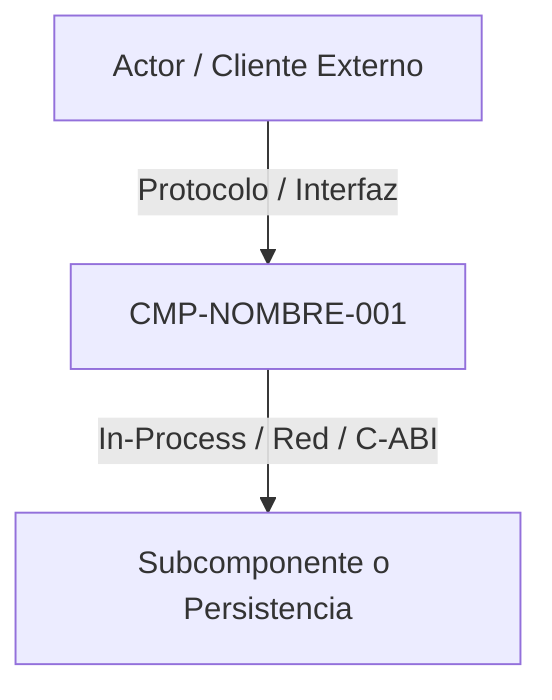

# CMP-NOMBRE-001: Nombre del Componente de Arquitectura

## 1. Propósito, Responsabilidad y Bounded Context
Define la responsabilidad única del componente, su alineación con el Bounded Context de dominio y su nivel de abstracción dentro de la arquitectura general.

## 2. Diagrama de Estructura y Conectividad (arc42 Sec. 5 / NAF v4)

## 3. Contratos de Interfaz y Políticas de Ejecución
- **Mecanismo de Ejecución**: Especificación del ciclo de vida (servicio autónomo, carga dinámica mediante `LoadLibrary`/`dlopen` si es DLL, o invocación funcional directa).
- **Tolerancia a Fallos y Rendimiento**: Límites de memoria, latencia objetivo, concurrencia o aislamiento de fallos.

---

## 4. Historial de Revisiones y Control de Versiones

| Versión | Fecha | Autor / Agente | Descripción del Cambio | Referencia de Cambio (Change/PR) |
| :--- | :--- | :--- | :--- | :--- |
| **1.0.0** | 2026-09-14 | Lead Architect | Definición inicial de la arquitectura del componente | CHG-ARCH-001 |
