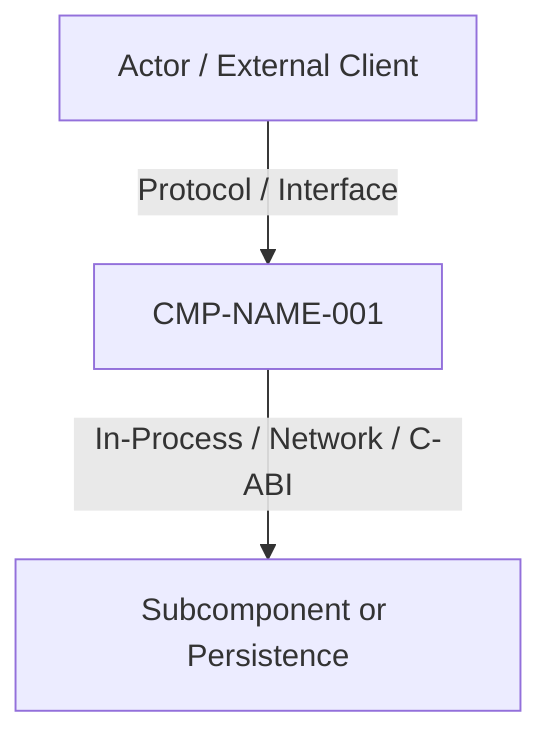

# CMP-NAME-001: Architecture Component Name

## 1. Purpose, Responsibility, and Bounded Context
Defines the single responsibility of the component, its domain Bounded Context alignment, and abstraction level within the overall architecture.

## 2. Structure and Connectivity Diagram (arc42 Sec. 5 / NAF v4)

## 3. Interface Contracts and Execution Policies
- **Execution Mechanism**: Lifecycle specification (autonomous daemon/service, dynamic loading via `LoadLibrary`/`dlopen` if DLL, or direct function invocation).
- **Fault Tolerance and Performance**: Memory bounds, target latency, concurrency, or failure isolation.

---

## 4. Revision History and Version Control

| Version | Date | Author / Agent | Change Description | Change Reference (Change/PR) |
| :--- | :--- | :--- | :--- | :--- |
| **1.0.0** | 2026-09-14 | Lead Architect | Initial component architecture definition | CHG-ARCH-001 |
