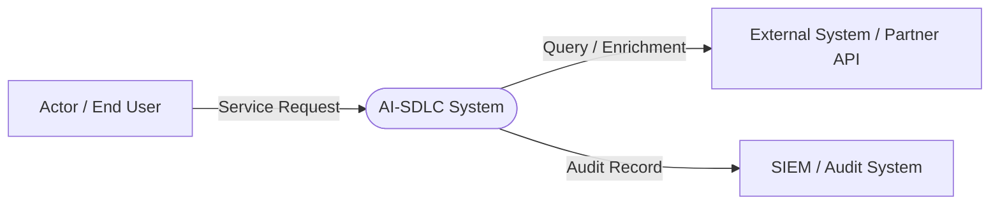
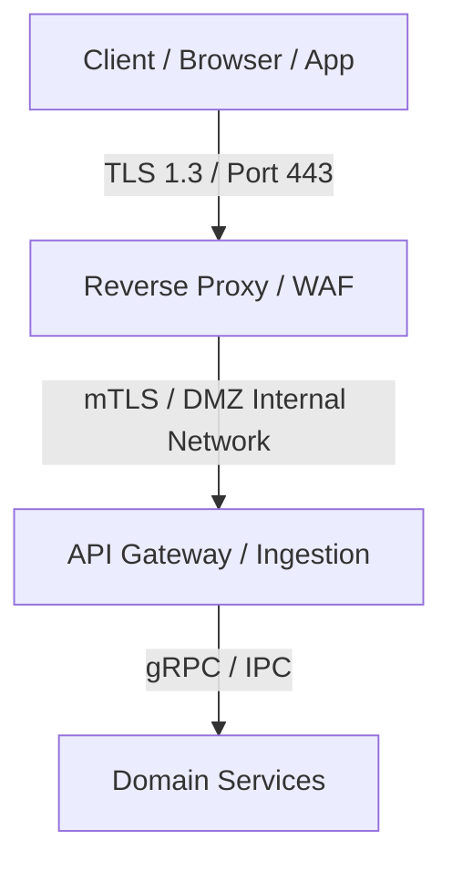

# 03. Context and Scope (arc42 Sec. 3 / NAF Operational)

## 1. Business Context
Models conceptual boundaries of the system with respect to users, collaborating external systems, and external data sources.

### 1.1 Business Context Diagram

### 1.2 Operational Information Exchanges (`OIE-*`)
| Exchange ID | Source / Target | Payload / Message | Protocol / Channel | Format |
| :--- | :--- | :--- | :--- | :--- |
| `OIE-COMM-001` | User ➔ System | Operation Request | HTTPS / REST | JSON (Schema v1) |
| `OIE-NOTIF-002`| System ➔ User | Events and Notifications | WebSocket / WSS | JSON Streaming |
| `OIE-AUDIT-003`| System ➔ SIEM | Immutable Audit Trails | Syslog / TLS | RFC 5424 |

---

## 2. Technical Context and Perimeter Infrastructure
Models physical and logical channels crossing system boundaries (DMZ networks, load balancers, firewalls, and reverse proxies).

### 2.1 Technical Context Diagram

---

## 3. Revision History and Version Control

| Version | Date | Author / Agent | Change Description | Change Reference (Change/PR) |
| :--- | :--- | :--- | :--- | :--- |
| **1.0.0** | 2026-09-24 | Lead Architect | Initial context and scope definition | CHG-ARCH-001 |
