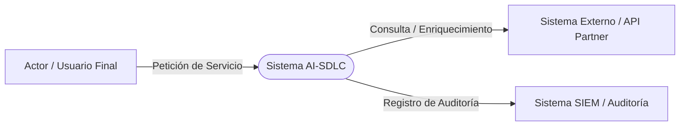
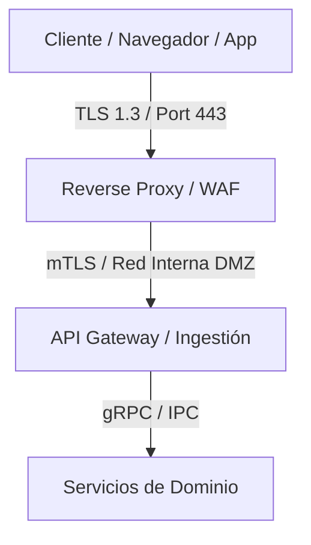

# 03. Contexto y Alcance (arc42 Sec. 3 / NAF Operational)

## 1. Contexto de Negocio (Business Context)
Modela los límites conceptuales del sistema respecto a los usuarios, sistemas externos colaboradores y fuentes de datos externas.

### 1.1 Diagrama de Contexto de Negocio

### 1.2 Intercambios de Información Operativa (`OIE-*`)
| ID Intercambio | Origen / Destino | Carga Útil / Mensaje | Protocolo / Canal | Formato |
| :--- | :--- | :--- | :--- | :--- |
| `OIE-COMM-001` | Usuario ➔ Sistema | Solicitud de Operación | HTTPS / REST | JSON (Schema v1) |
| `OIE-NOTIF-002`| Sistema ➔ Usuario | Eventos y Notificaciones | WebSocket / WSS | JSON Streaming |
| `OIE-AUDIT-003`| Sistema ➔ SIEM | Trazas Inmutables de Auditoría | Syslog / TLS | RFC 5424 |

---

## 2. Contexto Técnico e Infraestructura Perimetral
Modela los canales físicos y lógicos que cruzan la frontera del sistema (redes DMZ, balanceadores, cortafuegos y proxies inversos).

### 2.1 Diagrama de Contexto Técnico

---

## 3. Historial de Revisiones y Control de Versiones

| Versión | Fecha | Autor / Agente | Descripción del Cambio | Referencia de Cambio (Change/PR) |
| :--- | :--- | :--- | :--- | :--- |
| **1.0.0** | 2026-09-24 | Lead Architect | Definición inicial de contexto y alcance | CHG-ARCH-001 |
