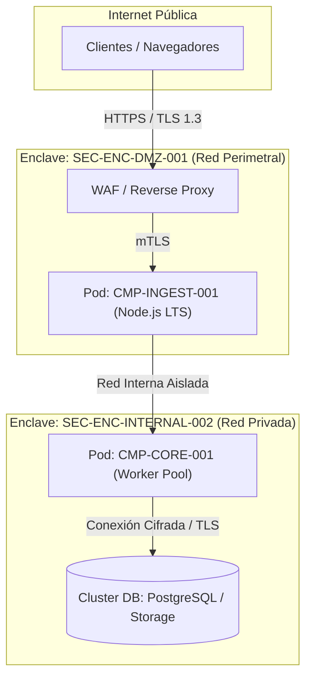

# 07. Vista de Despliegue (arc42 Sec. 7 / NAF Resource Deployment)

## 1. Topología de Infraestructura y Enclaves de Red
Mapea la distribución física y lógica de los componentes sobre nodos de computación, clusters Kubernetes, zonas de disponibilidad y enclaves de seguridad segmentados.

### 1.1 Diagrama de Topología de Despliegue

---

## 2. Inventario de Nodos y Recursos de Ejecución (`RES-*` / `DEP-*`)

| ID Recurso | Tipo de Nodo | Enclave Asociado | CPU / RAM Mínima | Componentes Desplegados |
| :--- | :--- | :--- | :--- | :--- |
| `RES-NODE-DMZ-01` | VM / Kubernetes Node | `SEC-ENC-DMZ-001` | 2 vCPU / 4 GB | `CMP-INGEST-001` |
| `RES-NODE-CORE-01`| VM / Worker Node | `SEC-ENC-INTERNAL-002` | 4 vCPU / 8 GB | `CMP-CORE-001` |
| `RES-NODE-DB-01`  | Instancia Gestionada | `SEC-ENC-INTERNAL-002` | 4 vCPU / 16 GB | Almacenamiento Inmutable |

---

## 3. Políticas de Red y Aislamiento de Tráfico
- **Control Perimetral**: El acceso externo está restringido exclusivamente al puerto 443 a través del WAF.
- **Aislamiento Lateral**: La red perimetral (`SEC-ENC-DMZ-001`) no tiene visibilidad directa sobre la base de datos interna.
- **Canales Cifrados**: Todas las conexiones inter-nodo operan bajo mTLS con certificados emitidos por la CA interna.

---

## 4. Historial de Revisiones y Control de Versiones

| Versión | Fecha | Autor / Agente | Descripción del Cambio | Referencia de Cambio (Change/PR) |
| :--- | :--- | :--- | :--- | :--- |
| **1.0.0** | 2026-09-24 | Lead Architect | Definición inicial de vista de despliegue | CHG-ARCH-001 |
