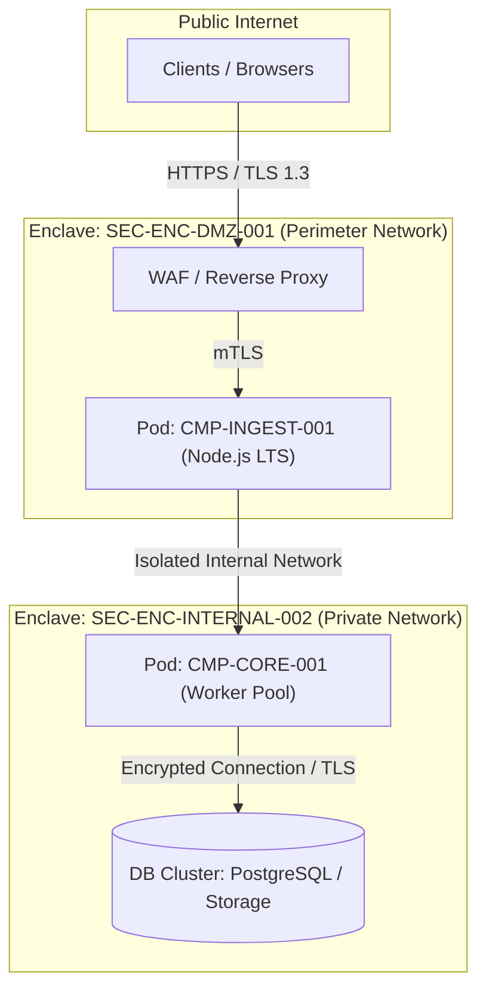

# 07. Deployment View (arc42 Sec. 7 / NAF Resource Deployment)

## 1. Infrastructure Topology and Network Enclaves
Maps physical and logical component distribution across compute nodes, Kubernetes clusters, availability zones, and segmented security enclaves.

### 1.1 Deployment Topology Diagram

---

## 2. Node and Execution Resources Inventory (`RES-*` / `DEP-*`)

| Resource ID | Node Type | Associated Enclave | Min CPU / RAM | Deployed Components |
| :--- | :--- | :--- | :--- | :--- |
| `RES-NODE-DMZ-01` | VM / Kubernetes Node | `SEC-ENC-DMZ-001` | 2 vCPU / 4 GB | `CMP-INGEST-001` |
| `RES-NODE-CORE-01`| VM / Worker Node | `SEC-ENC-INTERNAL-002` | 4 vCPU / 8 GB | `CMP-CORE-001` |
| `RES-NODE-DB-01`  | Managed Instance | `SEC-ENC-INTERNAL-002` | 4 vCPU / 16 GB | Immutable Storage |

---

## 3. Network Policies and Traffic Isolation
- **Perimeter Control**: External access strictly restricted to port 443 via WAF.
- **Lateral Isolation**: Perimeter network (`SEC-ENC-DMZ-001`) has no direct visibility into internal database.
- **Encrypted Channels**: All inter-node connections operate under mTLS with certificates issued by internal CA.

---

## 4. Revision History and Version Control

| Version | Date | Author / Agent | Change Description | Change Reference (Change/PR) |
| :--- | :--- | :--- | :--- | :--- |
| **1.0.0** | 2026-09-24 | Lead Architect | Initial deployment view definition | CHG-ARCH-001 |
