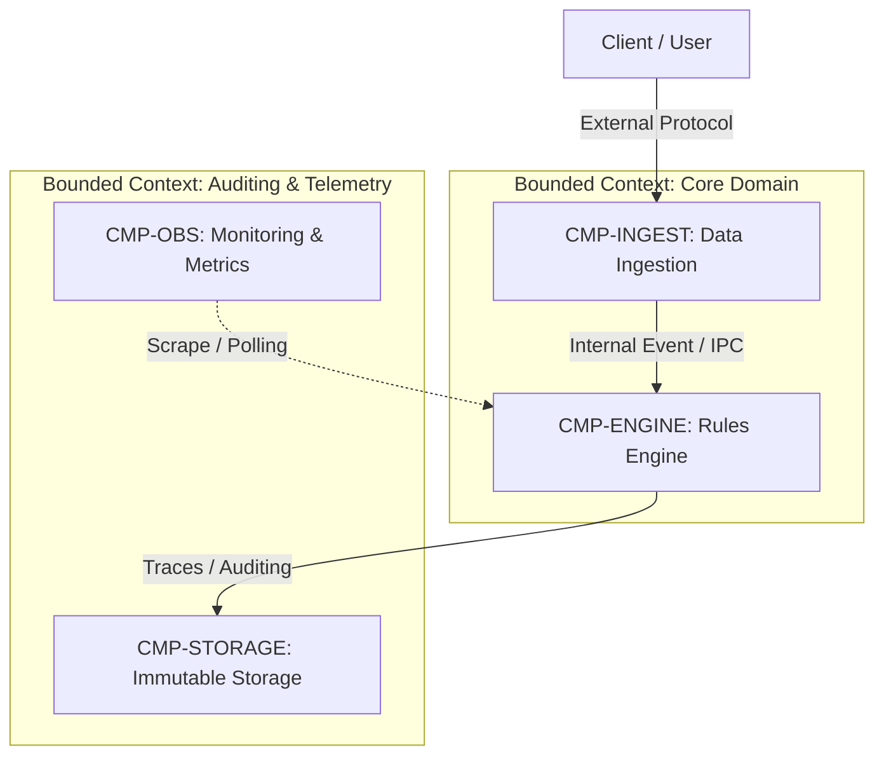

# 05. Building Blocks View: Level 1 Whitebox (arc42 Sec. 5 / NAF Services & Systems)

## 1. Overall System Decomposition (Level 1)
Presents system decomposition into major subsystems, execution containers, and domain Bounded Contexts.

### 1.1 Level 1 Whitebox Diagram

---

## 2. Bounded Contexts and Root Components Catalog

| Bounded Context | Component ID | Implementation Type | Primary Responsibility |
| :--- | :--- | :---: | :--- |
| **Core Domain** | `CMP-INGEST` | `service` | TLS termination, syntactic payload validation, and filtering |
| **Core Domain** | `CMP-ENGINE` | `service` | Business rules evaluation and deterministic computation |
| **Auditing** | `CMP-STORAGE` | `composite` | Event persistence and immutable traceability |

---

## 3. Recursive Decomposition into Sub-Levels
Each listed container or subsystem is detailed in its own component specification (`CMP-*.md`) conforming to `templates/architecture/component.template.md`:
- **Level 2 (Subsystems / Containers)**: Autonomous services, microservices, daemons.
- **Level 3 (Execution Units)**: DLLs, native plugins (.so, .dylib), pure domain functions.

---

## 4. Revision History and Version Control

| Version | Date | Author / Agent | Change Description | Change Reference (Change/PR) |
| :--- | :--- | :--- | :--- | :--- |
| **1.0.0** | 2026-09-24 | Lead Architect | Initial L1 whitebox definition | CHG-ARCH-001 |
