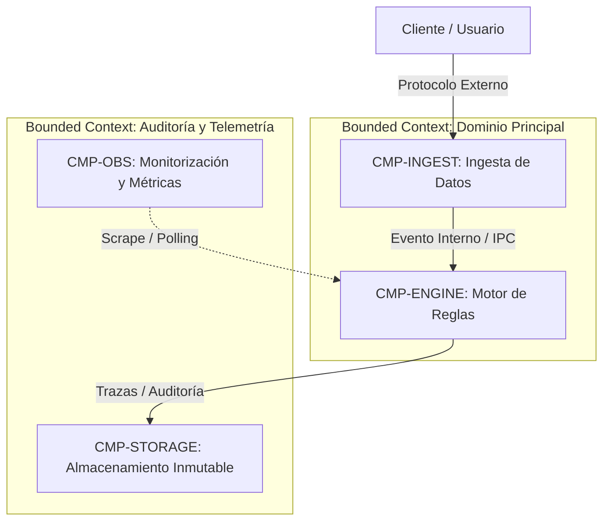

# 05. Vista de Bloques de Construcción: Nivel 1 Whitebox (arc42 Sec. 5 / NAF Services & Systems)

## 1. Descomposición General del Sistema (Nivel 1)
Presenta la descomposición del sistema en subsistemas principales, contenedores de ejecución y Bounded Contexts de dominio.

### 1.1 Diagrama de Caja Blanca de Nivel 1

---

## 2. Catálogo de Bounded Contexts y Componentes Raíz

| Bounded Context | Componente ID | Tipo de Implementación | Responsabilidad Principal |
| :--- | :--- | :---: | :--- |
| **Dominio Principal** | `CMP-INGEST` | `service` | Terminación TLS, validación sintáctica de cargas y filtrado |
| **Dominio Principal** | `CMP-ENGINE` | `service` | Evaluación de reglas de negocio y cálculo determinista |
| **Auditoría** | `CMP-STORAGE` | `composite` | Persistencia y trazabilidad inmutable de eventos |

---

## 3. Descomposición Recursiva en Niveles Inferiores
Cada contenedor o subsistema listado se detalla en su propia especificación de componente (`CMP-*.md`) conforme a `templates/architecture/component.template.md`:
- **Nivel 2 (Subsistemas / Contenedores)**: Servicios autónomos, microservicios, daemons.
- **Nivel 3 (Unidades de Ejecución)**: DLLs, plugins nativos (.so, .dylib), funciones puras de dominio.

---

## 4. Historial de Revisiones y Control de Versiones

| Versión | Fecha | Autor / Agente | Descripción del Cambio | Referencia de Cambio (Change/PR) |
| :--- | :--- | :--- | :--- | :--- |
| **1.0.0** | 2026-09-24 | Lead Architect | Definición inicial de caja blanca L1 | CHG-ARCH-001 |
