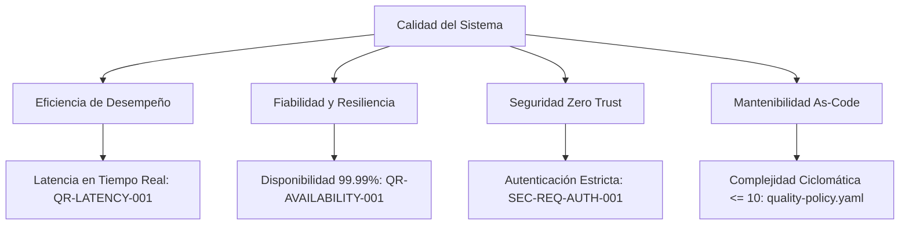

# 10. Requerimientos de Calidad (arc42 Sec. 10 / NAF Quality)

## 1. Árbol de Calidad (Quality Tree)
Estructura jerárquica de los atributos de calidad clave del sistema según la norma ISO/IEC 25010:

---

## 2. Escenarios de Calidad Evaluables (Quality Scenarios)
Definición de escenarios concretos con estímulo, entorno, respuesta y medida:

| ID Requerimiento | Atributo ISO | Estímulo y Entorno | Respuesta del Sistema | Medida Objetiva |
| :--- | :--- | :--- | :--- | :--- |
| `QR-LATENCY-001` | Rendimiento | Carga pico de 10,000 req/s | Procesamiento y persistencia en cola | Latencia p95 < 50ms |
| `QR-AVAILABILITY-001` | Fiabilidad | Caída abrupta de 1 nodo trabajador | Redistribución automática de pods | Pérdida de servicio = 0s |
| `QR-MAINTAINABILITY-001`| Mantenibilidad | Refactorización de submódulos | Ejecución de Release Gates deterministas | CC $\le 10$, LOC $\le 40$ |

---

## 3. Historial de Revisiones y Control de Versiones

| Versión | Fecha | Autor / Agente | Descripción del Cambio | Referencia de Cambio (Change/PR) |
| :--- | :--- | :--- | :--- | :--- |
| **1.0.0** | 2026-09-24 | Lead Architect | Definición inicial del árbol de calidad | CHG-ARCH-001 |
