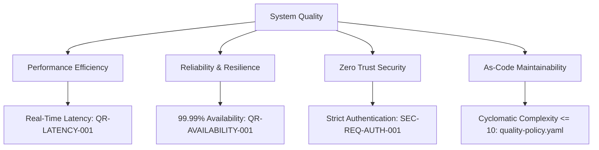

# 10. Quality Requirements (arc42 Sec. 10 / NAF Quality)

## 1. Quality Tree
Hierarchical structure of key system quality attributes based on ISO/IEC 25010:

---

## 2. Assessable Quality Scenarios
Definition of concrete scenarios with stimulus, environment, response, and measure:

| Requirement ID | ISO Attribute | Stimulus and Environment | System Response | Objective Measure |
| :--- | :--- | :--- | :--- | :--- |
| `QR-LATENCY-001` | Performance | Peak load of 10,000 req/s | Processing and queuing persistence | p95 latency < 50ms |
| `QR-AVAILABILITY-001` | Reliability | Abrupt crash of 1 worker node | Automatic pod redistribution | Service downtime = 0s |
| `QR-MAINTAINABILITY-001`| Maintainability | Submodule refactoring | Deterministic Release Gates execution | CC $\le 10$, LOC $\le 40$ |

---

## 3. Revision History and Version Control

| Version | Date | Author / Agent | Change Description | Change Reference (Change/PR) |
| :--- | :--- | :--- | :--- | :--- |
| **1.0.0** | 2026-09-24 | Lead Architect | Initial quality tree definition | CHG-ARCH-001 |
