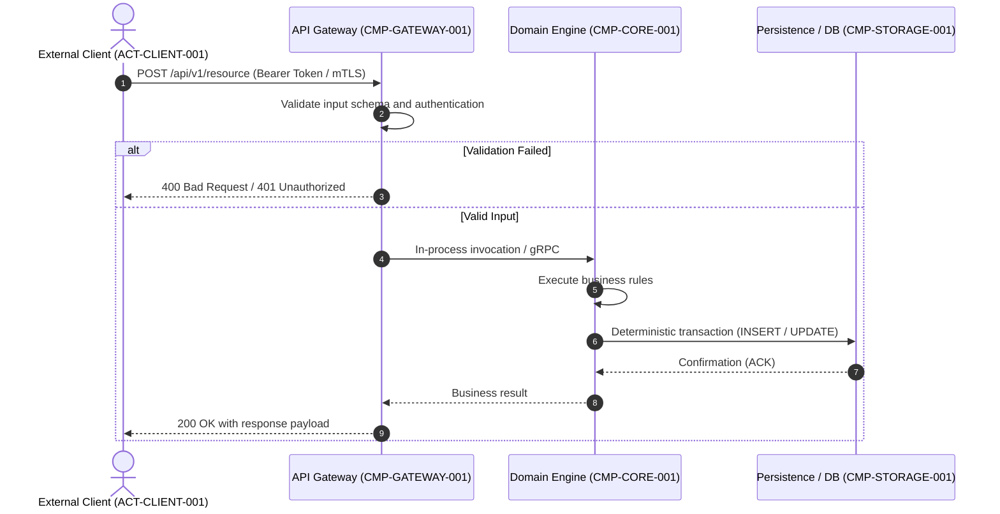
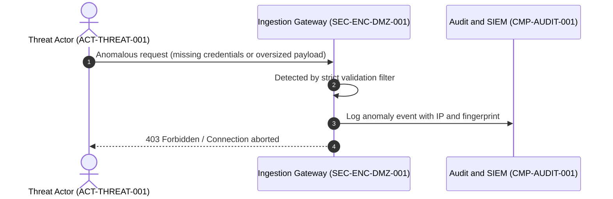

# 06. Runtime View (arc42 Sec. 6 / NAF Behaviour)

## 1. Nominal Scenario: Main Business Flow (`SEQ-NOMINAL-001`)
Describes sequence orchestration and component interactions for a typical user request or system event:

---

## 2. Security Scenario / Abuse Mitigation (`SEQ-SEC-002`)
Models behavior and isolation under malicious attempts or anomalous loads:

---

## 3. Dynamic Scenarios and Associated Requirements Matrix

| Scenario ID | Type | Satisfied Requirements | Participating Components |
| :--- | :---: | :--- | :--- |
| `SEQ-NOMINAL-001` | Nominal | `FR-FEATURE-001` | `CMP-GATEWAY-001`, `CMP-CORE-001` |
| `SEQ-SEC-002` | Security | `SEC-REQ-AUTH-001` | `CMP-GATEWAY-001`, `CMP-AUDIT-001` |

---

## 4. Revision History and Version Control

| Version | Date | Author / Agent | Change Description | Change Reference (Change/PR) |
| :--- | :--- | :--- | :--- | :--- |
| **1.0.0** | 2026-09-24 | Lead Architect | Initial runtime views definition | CHG-ARCH-001 |
