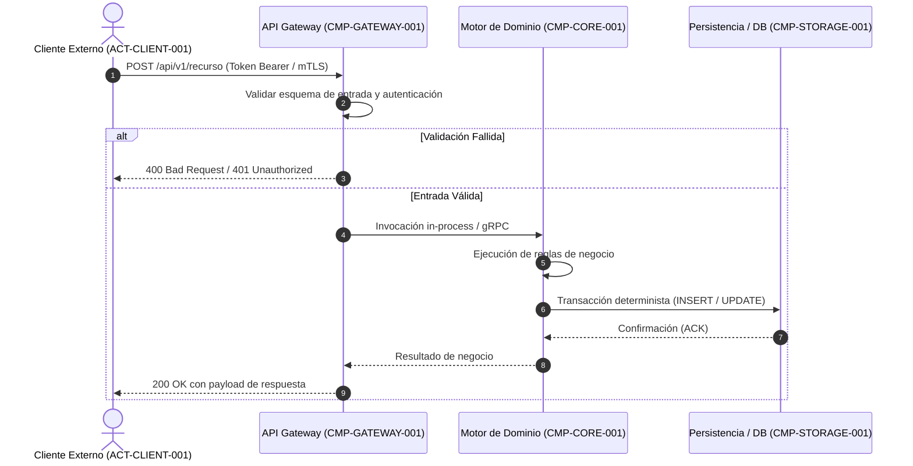
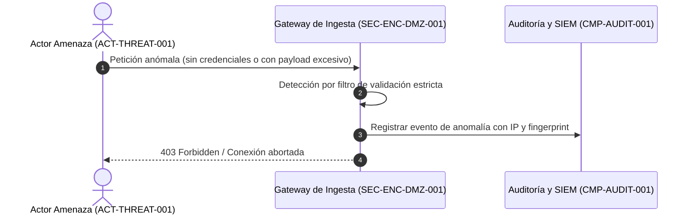

# 06. Vista de Ejecución / Runtime (arc42 Sec. 6 / NAF Behaviour)

## 1. Escenario Nominal: Flujo Principal de Negocio (`SEQ-NOMINAL-001`)
Describe la orquestación e interacción secuencial de componentes ante una solicitud típica de usuario o evento del sistema:

---

## 2. Escenario de Seguridad / Mitigación de Abusos (`SEQ-SEC-002`)
Modela el comportamiento y el aislamiento ante intentos maliciosos o cargas anómalas:

---

## 3. Matriz de Escenarios Dinámicos y Requerimientos Asociados

| ID Escenario | Tipo | Requerimientos Satisfechos | Componentes Participantes |
| :--- | :---: | :--- | :--- |
| `SEQ-NOMINAL-001` | Nominal | `FR-FUNCIONALIDAD-001` | `CMP-GATEWAY-001`, `CMP-CORE-001` |
| `SEQ-SEC-002` | Seguridad | `SEC-REQ-AUTH-001` | `CMP-GATEWAY-001`, `CMP-AUDIT-001` |

---

## 4. Historial de Revisiones y Control de Versiones

| Versión | Fecha | Autor / Agente | Descripción del Cambio | Referencia de Cambio (Change/PR) |
| :--- | :--- | :--- | :--- | :--- |
| **1.0.0** | 2026-09-24 | Lead Architect | Definición inicial de vistas de ejecución | CHG-ARCH-001 |
