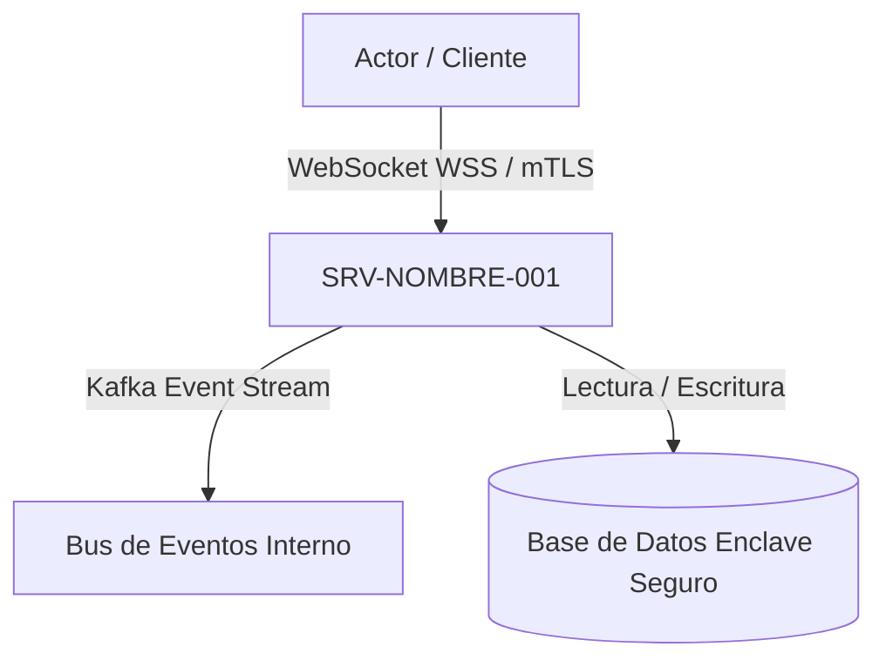

# SRV-NOMBRE-001: Nombre del Servicio de Arquitectura

## 1. Propósito y Límites del Servicio
Define la responsabilidad única del servicio, sus límites de dominio y su interacción con los casos de uso de negocio.

## 2. Diagrama de Conectividad (NAF Connectivity & arc42 Sec. 5)

## 3. Políticas de Tolerancia a Fallos y Rendimiento
- Estrategia de circuit breaker, límites de memoria y escalado horizontal.

---

## 4. Historial de Revisiones y Control de Versiones

| Versión | Fecha | Autor / Agente | Descripción del Cambio | Referencia de Cambio (Change/PR) |
| :--- | :--- | :--- | :--- | :--- |
| **1.0.0** | 2026-09-03 | Lead Architect | Definición inicial de la arquitectura del servicio | CHG-ARCH-001 |
